This section introduces the "analytics problem" — the persistent gap between investment in AI and analytics and the business value actually realized. Drawing on Weber and Zwingmann's (2024) *Augmented Analytics*, it situates analytics within broader industrial revolutions, arguing that today's transformation — driven by AI, IoT, and cloud — is both faster and more complex than any before. The chapter explains why many organizations stagnate at early maturity stages: technical tools routinely outpace culture, strategy, and people readiness. Two key frameworks anchor the solution: **IPTOP** (Infrastructure, People, Tools, Organization, Processes) for operational design, and **SPEC** (Strategy, People, Ecosystem, Culture) for strategic alignment. Together, they guide progress from data-reactive to data-fluent enterprises. Augmented analytics emerges as the bridge — embedding intelligence into workflows to empower non-experts, enhance insight delivery, and balance automation with human judgment.

::: note
###### *Reference:*

Chapters 1 and 2 from **Weber, W., & Zwingmann, T. (2024).** *Augmented Analytics.*\
O'Reilly Media, Inc.\
Available at: <https://learning.oreilly.com/library/view/augmented-analytics/9781098151713/>
:::

## The Analytics Problem

Chapters 1 and 2 from Weber and Zwingmann (2024) outline the journey of building a data-driven organization — from understanding the foundations of data acquisition, APIs, and web scraping, to progressing through the data maturity stages (Reactive → Active → Progressive → Fluent) by aligning culture, strategy, people, and technology.

### Historical Context: Industrial Transformations

Prior industrial revolutions unfolded in three distinct waves:

1.  **1760s** — Steam power enabled mechanized production for the first time.
2.  **Mid-1800s to 1910s** — Electricity and mass production reshaped manufacturing and labor.
3.  **Late 20th century onward** — Computerization digitized processes across every industry.

The current shift is different in kind, not just degree. Digital transformation is driven by the **simultaneous convergence** of AI, IoT, cloud computing, and advanced analytics — making it both faster and more complex than any previous era.

### Why Are Businesses Transforming?

**Speed of change.** Previous revolutions unfolded over decades; today, an industry can be disrupted within a few years. Amazon displaced local bookstores; Uber reshaped taxi markets; Industry 4.0 is redefining manufacturing. This pace demands organizational agility and strong leadership capable of making decisions under uncertainty.

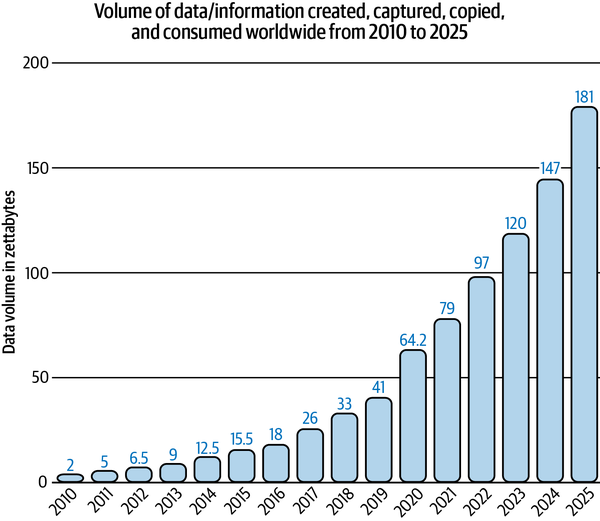

**Convergence of multiple technologies.** Earlier revolutions were driven by a single technology; today's changes combine AI, cloud computing, IoT, and advanced analytics simultaneously. This creates multidimensional complexity: the disruption is not just faster — it is harder to predict and harder to respond to.

**The importance of data.** Data has shifted from a byproduct of operations to a **core strategic asset**. The "data as oil" analogy is instructive but imprecise: unlike oil, data is not consumed when used, increases in value as more of it is combined, and requires "refining" — through cleaning, integration, and governance — to become useful.

**Changing consumer behavior.** "iPhone moments" — sudden shifts in customer expectations triggered by a new product or platform — reshape entire industries. Shopify transformed retail; Tesla changed automotive; Netflix disrupted entertainment; Amazon Prime redefined logistics. Digital transformation now touches all sectors and is frequently *initiated* by rising customer expectations rather than internal strategy.

### Industries Most Impacted

McKinsey research identifies the industries where big data and analytics deliver the greatest transformative potential:

| Industry | Key Applications |
|----|----|
| Agriculture | Precision farming, crop yield prediction, automation |
| Commercial insurance | Risk pricing, underwriting efficiency |
| Finance | Fraud detection, credit risk modeling, algorithmic trading |
| Healthcare | Personalized medicine, predictive diagnostics |
| IT | Automation, cybersecurity threat detection |
| Manufacturing | Predictive maintenance, supply chain optimization |
| Transportation | Route optimization, demand prediction |
| Utilities | Grid stability, renewable energy integration |

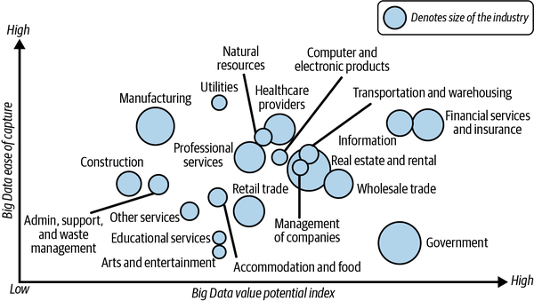

### Consequences for Businesses

The shift toward customer centricity means organizations must develop deep insight into the customer journey — not just internal efficiency metrics. Yet an **analytics adoption gap** persists: many analytics teams fail to deliver perceived business value, and tools are frequently too technical for the average employee to use confidently.

History offers a useful lesson: widespread adoption of transformative technology consistently follows from **simplicity**. The graphical user interface democratized computing; the mouse made it accessible; the touchscreen extended it to billions of people. The same principle applies to analytics.

### The Case for Augmented Analytics

Traditional analytics tools cannot handle the variety of today's data — structured (databases, spreadsheets), semi-structured (JSON, logs), and unstructured (text, images, video). Manual tools like Excel or static BI dashboards are insufficient at the scale and pace modern business demands.

**Augmented analytics** closes this gap by bringing insights directly to non-data professionals — roughly 80% of the workforce. The goal is to make analytics intuitive, embedded in daily workflows, and immediately actionable, without requiring users to become data scientists.

### Data-Driven Culture

A data-driven culture is one where decisions routinely begin with "What does the data say?" rather than relying on intuition or seniority. The current reality falls short: only approximately **24% of decision-makers** report feeling confident working with data. Closing this gap requires fostering curiosity, analytical thinking, and communication skills across the organization — not just among data teams.

### The People Problem and the Limits of Upskilling

Aging populations and shrinking workforces mean organizations cannot simply replace existing staff with data-savvy new hires. **Upskilling** — acquiring new skills or deepening existing ones to keep pace with technology — is essential, but it cannot transform every employee into a data analyst.

For individuals, upskilling maintains career competitiveness and supports role evolution. For organizations, it reduces skill gaps, improves adaptability, and strengthens resilience in fast-changing industries.

The practical solution is not to raise the floor of technical skill for everyone — it is to meet people where they are and equip them with **augmented tools** that make data-driven decisions accessible without requiring deep technical expertise.

### From Data-Driven to Insight-Driven

A **data-driven** orientation focuses on collecting and analyzing data. An **insight-driven** orientation goes a step further: it focuses on delivering actionable, user-friendly insights to the majority of employees — not just the analytics team.

Augmented analytics is the bridge between these two states. In the authors' analogy, it plays the role the mouse played for computing: it does not make the underlying technology simpler, but it makes the results of that technology accessible to everyone.

### Developing Analytical Maturity

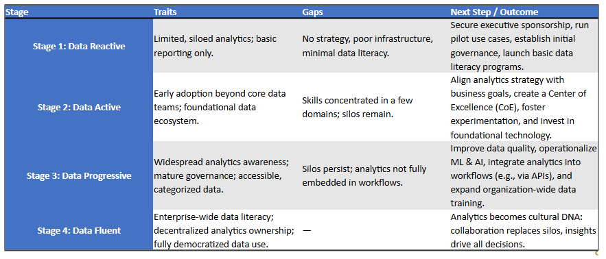

### The IPTOP Framework

The IPTOP framework is **operational** in nature — it guides data teams on *how* to build and sustain analytics capabilities across five dimensions:

-   [**Infrastructure**]{style="background-color: yellow"} — how data is collected, stored, made reliable, and made accessible. This includes cloud platforms, data pipelines, and data warehouses.
-   [**People**]{style="background-color: yellow"} — cultivating data literacy, a data-driven culture, and ongoing learning across all roles.
-   [**Tools**]{style="background-color: yellow"} — the analytics platforms and software used at various skill levels, plus reusable templates and frameworks.
-   [**Organization**]{style="background-color: yellow"} — structuring data talent through centralized, decentralized, or hybrid models to enable scalable, sustainable analytics.
-   [**Processes**]{style="background-color: yellow"} — workflows and governance practices that support collaboration, consistency, and alignment with business goals.

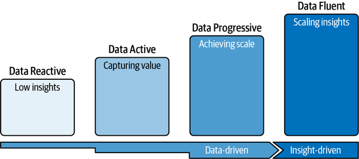

### Combining IPTOP and Data Maturity

The diagram below shows how IPTOP capabilities map onto each stage of the maturity journey — illustrating which operational investments are most critical at each level.

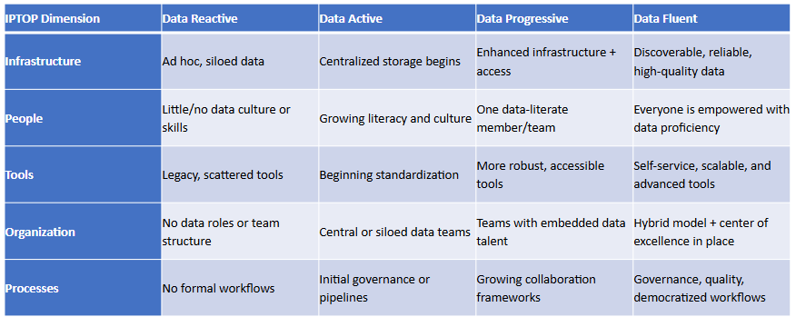

### The SPEC Framework for Transformation

While IPTOP answers *how* to build analytics capability, the SPEC framework answers *why* and *who drives it*. SPEC is **strategic** in nature — it helps executives align analytics with business vision and culture:

-   [**Strategy**]{style="background-color: yellow"} — define a clear analytics vision aligned with business objectives. Analytics without strategic alignment produces activity, not value.
-   [**People & Organization**]{style="background-color: yellow"} — build data talent across roles, bridge the gap between business and analytics teams, and promote continuous learning.
-   [**Data Ecosystem**]{style="background-color: yellow"} — establish reliable, secure, and accessible data infrastructure underpinned by sound governance.
-   [**Cultural Change**]{style="background-color: yellow"} — foster the collaboration, experimentation, and data-driven mindsets that make analytics stick at the organizational level.

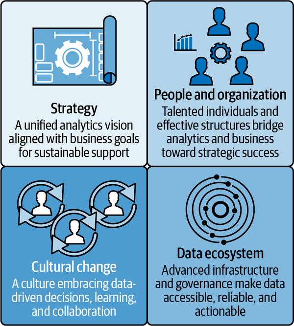

### Becoming Data Active

Moving from **Data Reactive** to **Data Active** requires coordinated progress across all four SPEC dimensions:

-   **Culture** — secure visible CEO support and gain buy-in from middle management; without this, analytics initiatives stall.
-   **Strategy** — develop a data strategy that explicitly connects analytics priorities to the organization's business purpose.
-   **People & Organization** — raise awareness of data literacy as a necessary competency across the workforce, not just within the data team.
-   **Data Ecosystem** — establish initial governance (clear rules, data ownership, and access processes) and focus analytics effort on specific, high-value use cases rather than broad abstract projects.

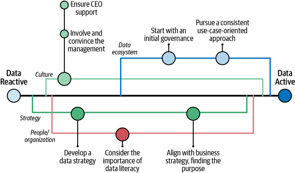

### Moving to Data Progressive

The transition from **Data Active** to **Data Progressive** deepens every dimension. **Culture** efforts expand to defining cross-team collaboration models, driving early adoption of analytics solutions, and democratizing access to data. **Strategy** crystallizes from broad intent into a documented analytics roadmap tied to business goals.

In **people and organization**, the organization defines its operating model, establishes a Center of Excellence, clarifies roles and personas, launches a formal data literacy program, and invests in developing internal talent for the long term. The **data ecosystem** work focuses on finalizing the target tool stack and setting up a structured use-case pipeline to manage analytics projects from ideation to production.

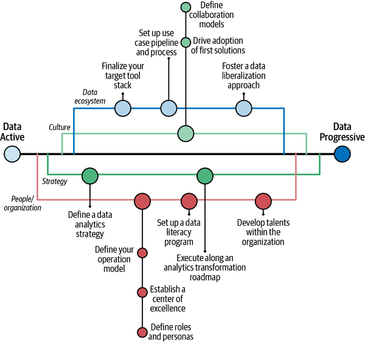

### Overcoming Gulfs and Chasms

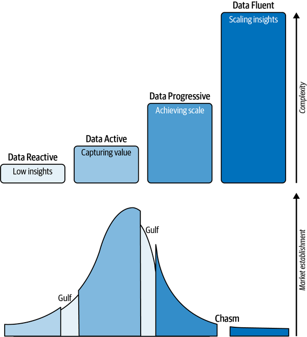

As organizations progress through maturity stages, both complexity and market establishment grow. But progress is not linear — there are key transition points where many organizations get stuck:

-   [**Gulfs**]{style="background-color: yellow"} — incremental adoption hurdles within a maturity stage (e.g., building trust in a new tool, or getting a team to use a dashboard consistently).
-   [**Chasms**]{style="background-color: yellow"} — the larger structural leap between stages, such as moving from isolated analytics projects to making data-driven decision-making part of the organizational DNA.

Successfully crossing each gulf and chasm requires overcoming organizational, technical, and cultural barriers simultaneously — with every stage demanding higher sophistication and broader adoption than the last.

## The Analytics Problem Lab

**1.** The chapter describes the current digital transformation as different "in kind, not just degree" from previous industrial revolutions. What three forces make it uniquely complex, and why does that complexity create a challenge for business leaders specifically?

::: {.callout-note collapse="true"}
### Show Answer

The three forces are the **simultaneous convergence** of AI, cloud computing, and IoT — combined with advanced analytics. Earlier revolutions were each driven by a single technology (steam, electricity, computers), which allowed organizations decades to adapt. Today's convergence is multidimensional: disruption comes from multiple directions at once, faster than human or organizational response cycles. For business leaders, this means decisions must be made under uncertainty and at speeds that traditional planning cycles cannot accommodate.
:::

**2.** What is the "analytics adoption gap," and what historical analogy does Weber and Zwingmann use to explain why simplicity — not just technical power — is what drives widespread adoption?

::: {.callout-note collapse="true"}
### Show Answer

The analytics adoption gap is the persistent disconnect between the sophistication of analytics tools and the actual business value organizations extract from them — often because tools are too technical for the average employee. The authors draw an analogy to computing history: the graphical user interface, the mouse, and the touchscreen each democratized computing not by making the underlying technology simpler, but by making its results accessible to everyday users. Augmented analytics aims to do the same for data — embedding insights where people already work.
:::

**3.** Compare and contrast the IPTOP and SPEC frameworks. Which is operational and which is strategic, and what does each one say about *why* so many organizations get stuck at early maturity stages?

::: {.callout-note collapse="true"}
### Show Answer

**IPTOP** (Infrastructure, People, Tools, Organization, Processes) is operational — it guides *how* analytics capability is built and sustained day-to-day. **SPEC** (Strategy, People, Ecosystem, Culture) is strategic — it guides *why* analytics is pursued and who drives it from the top. Organizations stall because IPTOP investments (tools, pipelines) frequently outpace SPEC alignment (culture, strategic buy-in). A data warehouse without executive sponsorship or a culture of curiosity is just infrastructure — it generates activity, not value.
:::

**4.** What distinguishes a "data-driven" organization from an "insight-driven" one? Give a concrete example of what each looks like in practice for a mid-size retailer.

::: {.callout-note collapse="true"}
### Show Answer

A **data-driven** organization collects and analyzes data — it has dashboards, reports, and analytics teams. An **insight-driven** organization goes further: it delivers actionable, user-friendly insights to the majority of employees at the moment they make decisions. For a mid-size retailer, data-driven might mean a central analyst team producing weekly sales reports. Insight-driven means a store manager's inventory app surfaces a restock recommendation automatically when she opens it Monday morning — no data skills required.
:::

## Augmented Analytics

Chapter 3 of Weber and Zwingmann (2024) explains why augmented analytics (AA) is the critical next step for organizations that have built basic data capabilities but struggle to scale them across the business.

::: note
###### *Reference:*

Chapter 3 from **Weber, W., & Zwingmann, T. (2024).** *Augmented Analytics.*\
O'Reilly Media, Inc.\
Available at: <https://learning.oreilly.com/library/view/augmented-analytics/9781098151713/>
:::

### What Is Augmented Analytics?

Augmented analytics means adding value by providing people with access to technology that gives them the analytical leverage they need to accomplish business tasks more effectively. It offers a path to scaling insights across an organization by making them **accessible**, **intuitive**, and **embedded** in decision-making.

AA is not simply about better technology — it is about **human-centric augmentation** that finds the right sweet spot between full automation and unaided human judgment. Done well, it becomes integrated, essential, and empowering, helping organizations progress toward Data Fluent maturity.

AA matters because it breaks down the divide between data experts and business users. It embeds analytics into daily work — making data use habitual and unobtrusive — through two mechanisms:

-   **Augmented workflows** — analytics functionality embedded directly inside existing business processes (e.g., a recommendation surfaced inside a CRM while a salesperson is entering a call note).
-   **Augmented frames** — context-specific, just-in-time insights delivered to the user at the moment of a decision.

### Five Key Components: From Data Reactive to Data Fluent

Augmented analytics rests on five interlocking components:

1.  **People** — human creativity, experience, and judgment remain at the center of analytics. Tools support people, but it is people who frame questions, interpret results, and make decisions.
2.  **Technology** — AI, automation, and analytics platforms provide the computational power to process large datasets and enable advanced analytics at scale.
3.  **Analytical leverage** — analytics amplifies human thinking by improving speed, scale, accuracy, and predictive ability — making insights more powerful than intuition alone.
4.  **Business task** — analytics should always be applied to solve real-world, value-driven business problems. Generating reports for their own sake is not the goal.
5.  **Better way** — the goal is faster, more reliable, less biased decisions — leading to better outcomes than gut instinct or legacy methods could deliver.

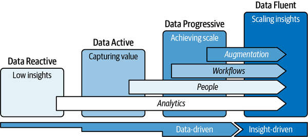

### Five Traits of Effective Augmented Analytics

Weber and Zwingmann describe effective AA using five "I" traits:

-   [**Insightful**]{style="background-color: yellow"} — turns raw data into actionable knowledge, not just pretty charts.
-   [**Integrated**]{style="background-color: yellow"} — embedded into existing workflows and tools that employees already use.
-   [**Invisible**]{style="background-color: yellow"} — works seamlessly in the background; the user receives the insight without needing to run an analysis.
-   [**Indispensable**]{style="background-color: yellow"} — delivers consistent, reliable value until users cannot imagine working without it.
-   [**Inclusive**]{style="background-color: yellow"} — usable by all employees, not just data experts.

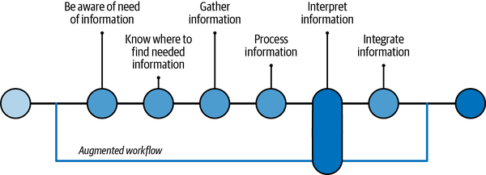

### Types of Bias

Analytics practitioners must recognize the cognitive and statistical biases that can distort data, models, and decisions. Nine key types are described by Weber and Zwingmann:

-   **Survivorship bias** — focusing only on entities that "survived" a selection process while ignoring those that did not. *Example: studying only successful companies without analyzing the failed ones leads to overconfidence in the "winning" strategies.*
-   **Confirmation bias** — seeking or favoring information that confirms existing beliefs while discounting contradictory evidence. *Example: a manager selects only the data points that support the decision they have already made.*
-   **Sample bias** — drawing conclusions from a dataset not representative of the full population. *Example: surveying only college students to estimate national voting behavior.*
-   **Availability bias** — overestimating the likelihood of events that are easy to recall, often because they are recent or vivid. *Example: overestimating the risk of plane crashes after a widely covered accident.*
-   **Outlier bias** — placing too much emphasis on unusual or extreme cases that do not represent the norm. *Example: using one exceptional sales month as the basis for an annual forecast.*
-   **Selection bias** — systematic error caused by non-random data selection that skews results. *Example: studying only patients who complete a treatment program, ignoring dropouts.*
-   **Cognitive bias** — a broad category covering systematic deviations from rational judgment caused by mental shortcuts. *Example: stereotyping a job applicant based on limited demographic information.*
-   **Anchoring bias** — relying too heavily on the first piece of information encountered when making a decision. *Example: letting a high initial salary offer anchor all subsequent negotiation.*
-   **Historical bias** — bias introduced when training data reflects outdated or inequitable historical conditions. *Example: a predictive policing model that perpetuates past discriminatory arrest patterns.*

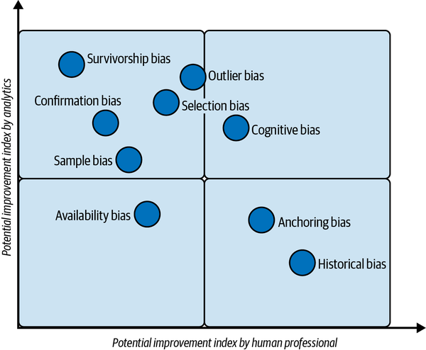

### The Five AI Archetypes

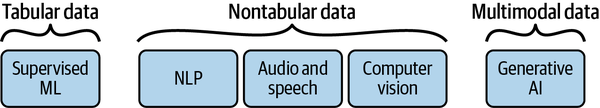

Not all AI is the same. Weber and Zwingmann identify five distinct archetypes, each suited to different business tasks:

-   **Automation** — repeatable, deterministic processes: data preparation, scheduled reports, rule-based alerts.
-   **Supervised machine learning** — learns from labeled examples to perform prediction, classification, anomaly detection, and recommendations.
-   **Natural language processing (NLP)** — understands and generates human language: text analysis, search, summarization, sentiment analysis.
-   **Speech** — converts between voice and text: voice-to-text transcription, text-to-voice synthesis.
-   **Computer vision** — interprets visual content: document analysis, image classification, defect detection.
-   **Generative AI** — creates new content: code generation, automated report writing, conversational interfaces.

### Supervised Learning

Supervised learning is the most widely used AI archetype in business analytics. A model is trained on labeled examples (inputs paired with known outputs), then used to make predictions on new, unseen data. The workflow is iterative:

1.  **Collect data** — gather high-quality datasets with both features (inputs) and labels (known outputs).
2.  **Define features and labels** — determine which variables are predictors (features) and what is being predicted (the label/target).
3.  **Train/test split** — divide data into a training set (to learn from) and a test set (to evaluate performance on unseen data).
4.  **Find the best model** — experiment with algorithms and hyperparameters; compare performance metrics.
5.  **Evaluate** — measure accuracy, precision, recall, F1-score, or other relevant metrics on the test set.
6.  **Deploy** — integrate the trained model into a real-world application or workflow.
7.  **Monitor** — track prediction quality over time; retrain when data drift degrades performance.

This process is a **loop**, not a line. After monitoring, teams routinely return to earlier steps as new data arrives or business conditions change.

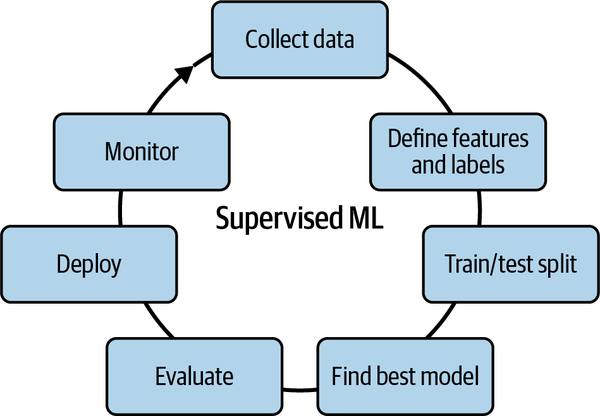

## Augmented Analytics Lab

**1.** Weber and Zwingmann describe augmented analytics as finding the right "sweet spot between full automation and unaided human judgment." What could go wrong if an organization tips too far in either direction?

::: {.callout-note collapse="true"}
### Show Answer

**Too much automation:** decisions are made without human review, errors propagate at scale, accountability disappears, and edge cases the model was not trained on produce harmful outcomes. **Too little augmentation:** employees are overwhelmed by data they cannot interpret, decision-making remains slow and intuition-driven, and the analytics investment generates reports no one acts on. The sweet spot — augmented workflows and augmented frames — delivers insight at the moment of decision without removing the human from the loop.
:::

**2.** What is the difference between an "augmented workflow" and an "augmented frame"? Give a business example of each.

::: {.callout-note collapse="true"}
### Show Answer

An **augmented workflow** embeds analytics directly inside an existing process — the user does not need to switch tools or run a separate analysis. *Example: a CRM that surfaces a churn risk score automatically when a salesperson logs a call with a long-tenured client.* An **augmented frame** delivers context-specific insight at the moment of a decision. *Example: a purchasing system that alerts a buyer that a supplier's delivery performance has declined 15% over the last 30 days just as the buyer is about to reorder.*
:::

**3.** Which of the five AI archetypes — Automation, Supervised ML, NLP, Speech, Computer Vision, or Generative AI — is most directly aligned with augmented analytics as Weber and Zwingmann define it? Justify your choice with reference to the five "I" traits.

::: {.callout-note collapse="true"}
### Show Answer

**Supervised machine learning** is most directly aligned because it learns from labeled business data to make predictions and recommendations — the core of augmented analytics. It maps cleanly to all five traits: *Insightful* (surfaces predictions users could not compute manually), *Integrated* (embedded in dashboards and workflows), *Invisible* (runs in the background), *Indispensable* (users rely on the recommendation), and *Inclusive* (non-experts receive actionable output without needing to understand the model). Generative AI is adjacent but more focused on content creation than embedded decision support.
:::

**4.** Using the supervised learning workflow, trace what steps a retail company would follow to build a model that predicts which customers will churn in the next 30 days. Be specific about what the features and label would be.

::: {.callout-note collapse="true"}
### Show Answer

1. **Collect data** — purchase history, recency, frequency, average order value, customer service contacts, email open rates, returns. 2. **Define features and label** — features: all variables above; label: churned (1) or retained (0) within 30 days after the observation window. 3. **Train/test split** — hold out the most recent period as a test set; train on historical data. 4. **Find the best model** — compare logistic regression, gradient boosting, and random forest. 5. **Evaluate** — use recall (minimizing missed churners is more costly than false positives) and AUC. 6. **Deploy** — surface predictions in the CRM for the retention team. 7. **Monitor** — retrain monthly as new purchase data arrives; watch for data drift.
:::

# Summary and Review

## Using AI

Use the following prompts with a generative AI tool to explore the analytics problem and augmented analytics further.

- What is the difference between descriptive, diagnostic, predictive, and prescriptive analytics? Give a business example of each that a mid-size retail company might actually use.
- How do the IPTOP and SPEC frameworks complement each other? Why would using IPTOP alone be insufficient for a company trying to scale its analytics culture?
- What makes the current wave of digital transformation different from previous industrial revolutions? Is the "data as oil" analogy useful or misleading?
- A company has a data team, modern BI dashboards, and a data warehouse — but executives still make decisions based on gut feel. Which SPEC pillar is most likely failing, and what would you recommend?
- What are the five "I" traits of effective augmented analytics, and how does each one address a specific barrier that prevents non-expert employees from using data?
- Why does the supervised ML workflow described in the chapter end with a monitoring step that loops back to earlier stages? What business conditions trigger a retraining cycle?

## Summary

This chapter introduced the analytics problem — the persistent gap between analytics investment and realized business value — and the frameworks organizations use to close it.

| Topic | Key concepts |
|---|---|
| Industrial context | Three prior revolutions; current transformation driven by AI, IoT, cloud simultaneously |
| Why businesses transform | Speed of change, technology convergence, data as strategic asset, shifting consumer expectations |
| Analytics adoption gap | Tools outpace culture and people; simplicity drives adoption historically |
| IPTOP framework | Infrastructure, People, Tools, Organization, Processes — operational capability building |
| SPEC framework | Strategy, People & Org, Ecosystem, Culture — strategic alignment and leadership |
| Data maturity stages | Reactive → Active → Progressive → Fluent; gulfs within stages, chasms between them |
| Augmented analytics | Human-centric augmentation; augmented workflows and frames; five "I" traits |
| Types of bias | Survivorship, confirmation, sample, availability, outlier, selection, cognitive, anchoring, historical |
| Five AI archetypes | Automation, Supervised ML, NLP, Speech, Computer Vision, Generative AI |
| Supervised learning | Collect → features/labels → train/test split → model → evaluate → deploy → monitor |

**What comes next:** The AI and Data Ethics chapter examines the ethical and cybersecurity dimensions of deploying these AI archetypes in real organizations — including bias, explainability, governance, and responsible design.
