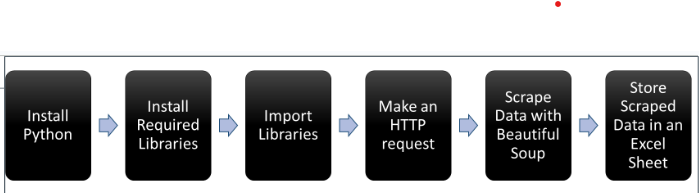

This section surveys modern data acquisition — what to collect, where it lives, and how to fetch it at scale — spanning primary and secondary sources, files and databases, streaming feeds, APIs, and web scraping. It contrasts APIs (structured, reliable, and governed) with web scraping (flexible but fragile and compliance-sensitive), then maps the end-to-end pipeline from sensing and signal conditioning to collection, storage, and analysis. Common data formats are examined alongside typical challenges including data quality, volume, variety, integration, governance, cost, and scalability. Finally, the section introduces Python tooling with a focus on Beautiful Soup: how HTML parsing fits into practical projects and how to build scrapers that hold up when page structures change, grounded in Mitchell (2024).

::: note
###### *Reference:*

Mitchell, R. (2024). *Web Scraping with Python* (3rd ed.).\
O'Reilly Media. ISBN: 9781098145354.
:::

## Data Acquisition: Theory and Methods

**Data acquisition** is the process of gathering information from various sources so it can be stored, processed, and analyzed. In the digital world, data often resides on external systems — websites, APIs, sensors, databases — and accessing it efficiently is essential for analytics, automation, and decision-making.

The importance of data acquisition spans many fields. In **aerospace**, it supports monitoring aircraft performance to ensure passenger safety. In **scientific research**, it enables the collection of experimental data that drives breakthroughs in physics, chemistry, and biology. In the **automotive industry**, it feeds safety systems, performance diagnostics, and the driving experience.

### Types of Data Sources

Data sources fall into four broad categories:

-   [**Primary data**]{style="background-color: yellow;"} — collected directly by the organization. Examples: surveys, IoT sensors, user behavior logs, lab experiments.
-   [**Secondary data**]{style="background-color: yellow;"} — existing datasets created by others. Examples: government open data portals, commercial datasets, academic repositories.
-   [**Streaming data**]{style="background-color: yellow;"} — real-time continuous feeds. Examples: financial tick data, social media firehoses, telemetry from connected devices.
-   [**Public vs. private sources**]{style="background-color: yellow;"} — public sources are openly available; private sources carry licensing restrictions, access requirements, and often cost.

### The Data Acquisition Process

Data acquisition follows a well-defined pipeline from physical measurement to usable insight:

1.  **Sensing** — devices or instruments measure physical parameters such as temperature, pressure, voltage, or biological signals.
2.  **Signal conditioning** — raw sensor output is amplified, filtered, or digitized to make it suitable for further processing.
3.  **Data conversion** — analog signals are converted to digital format, making them compatible with computers and analysis software.
4.  **Data collection** — acquisition hardware and software log and store the prepared data.
5.  **Data analysis** — the collected data is transformed into meaningful insights through visualization and statistical processing.

### Data Formats

Data acquisition encompasses a wide range of formats:

**Numerical data** includes both:

-   *Continuous* values — data that can take any value within a range, such as temperature, voltage, or pressure.
-   *Discrete* values — distinct, countable values such as the number of products sold or responses to a multiple-choice question.

**Textual data** includes:

-   *Unstructured* text — free-form content such as emails, social media posts, and documents. Can be analyzed for sentiment, topic modeling, or information extraction.
-   *Structured* text — organized content in databases, spreadsheets, or formatted files like XML and JSON. Structured text is often the target of [web scraping]{style="background-color: yellow;"} and automated data extraction.

Other common formats include audio recordings, video files, sensor time series, biological signals, and social media interaction data.

### Methods of Data Acquisition

Organizations acquire data through several distinct methods:

-   **File-based retrieval** — downloading CSV, Excel, or JSON files from a server or data portal.
-   **Database queries** — running SQL or NoSQL queries against relational or document databases.
-   **APIs** — making structured, programmatic requests to a service endpoint that returns clean, machine-readable data.
-   **Web scraping** — programmatically extracting data from websites when no API exists.
-   **Data marketplaces** — purchasing access to curated, third-party datasets (e.g., Snowflake Marketplace, AWS Data Exchange).

### Common Sources for Acquisition

Data can be sourced from a broad ecosystem of providers:

| Source Type            | Examples                                        |
|------------------------|-------------------------------------------------|
| Public APIs            | OpenWeather, World Bank, NASA                   |
| Private / partner APIs | Internal APIs, licensed data feeds              |
| Web scraping           | Any publicly accessible website                 |
| Databases              | MySQL, PostgreSQL, MongoDB                      |
| Flat files             | CSV, Excel, JSON, XML (local or cloud storage)  |
| Cloud storage          | Google Drive, Dropbox, AWS S3                   |
| Open data portals      | data.gov, Eurostat, UN Data                     |
| IoT / sensor devices   | Smart meters, wearables, industrial sensors     |
| Logs & system data     | Server logs, application logs, monitoring tools |
| Surveys & forms        | Questionnaires, user feedback                   |
| Social media           | Twitter/X, Reddit, LinkedIn (via API or export) |
| Streaming sources      | Apache Kafka, AWS Kinesis, real-time data feeds |

### Challenges

Data acquisition is rarely straightforward. The most common persistent challenges are:

-   [**Data quality**]{style="background-color: yellow;"} — inaccurate data leads to incorrect conclusions; incomplete data requires time-consuming imputation. Quality problems are usually easiest to fix at the source.
-   [**Data volume**]{style="background-color: yellow;"} — "big data" demands specialized infrastructure (distributed storage, cloud computing) for storing and processing massive datasets.
-   [**Data variety**]{style="background-color: yellow;"} — integrating structured databases, unstructured text, images, and sensor readings requires significant engineering effort.
-   [**Data integration**]{style="background-color: yellow;"} — data silos scattered across departments create fragmented views; a single customer may exist in five different systems with inconsistent IDs.
-   [**Cost**]{style="background-color: yellow;"} — sensors, software licenses, storage, bandwidth, and the people to manage it all add up quickly.
-   [**Scalability**]{style="background-color: yellow;"} — a system that works for 10,000 records today may collapse under 10 million tomorrow; architecture must anticipate growth.
-   [**Data governance**]{style="background-color: yellow;"} — establishing clear ownership, access controls, retention policies, and lifecycle management is organizationally complex but essential for compliance and trust.

## Data Acquisition: Theory and Methods Lab

**1.** A logistics company wants to improve its delivery time predictions. Walk through each of the five steps in the data acquisition pipeline — sensing through analysis — using a specific example from that company's operations at each step.

::: {.callout-note collapse="true"}
### Show Answer

1.  **Sensing:** GPS devices and weight sensors on delivery trucks measure location, speed, and load continuously. 2. **Signal conditioning:** raw GPS coordinates are filtered to remove noise from tunnels or signal dropout; timestamps are synchronized across devices. 3. **Data conversion:** analog sensor outputs are digitized and packaged into structured records with vehicle ID, timestamp, coordinates, and load weight. 4. **Data collection:** a fleet management platform logs each record to a cloud database in real time, with every vehicle reporting every 30 seconds. 5. **Data analysis:** a predictive model ingests historical trip records alongside traffic, weather, and route data to estimate delivery windows — surfacing alerts when a driver is running behind schedule.
:::

**2.** You are building an analytics pipeline for a hospital. Identify which of the seven data acquisition challenges would most severely affect (a) a real-time patient monitoring system and (b) a retrospective research study on 10-year readmission trends. Explain why the dominant challenge differs between the two.

::: {.callout-note collapse="true"}
### Show Answer

**(a) Real-time monitoring:** **Scalability** and **Data quality** are paramount. Thousands of sensors stream continuously — the pipeline must handle peak loads without degradation, and a single faulty reading could trigger a false alarm or miss a critical event. **Data governance** is also acute: real-time systems must enforce access controls at the moment of collection, not retroactively. **(b) Retrospective study:** **Data integration** dominates — a patient over 10 years may appear in the EHR, billing system, pharmacy system, and three different acquired facilities under different IDs. Merging these into a coherent longitudinal record requires entity resolution that is organizationally and technically complex. **Data variety** is also significant: structured vitals data must be reconciled with free-text clinical notes. The challenges differ because real-time systems battle throughput and freshness; retrospective systems battle completeness and consistency across fragmented historical records.
:::

**3.** The "data as oil" analogy is commonly used but also criticized. Based on the properties described in this chapter, identify two ways data behaves like oil and two important ways it does not.

::: {.callout-note collapse="true"}
### Show Answer

**Like oil:** (1) Both are raw materials that must be "refined" — cleaned, integrated, and governed — before they become useful; raw data, like crude oil, has limited direct value. (2) Both are strategic assets that confer competitive advantage to organizations that control large quantities of high-quality supply. **Unlike oil:** (1) Data is not consumed when used — the same dataset can be analyzed repeatedly by multiple teams simultaneously without depletion. (2) Data increases in value as more of it is combined — merging customer purchase data with demographic and behavioral data creates richer insight than either dataset alone, whereas combining barrels of different crude grades often lowers quality.
:::

## Acquiring Data from the Web

Data acquisition is the foundation of all analytics — you cannot analyze data you have not collected. **APIs** and **web scraping** are the two primary techniques for acquiring data from the web, and choosing between them correctly has significant implications for reliability, compliance, and maintenance cost.

### APIs vs. Web Scraping

**APIs (Application Programming Interfaces)** are standardized, documented contracts that allow software systems to communicate and exchange data. Many organizations — Twitter, Google, OpenWeather, government agencies — provide APIs to give developers direct, structured access to their data. APIs return machine-readable formats like JSON or XML, deliver data consistently and in real time, and come with clear documentation and usage terms.

**Web scraping** is the technique of programmatically fetching a web page and extracting specific data from its HTML. It is the right choice when no API exists or when an available API does not expose the specific data you need. However, scraping involves parsing page structure, locating target elements, and cleaning raw data — and it is more fragile than APIs, since changes to page layout can silently break scraping scripts.

**Rule of thumb:** always check for an API first. Use scraping only when an API does not exist or does not provide the data you need.

### Web Scraping

With automated web scraping, code can be written once and used to collect information many times and across many pages. Before undertaking any large-scale scraping project, it is important to:

1.  Review the target website's `robots.txt` file (e.g., `https://example.com/robots.txt`) — this specifies which paths automated crawlers are permitted to access.
2.  Read the site's **Terms of Service** for explicit policies on automated access.
3.  Be respectful of server load — add delays between requests and limit your request rate.

### Challenges of Web Scraping

Two technical challenges make scraping harder than calling an API:

**Variety** — every website has a unique structure. While certain patterns recur (navigation bars, article containers, data tables), each site requires its own tailored approach. A scraper built for one website will not work on another without modification.

**Durability** — websites change frequently. A scraper that runs flawlessly this week may fail entirely next week because the development team updated the page template. This is the single most common cause of scraper breakage.

Three key design considerations follow from these challenges:

-   The source is **unstructured HTML** written for human readers, not machines.
-   The format is **fragile** — always write defensive code that handles missing elements gracefully.
-   The output requires **cleanup** — footnotes, encoding artifacts, extra whitespace, and inconsistent capitalization are typical.

## Acquiring Data from the Web Lab

**1.** A competitor analysis project requires pricing data from five e-commerce websites. Three have public APIs; two do not. Describe how you would approach each group, including at least two compliance checks you would perform before scraping the two sites without APIs.

::: {.callout-note collapse="true"}
### Show Answer

**For the three sites with APIs:** register for API credentials, read the documentation, confirm rate limits and terms of service, then query the pricing endpoints directly. API data arrives structured, is more reliable, and carries clear legal standing from the terms. **For the two sites without APIs:** (1) check `robots.txt` (e.g., `https://example.com/robots.txt`) to confirm the pricing pages are not disallowed for crawlers; (2) read the Terms of Service for explicit prohibitions on automated access or commercial data use. If both checks pass, write a scraper with deliberate delays between requests to avoid overloading the server, handle missing elements defensively, and plan for breakage when the page layout changes. If either check raises concerns, seek legal guidance before proceeding.
:::

**2.** Explain why web scraping is considered more fragile than using an API. Give a specific example of a page change that would silently break a scraper without throwing any errors.

::: {.callout-note collapse="true"}
### Show Answer

APIs are structured contracts — the provider commits to a stable, documented format and notifies users of breaking changes. Web pages are designed for human readers and change whenever the design or CMS template changes, with no obligation to notify scrapers. **Example of silent breakage:** a scraper extracts product prices by finding all `<span class="price">` elements on the page. The site redesigns and renames the class to `<span class="product-price">`. The scraper still runs successfully — it finds zero matching elements, returns an empty list, and writes nothing to the database. No exception is raised. The analyst discovers weeks later that the pricing table has been empty since the redesign date.
:::

## Beautiful Soup



**Beautiful Soup** is a Python library for parsing HTML and XML documents. It transforms a raw page's source code into a **parse tree** — a navigable tree of Python objects — making it easy to search for specific elements and extract their content.

The library's name is a nod to Lewis Carroll's *Alice's Adventures in Wonderland*: it is designed to make sense of the "tag soup" — poorly structured or malformed HTML — that real-world websites often serve.

Beautiful Soup is well suited for **static content** (HTML that is fully present in the server's response). For **dynamic content** rendered by JavaScript (e.g., single-page applications), additional tools such as **Selenium** or **Playwright** are needed to first render the page before passing the HTML to Beautiful Soup.

Using Beautiful Soup is legal because it operates purely as a document parser. Whether the scraping *itself* is legal depends on the target site's terms of service and applicable copyright law — always verify before scraping at scale.

### Web Scraping Basics

Effective use of Beautiful Soup requires a basic understanding of HTML. HTML (HyperText Markup Language) is a **tag-based** language: every element is wrapped in opening and closing tags that define its role on the page.

``` html
<p>Hello</p>
```

-   `<p>` is the **opening tag** (paragraph).
-   `</p>` is the **closing tag**.
-   `Hello` is the **text content** — called a **navigable string** in Beautiful Soup's terminology.

Tags can also carry **attributes** that provide additional information:

``` html
<span class="event-location">Williamsburg, VA</span>
```

Here, `class="event-location"` is an attribute that Beautiful Soup can use to locate this specific `<span>` among all other `<span>` elements on the page.

Beautiful Soup's workflow is:

1.  Parse the HTML into a tree of Python objects.
2.  Navigate the tree using tag names, attributes, or text content.
3.  Extract the data with `.get_text()` or attribute access.

### Practical Applications of Beautiful Soup

Beautiful Soup is used across many real-world analytics contexts:

-   **Competitor analysis** — scrape product listings, prices, and reviews to monitor competitor strategies and market trends.
-   **Sentiment analysis** — collect user opinions from forums, review sites, and comment sections to understand public perception of a product or brand.
-   **Academic and market research** — aggregate data from news sites, journals, and public databases to identify patterns and generate insights.
-   **Price monitoring** — track e-commerce prices in real time to inform dynamic pricing strategies.
-   **Content aggregation** — gather news, blog posts, and social updates for curated feeds or trend-tracking dashboards.

### Integrating Beautiful Soup with Other Tools

Beautiful Soup is most powerful when used as part of a broader Python toolkit:

-   **Pandas** — for cleaning, transforming, and analyzing scraped data. After extraction, `pd.DataFrame()` organizes results into a table-ready format.
-   **lxml** — a fast XML and HTML processing library that Beautiful Soup can use as an alternative parser for improved performance: `BeautifulSoup(html, 'lxml')`.
-   **Selenium** — automates a full browser and can execute JavaScript, producing fully rendered HTML for dynamic pages. Use Selenium to render, then pass the page source to Beautiful Soup to parse.
-   **requests** — handles the HTTP request to fetch the raw HTML before Beautiful Soup processes it.

A typical pipeline looks like: `requests` fetches → `BeautifulSoup` parses → `pandas` cleans and stores.

## Beautiful Soup Lab

**1.** Beautiful Soup is described as well-suited for static content but not dynamic content. What is the difference between the two, and what tool would you add to the pipeline when the target site renders content with JavaScript?

::: {.callout-note collapse="true"}
### Show Answer

**Static content** is fully present in the HTML returned by the server's HTTP response — the page source contains all the data you need, and Beautiful Soup can parse it directly. **Dynamic content** is generated client-side by JavaScript after the initial page load — product prices, search results, or infinite-scroll feeds are common examples. When you fetch the URL with `requests`, the response contains only the JavaScript skeleton, not the rendered data. **Solution:** add **Selenium** (or Playwright) to the pipeline. Selenium automates a real browser, executes the JavaScript, and waits for the page to fully render before exposing the final HTML. You then pass that rendered HTML to Beautiful Soup for parsing: Selenium renders → Beautiful Soup parses → pandas stores.
:::

**2.** Describe the three-step Beautiful Soup workflow — parse, navigate, extract — and explain what a "parse tree" is and why it is useful for locating specific elements on a page.

::: {.callout-note collapse="true"}
### Show Answer

1.  **Parse:** Beautiful Soup reads the raw HTML string and constructs a **parse tree** — a hierarchical Python object that mirrors the nesting structure of the HTML tags. A `<div>` containing a `<p>` containing a `<span>` becomes a tree with those elements as parent-child nodes. 2. **Navigate:** you traverse the tree using tag names (`soup.find("h1")`), attributes (`soup.find_all("span", class_="price")`), or CSS selectors — locating the specific elements that contain the data you want. The tree structure is useful because it preserves the relationships between elements, letting you navigate from a container tag down to its children rather than scanning the entire HTML string. 3. **Extract:** once you have located the target element, `.get_text()` returns its text content and attribute access (e.g., `tag["href"]`) returns attribute values like URLs.
:::

**3.** A typical Beautiful Soup pipeline is described as: `requests` fetches → `BeautifulSoup` parses → `pandas` cleans and stores. For each step in that pipeline, state what the input and output are — in terms of data type — so the handoff between tools is explicit.

::: {.callout-note collapse="true"}
### Show Answer

| Step | Tool | Input | Output |
|------------------|------------------|------------------|------------------|
| Fetch | `requests` | URL (string) | HTTP response object → `.text` is a raw HTML string |
| Parse | `BeautifulSoup` | Raw HTML string | BeautifulSoup parse tree (navigable Python object) |
| Extract | BeautifulSoup methods | Parse tree | Python list of strings or tag objects |
| Clean and store | `pandas` | List of strings / dicts | DataFrame → `.to_csv()` or database write |

The explicit handoff matters because each tool expects a specific input type. Passing a response object directly to BeautifulSoup instead of `.text`, or passing a tag object instead of a string to pandas, are common beginner errors.
:::

# Summary and Review

## Using AI

Use the following prompts with a generative AI tool to explore data acquisition further.

-   What are the key differences between primary data, secondary data, and streaming data? Give one analytics use case where each type would be the most appropriate source.
-   The "data as oil" analogy is widely used but also criticized. What does it get right, and what does it miss about how data actually behaves as a strategic resource?
-   When should you use an API instead of web scraping? What factors — technical, legal, and practical — influence the decision?
-   Why is web scraping considered fragile compared to API access? What defensive coding practices reduce the risk of silent failures when a site's HTML structure changes?
-   What is Beautiful Soup, and where does it fit in the broader data collection pipeline? When is it insufficient on its own, and what tools complement it?
-   A company wants to build a real-time competitor pricing dashboard. Sketch the data pipeline from collection to display, naming the tool or method you would use at each step and why.

## Summary

This chapter surveyed the theory and practice of data acquisition — from physical sensing to web-based collection tools.

| Topic | Key concepts |
|------------------------------------|------------------------------------|
| Data source types | Primary, secondary, streaming, public vs. private |
| Acquisition pipeline | Sensing → signal conditioning → data conversion → collection → analysis |
| Data formats | Continuous, discrete, unstructured text, structured text, audio, video, sensor time series |
| Methods | Manual entry, automated sensors, APIs, web scraping, database queries, open data portals |
| Common sources | Government portals, commercial providers, IoT sensors, social media APIs, internal systems |
| Seven challenges | Quality, volume, variety, integration, cost, scalability, data governance |
| APIs vs. web scraping | APIs: structured, reliable, governed; scraping: flexible but fragile and compliance-sensitive |
| Scraping compliance | Check `robots.txt`; read Terms of Service; respect rate limits |
| Why scraping breaks | Pages change without notice; silent failures when CSS classes or HTML structure shifts |
| Beautiful Soup | Python HTML parser; transforms raw HTML into a navigable parse tree |
| BS4 workflow | `requests` fetches → `BeautifulSoup` parses → `pandas` cleans and stores |
| Dynamic content | Static HTML: BS4 alone; JavaScript-rendered pages: Selenium or Playwright + BS4 |

**What comes next:** The Web Scraping and APIs chapter builds directly on these foundations with hands-on Python code — writing your first scraper, making API calls, and handling real-world data cleaning challenges.
