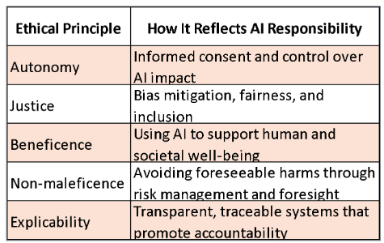
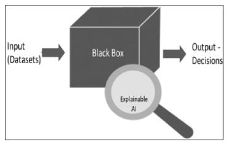
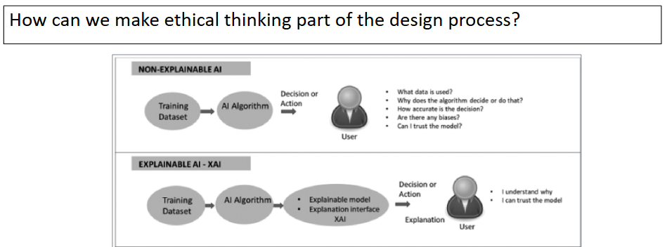

This section surveys the ethical foundations and cybersecurity dimensions of AI, moving from first principles — autonomy, justice, beneficence, non-maleficence, and explicability — to practical guardrails for responsible design. It introduces the CIA+A triad (confidentiality, integrity, accountability, and availability) and maps key risk areas: bias in data, labels, and algorithms; digital amplification and echo chambers; deepfakes; misuse in autonomous systems; AI-enabled fraud; and militarization. The discussion then turns to governance and transparency — explainable AI, zero-trust security, human-in-the-loop oversight, and continuous auditing across demographic groups. Finally, the section addresses scholarly practice: how to cite generative AI and how to verify and format sources, to protect credibility while deploying AI ethically at scale.

::: note
###### *Reference:*

Chapters 3 and 4 in *Ravindran, S., & Anton, F. (2022). Will AI Dictate the Future? Lessons from Successful Leaders and Managers from Around the World.*\
Marshall Cavendish International (Asia) Private Limited.\
Available via [ProQuest Ebook Central](https://ebookcentral.proquest.com/lib/cwm/detail.action?docID=29354182).
:::

## Ethics and Cybersecurity Issues with AI

The ethics of AI is a relatively new and fast-changing area, evolving alongside the technology itself. Ethics is sometimes viewed as too abstract for the practical concerns of data scientists and AI engineers — but this view is shortsighted. Technical design choices have ethical consequences, and organizations that ignore this tend to discover the hard way.

From a **technical perspective**, those who design AI systems must take steps to avoid potential harms, embed safeguards into the system architecture, and deploy contingency measures to mitigate bias and unintended outputs.

From an **organizational perspective**, robust procedures, guidelines, and governance frameworks are required to ensure that AI is used responsibly, consistently, and in alignment with stated values.

These tensions raise fundamental questions that anchor this section:

-   Who is responsible when AI makes a harmful decision — the engineer, the manager, the company, or the algorithm?
-   Who defines "good" use, and by whose standards?
-   How much control should platform owners have over how their technologies are used?

### Core Principles of Ethical AI

Five principles form the ethical foundation for responsible AI design and deployment. These are widely cited across industry frameworks (EU AI Act, IEEE, NIST) and provide a shared vocabulary for discussing AI ethics:

-   [**Autonomy**]{style="background-color: yellow;"} — individuals have the right to make informed, uncoerced decisions about how AI systems affect them. This includes meaningful consent, clear opt-out options, and respect for personal agency. *Example: a credit scoring system should explain to applicants why they were denied.*
-   [**Justice**]{style="background-color: yellow;"} — AI systems must treat all individuals equitably. This means actively identifying and mitigating bias, and ensuring fair access across demographic groups. *Example: a hiring algorithm must be tested to confirm it does not systematically disadvantage any protected group.*
-   [**Beneficence**]{style="background-color: yellow;"} — AI should actively enhance human well-being. *Example: a medical AI that helps physicians detect cancer earlier than unaided review.*
-   [**Non-maleficence**]{style="background-color: yellow;"} — designers have a duty to prevent harm — discriminatory outcomes, misuse of personal data, or unintended consequences of automation. *Example: a content recommendation system should not amplify extremist content even if engagement metrics reward it.*
-   [**Explicability**]{style="background-color: yellow;"} — AI systems must be transparent and understandable to users, regulators, and affected stakeholders. This includes explaining both *what* the system decided and *why*. *Example: a loan decision algorithm should be able to state which factors drove the outcome.*

### Responsibility in AI

Responsibility in AI development involves designing, deploying, and governing AI in ways that uphold human rights, dignity, and societal values. It is not sufficient to build a system that works — it must work *fairly*, be *explainable*, and have clear *accountability* structures so that when something goes wrong, there is a traceable path to a responsible party.

### Cybersecurity Ethics: The CIA+A Triad

The CIA+A triad provides a framework for designing systems that are both technically secure and ethically responsible. Each pillar represents both a technical requirement and an ethical obligation:

1. [**C**]{style="background-color: yellow;"}**onfidentiality** — sensitive data must be protected from unauthorized access. Only authorized parties should be able to view it. *Ethical dimension: respecting individuals' right to privacy.*
2. [**I**]{style="background-color: yellow;"}**ntegrity** — data and systems must be accurate, consistent, and protected from unauthorized tampering. *Ethical dimension: ensuring that decisions are based on truthful information.*
3. [**A**]{style="background-color: yellow;"}**ccountability** — actions must be traceable back to the individual or system responsible. *Ethical dimension: enabling consequences for misconduct and trust in the system.*
4. [**A**]{style="background-color: yellow;"}**vailability** — systems must be resilient, redundant, and responsive so that users can access the data and tools they need. *Ethical dimension: ensuring equitable access, particularly for critical services like healthcare or emergency response.*

### Cybersecurity as an Ethical Issue

AI systems depend on massive datasets, making them prime targets for attack. A breach is not just a technical failure — it is an ethical one. Organizations bear three core ethical duties around data security:

1. **Prevent breaches** through strong access controls, encryption, and security architecture.
2. **Disclose quickly** when breaches occur — delayed disclosure compounds the harm to affected individuals.
3. **Protect user trust** by treating security as a fundamental responsibility, not an afterthought.

The Equifax breach (2017) is a widely cited cautionary case: the personal data of 147 million people was exposed through a known, unpatched vulnerability. Worse, several executives sold stock before public disclosure was made — compounding the technical failure with a failure of accountability and ethics.

### Challenges in AI Ethics

Five challenge areas recur across AI deployments in organizations:

-   [**Amplification**]{style="background-color: yellow;"} — recommendation algorithms optimize for engagement, not truth. Harmful content spreads faster and further than accurate content because it provokes stronger reactions.
-   [**Bias**]{style="background-color: yellow;"} — bias enters AI systems through the data, the labeling process, the algorithm design, and the human judgments made throughout. Each layer introduces its own risk.
-   [**Security**]{style="background-color: yellow;"} — AI systems introduce new attack surfaces: data poisoning, adversarial inputs, model theft, and inference attacks on private training data.
-   [**Control**]{style="background-color: yellow;"} — platforms often cannot fully govern how their technologies are used once released to third parties at scale.
-   [**Inequality**]{style="background-color: yellow;"} — AI-driven automation and personalization can widen existing socioeconomic gaps if the benefits disproportionately accrue to those already advantaged.

### Digital Amplification and Echo Chambers

Recommendation algorithms optimize for **clicks and engagement** — not accuracy, well-being, or social cohesion. This creates a structural incentive to surface content that provokes strong emotional reactions, which tends to be divisive, sensationalized, or false.

The **echo chamber effect** describes what happens downstream: individuals are increasingly served content that confirms their existing views. They dismiss opposing perspectives, engage primarily with communities that reinforce their biases, and over time develop a distorted picture of what most people believe. This dynamic has been documented in political radicalization, vaccine hesitancy, and financial misinformation.

The scale of the problem is unprecedented. Algorithms operating at the scale of Facebook, YouTube, or TikTok can deliver tailored harmful messages to hundreds of millions of people simultaneously — faster than any human moderation team can respond.

### Data and Labeling Bias

**Data bias** occurs when the training data used for an AI model is unrepresentative, incomplete, or skewed — producing unfair or inaccurate outcomes even when the algorithm itself is technically correct. Two primary forms:

-   *Representation bias* — certain groups or features are over- or under-represented in the dataset. *Example: a facial recognition system trained predominantly on lighter-skinned faces performs poorly on darker-skinned individuals.*
-   *Measurement bias* — the way features or outcomes are recorded is itself flawed. *Example: using arrest records as a proxy for criminal behavior, when arrest rates reflect policing patterns, not actual crime rates.*

**Labeling bias** arises from how data is annotated, not what data is collected. It is common in crowd-sourced and expert-tagged datasets. A labeler who sees an image of a man and a woman in an office may tag them "boss and assistant" based on unconscious gender stereotypes rather than actual context. When millions of such labels are used to train a model, the model learns to replicate the same stereotypes at scale.

### Algorithm and Human Bias

**Algorithm bias** refers to systematic errors caused by flaws in how the model is constructed, optimized, or evaluated — errors that occur even with high-quality, unbiased data. *Example: a hiring algorithm trained to identify "successful" employees by mimicking historical promotions will perpetuate whatever biases existed in those past promotion decisions, regardless of data quality.*

**Human or cognitive bias** enters through the choices made by developers, data labelers, and end users. Choices about which features to include, how to define the target variable, which metrics to optimize, and how to interpret results are all value-laden decisions that can introduce systematic distortion. AI does not eliminate human judgment — it encodes it.

## Security: Abuse and Misuse of AI

### Deepfakes

A **deepfake** is synthetic media — typically video, audio, or images — created using AI (particularly deep learning techniques such as generative adversarial networks) to manipulate or fabricate content so realistically that it appears authentic. Common techniques include face-swapping, voice cloning, and full-body synthesis.

The threat is not hypothetical. Documented real-world examples include:

-   **Entertainment face swaps** — Jim Carrey's face digitally inserted into *The Shining* and the viral Tom Cruise TikTok deepfakes are widely cited examples. Many such creations are made without the subject's consent, raising serious questions about dignity and intellectual property.
-   **Political disinformation** — a [deepfake of Ukrainian President Volodymyr Zelenskyy](https://www.euronews.com/my-europe/2022/03/16/deepfake-zelenskyy-surrender-video-is-the-first-intentionally-used-in-ukraine-war?) in 2022 falsely depicted him calling for military surrender — one of the first confirmed uses of a deepfake as a weapon in an active conflict.
-   **Synthetic audio of public figures** — Buzzfeed and director Jordan Peele created a deepfake video of Barack Obama to demonstrate how convincingly the technology could fabricate statements a real person never made.
-   **[Financial fraud](https://www.ic3.gov/PSA/2024/PSA241203)** — criminals used AI-cloned audio to impersonate the CEO of a German company, convincing a UK CFO to transfer €220,000 to a fraudulent account. Voice-cloning fraud has since become a common attack vector targeting finance teams.

### Misuse of AI in Autonomous Vehicles

Autonomous vehicles (AVs) concentrate several AI ethics challenges in a single, high-stakes context. Key unresolved questions:

-   When an AV must choose between hitting a pedestrian or crashing into a barrier, who bears moral and legal responsibility — the AI system, the manufacturer, the software engineer, or the vehicle operator?
-   Cybercriminals could remotely hijack or disable AVs to create public safety threats or demand ransoms. What safeguards prevent this?

Real-world incidents that have shaped the regulatory conversation:

-   **[Tesla Autopilot misuse](https://www.wired.com/story/safety-board-faults-tesla-regulators-fatal-2018-crash/)** — drivers filmed sleeping or using their phones while Autopilot was engaged, despite clear warnings that the system requires hands on the wheel at all times. Several incidents resulted in crashes and fatalities; the NTSB found fault with both Tesla and regulators.
-   **[Uber AV fatality (2018)](https://etsc.eu/inadequate-safety-culture-contributed-to-fatal-uber-automated-test-vehicle-crash/)** — a pedestrian was killed when Uber's test vehicle failed to correctly classify her as a person in the road. The backup safety driver was watching a video at the time. The incident raised fundamental questions about whether the technology was ready for public road testing.
-   **[Phantom braking](https://spectrum.ieee.org/self-driving-cars-2662494269)** — multiple self-driving systems have been documented braking unexpectedly for non-existent obstacles, creating rear-end collision risks for following vehicles.

### Lack of Control: Regulatory and Design Issues with Autonomous Vehicles

Governance of AVs remains fragmented. AV companies vary widely in how they test vehicles and report safety incidents — there is no universal standard, leaving consumers exposed to uneven protections.

Fundamental ethical dilemmas remain unresolved: the "trolley problem" — choosing between saving a passenger versus pedestrians — has no universally agreed answer in philosophy, let alone in AI code. These gaps raise a pointed question: **what decisions are programmers effectively making on behalf of society, and who holds them accountable for those choices?**

### Control: Platforms Enabling Harmful Use

Platform owners such as Meta, Google, and TikTok bear ethical responsibility for how their technologies are used — yet preventing misuse at scale is genuinely difficult. Two structural challenges dominate: the **absence of robust governance mechanisms** over third-party use, and the **practical impossibility of reviewing every interaction** at the scale these platforms operate.

Notable cases that illustrate the problem:

-   The **[Cambridge Analytica scandal](https://www.nytimes.com/2018/04/04/us/politics/cambridge-analytica-scandal-fallout.html)** — a third-party app harvested the data of 87 million Facebook users without their knowledge and used it for targeted political advertising. Facebook's platform architecture made this possible.
-   The **[Google+ 2018 API breach](https://www.forbes.com/sites/kateoflahertyuk/2018/10/09/google-plus-breach-what-happened-who-was-impacted-and-how-to-delete-your-account/)** — a bug exposed user data to third-party developers; Google delayed disclosure for months.
-   The **[Christchurch attack](https://ctc.westpoint.edu/christchurch-attacks-livestream-terror-viral-video-age/)** — Facebook's platform was used to livestream the massacre in real time; copies spread across the internet faster than platforms could remove them.
-   **[Russian bot-driven election interference](https://www.npr.org/2024/09/04/nx-s1-5100329/us-russia-election-interference-bots-2024)** — coordinated inauthentic behavior campaigns used platform infrastructure to spread political disinformation at scale.

These cases collectively demonstrate that **scale amplifies harm**: the same openness and network effects that make platforms valuable also make them difficult to police.

### AI vs. AI: The Cybersecurity Arms Race

AI has created a new dynamic in cybersecurity: it simultaneously strengthens defenses and enables more sophisticated attacks. Cybercriminals use AI to automate phishing at scale, generate convincing synthetic identities, and run brute-force attacks more efficiently. The only scalable counter is AI-enabled defense — models that learn from evolving attack patterns and adapt in real time without requiring a human analyst to review every alert.

Two emerging threats deserve particular attention:

-   **Data poisoning** — an attacker feeds manipulated or false data into a machine learning model's training pipeline, corrupting its predictions in a targeted, hard-to-detect way. *Example: a spam filter that is gradually trained to classify real spam as legitimate.*
-   **Model theft and inversion** — training data and model weights are valuable intellectual property and can contain sensitive information about individuals. Encryption, strict access controls, and data versioning (to roll back compromised models) are essential safeguards.

### AI-Driven Fraud

AI enables fraudsters to operate faster, at greater scale, and more covertly than was previously possible. Key attack vectors include:

-   **Phishing** — AI generates personalized, grammatically correct phishing messages tailored to each target using data scraped from social media and corporate websites.
-   **Synthetic identity fraud** — AI creates entirely fictitious identities by combining real and fabricated personal data, bypassing traditional identity verification systems.
-   **Account takeovers** — AI tools mimic legitimate user behavior to defeat behavioral security controls that flag unusual login patterns.

The scale of the damage is substantial: [Visa alone prevented 80 million fraudulent transactions worth $40 billion in 2023](https://www.reuters.com/technology/cybersecurity/visa-prevented-40-bln-worth-fraudulent-transactions-2023-official-2024-07-23/).

### Intelligent Warfare

AI is transforming modern conflict through autonomous drones, real-time targeting systems, satellite surveillance, and precision munitions capable of operating without direct human control. The rapid **militarization of AI** raises concerns that extend beyond battlefield ethics:

-   **Untraceable cyberattacks** — AI-enabled offensive cyber tools can operate at machine speed, making attribution difficult and escalation harder to contain.
-   **Satellite vulnerability** — space-based infrastructure supporting GPS, communications, and surveillance is increasingly a target.
-   **Dual-use risk** — AI tools designed for legitimate research (including in chemistry and biology) lower the barrier to developing dangerous weapons.

## AI Governance

### Making the Black Box Transparent

One of the most persistent challenges in deploying AI responsibly is that many high-performing models — especially deep learning systems — are effectively **black boxes**: they produce outputs without providing human-understandable explanations of how they arrived at those outputs. This opacity creates accountability gaps, erodes trust, and makes it difficult to identify and correct bias.

### Explainable AI

**Explainable AI (XAI)**, sometimes called Interpretable AI, refers to methods and techniques that allow humans to understand how an AI system arrived at a given output. XAI is not one technique — it is a family of approaches (SHAP values, LIME, decision trees, attention maps) applied depending on the model type and the audience.

Four properties define effective explainability:

-   [**Explanation**]{style="background-color: yellow;"} — systems should provide evidence or reasoning for every output, not just a final answer.
-   [**Meaningfulness**]{style="background-color: yellow;"} — explanations must be understandable to the intended user, not just to engineers. An explanation that requires a PhD to interpret fails this criterion.
-   [**Accuracy**]{style="background-color: yellow;"} — the explanation must faithfully describe the system's actual decision process, not a simplified post-hoc rationalization.
-   [**Knowledge limits**]{style="background-color: yellow;"} — the system should clearly communicate when it is operating outside the conditions it was designed for, rather than generating low-confidence outputs that look as authoritative as high-confidence ones.

### Security That Thinks

AI security refers to using AI to autonomously identify malicious behavior and respond to threats based on learned patterns — going beyond rule-based systems that can only detect known attack signatures.

Three capabilities define modern AI-powered security:

-   [**Real-time anomaly detection**]{style="background-color: yellow;"} — by analyzing vast volumes of event data in real time, AI identifies deviations from normal behavior that may indicate an attack in progress, even if the specific attack pattern has never been seen before.
-   [**Zero-trust architecture**]{style="background-color: yellow;"} — rather than trusting users inside the network perimeter, zero-trust verifies every request continuously. AI enhances this by incorporating behavioral signals — device ID, location, typing patterns, facial recognition — into multifactor authentication.
-   [**Explainability for human analysts**]{style="background-color: yellow;"} — security analysts must be able to understand and trust automated threat-detection decisions. Explainable AI enables this, preventing alert fatigue from "black box" detections that analysts cannot evaluate or act on confidently.

### Designing Ethical, Human-Centered AI Systems

Building ethical AI is not a compliance checkbox — it requires deliberate design choices at every stage of development and deployment:

-   [**Involve diverse stakeholders early**]{style="background-color: yellow;"} — diverse teams with different lived experiences identify potential harms, edge cases, and unintended consequences that homogeneous teams miss. The cost of finding a problem before deployment is a fraction of the cost of fixing it afterward.
-   [**Use interpretable models when stakes are high**]{style="background-color: yellow;"} — in healthcare, criminal justice, financial lending, and employment decisions, the ability to explain a decision is not just nice to have — it is a legal and ethical requirement in many jurisdictions. Decision trees, logistic regression, and SHAP-based explanations for more complex models are practical starting points.
-   [**Maintain human-in-the-loop oversight**]{style="background-color: yellow;"} — for high-stakes or ambiguous decisions, a human should review and authorize the AI's recommendation before it is acted upon. Automation should augment judgment, not replace it.
-   [**Regularly audit for unintended harms**]{style="background-color: yellow;"} — models that perform well overall may perform poorly for specific demographic subgroups. Post-deployment monitoring across subgroups, combined with regular retraining, is essential for sustained ethical performance.

## Citing AI and Verifying Sources

### Citing ChatGPT in APA Style

Generative AI tools like ChatGPT are increasingly used in research and writing workflows, which creates new citation obligations. The general principles are:

-   **If you directly use ChatGPT's text**, cite it as a source — just as you would cite a book or article you quoted or paraphrased.
-   **If ChatGPT suggests a citation**, do not use it without verification. LLMs hallucinate plausible-sounding references that do not exist. Always locate the original source independently, confirm its details, and cite the verified source.
-   **If you cannot verify a source**, do not include it in your work.

To cite ChatGPT directly in APA format:

-   **Reference list entry:** OpenAI. (2025). *ChatGPT* \[Large language model\]. https://chat.openai.com/
-   **In-text citation:** The analysis suggested that "machine learning models require clean training data" (OpenAI, 2025).

Key principle: **your credibility depends on the accuracy of your sources.** A hallucinated citation that passes through unchecked damages your work and, if published, contributes to misinformation.

### Trimming a URL for APA Style

APA treats AI software similarly to other software tools (statistical packages, specialized programs) in the reference list. APA recommends the **shortest retrievable URL** — tracking parameters and session codes should be removed.

For example:

- **Before:** `https://www.journal.com/article/12345?utm_source=chat-gpt&session=abc`
- **After:** `https://www.journal.com/article/12345`

Before trimming, always test the shortened URL in a browser to confirm it still resolves correctly. If the full tagged URL is the only one that works (rare), keep it but note the unusual format.
