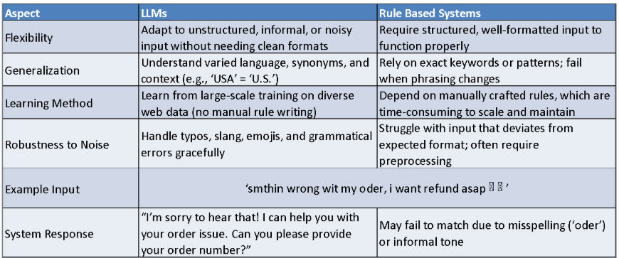
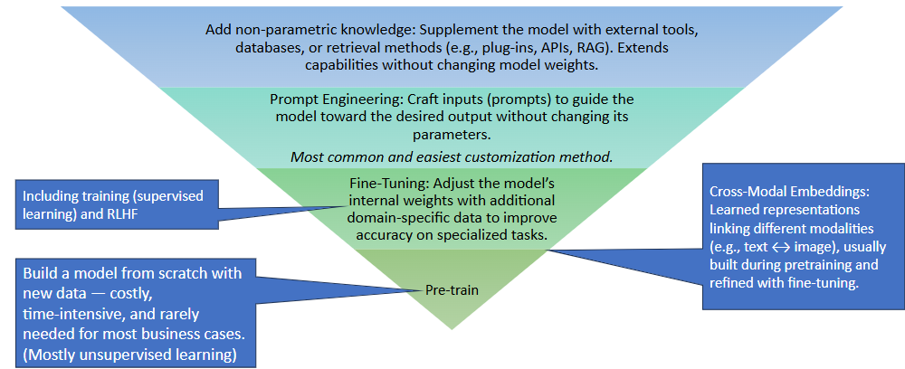
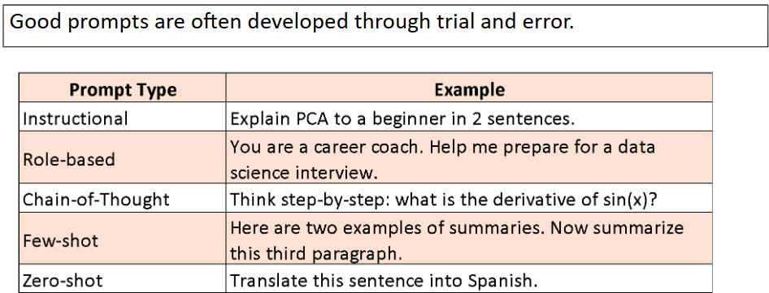
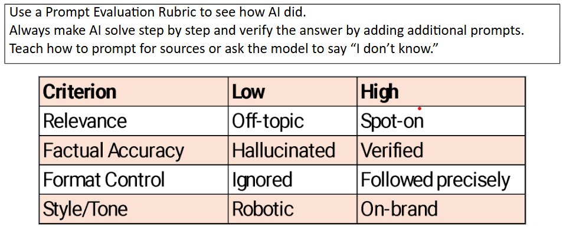

This section introduces multimodal generative AI — systems that create and reason across text, images, audio, and video — and situates them within the broader evolution from language models (LMs) to large language models (LLMs) and multimodal LLMs (MLLMs). It explains how advances in transformer architectures, GPUs, and training methods (pretraining, fine-tuning, RLHF, and cross-modal embeddings) enable cross-modal understanding and generation, while prompt engineering turns these capabilities into reliable workflows. The section also surveys high-impact applications (automation, personalization, retrieval, and decision support), highlights key risks (hallucination, bias, and transparency), and outlines practical guardrails — evaluation rubrics, prompt engineering, and governance — for responsible deployment.

::: note
###### *Reference:*

Chapters 1 and 3 of *Multimodal Generative AI* present an overview of the foundations, architectures, and ethical considerations of multimodal generative systems, and examine how emerging multimodal large language models extend these capabilities with advanced cross-modal reasoning and generation — while addressing challenges in complexity, data integration, and responsible deployment.
:::

## Generative AI

**Generative AI** refers to a category of AI that creates new content — text, audio, images, video, and code — based on patterns learned from training data. It contrasts with **predictive AI**, which forecasts outcomes from historical data without creating new content.

| Type          | Goal               | Example                        |
|---------------|--------------------|--------------------------------|
| Generative AI | Create new content | ChatGPT, DALL·E, Copilot       |
| Predictive AI | Forecast outcomes  | Churn models, demand forecasts |

Notable generative AI tools include **ChatGPT** (conversational text generation), **Codex and GitHub Copilot** (code generation and completion), **DALL·E** (image generation from text prompts), and **Perplexity AI** (conversational search combined with generative synthesis).

## From Language Models to Large Language Models

Generative AI is the broad field encompassing AI systems that create new content across modalities. Within that field, **language models (LMs)** are a core branch focused on predicting and generating text. An LM estimates the likelihood of words or phrases in a sequence, enabling it to generate text, complete sentences, and suggest ideas based on context. For example, given the prompt "The stock market is…," a language model predicts plausible continuations.

A **large language model (LLM)** is a scaled-up language model trained on massive datasets with billions of parameters. This scale enables advanced capabilities in reasoning, summarization, translation, and dialogue. LLMs — such as GPT-3 and GPT-4 — use deep learning, particularly transformer architectures, to understand complex patterns across large text corpora and generate human-like responses across a wide variety of tasks.

::: note
The jump from LM to LLM is not just a size increase — it is a capability threshold. Researchers have observed that certain abilities (multi-step reasoning, in-context learning) only emerge reliably above a certain parameter count, a phenomenon called **emergent behavior**.
:::

## Multimodal Large Language Models (MLLMs)

A **Multimodal Large Language Model (MLLM)** is a specialized LLM that can process and produce more than just text — it works across images, audio, and video as well. MLLMs are capable of tasks like describing images, interpreting memes, or generating website code from a visual mockup.

These emergent capabilities are rarely seen in conventional single-modality models and are widely viewed as steps toward **Artificial General Intelligence (AGI)** — the hypothetical point at which an AI system can perform any intellectual task a human can. Researchers across academia and industry are rapidly developing MLLMs that aim to match or surpass models like GPT-4V.

## Why It Matters Now

The recent explosion of LLMs and MLLMs — including GPT-4, Gemini, and Claude — reflects a convergence of content generation and automated decision-making across business, healthcare, security, and creative work. AI carries transformational potential: it automates workflows and enhances productivity at scale. At the same time, it introduces new risks around bias, explainability, and control that organizations must actively manage.

## AI Evolution

The history of AI stretches from Pascal's mechanical calculator (1642) and Ada Lovelace's foundational work on analytical engines (1837) to the modern era. These early inventions established the basis for automated computation and logic. Progress accelerated through neural networks, statistical machine learning, and deep learning — each step enabled by advances in hardware, particularly GPUs, which made training large, complex models feasible.

Today, generative AI breakthroughs — including GPT-4, DALL·E 2, and GitHub Copilot — have redefined content creation and automation, with applications spanning IT helpdesks, creative arts, medical guidance, and beyond. The economic stakes are significant: generative AI is projected to increase global GDP by 7% while potentially displacing up to 300 million knowledge worker roles.

## How Generative AI Works

### Game Theory and Generative Adversarial Networks

Game theory inspires generative AI by modeling competition, cooperation, and strategic decision-making — core elements in adversarial training, multi-agent learning, and safe interactive AI design.

The clearest example is the **Generative Adversarial Network (GAN)**, in which two neural networks compete:

-   The **generator** tries to create realistic synthetic data (e.g., a fake photograph).
-   The **discriminator** tries to distinguish that synthetic data from real examples.

This mirrors a non-cooperative game in which both players improve iteratively through feedback. Equilibrium is reached when the generator fools the discriminator perfectly — at which point the synthetic output is indistinguishable from real data.

### The Data-Driven Workflow

Generative AI development follows a data-driven pipeline. The process begins with diverse datasets — text, images, audio, and more — from which the model iteratively learns patterns during training. **Fine-tuning** then adapts the pretrained foundation model to a specific task or domain using additional labeled data, improving relevance and reliability for industry-specific applications.

After training and fine-tuning, the model enters **inference** — the stage at which it generates outputs (such as answering a question or completing a sentence) in response to new inputs. These outputs can power applications, APIs, and digital platforms.

### Early AI and the Rise of Chatbots

The earliest chatbots (1960s) were rule-based systems relying on predefined keyword responses from expert knowledge bases — ELIZA being the canonical example. These systems were neither scalable nor flexible, failing in open-ended or dynamic conversations.

The rise of statistical AI in the 1990s introduced machine learning for pattern recognition from labeled text, enabling more adaptive and context-aware text classification. Neural network breakthroughs in the 2010s — particularly deep learning and Recurrent Neural Networks (RNNs) — significantly enhanced language understanding and contextual awareness at the sentence level.

The pivotal shift came around 2017 with the introduction of the **transformer architecture**: a neural network design that processes sequences using attention mechanisms, enabling context-aware and parallelized language generation. Two foundational concepts underpin transformers:

-   [**Tokenization**]{style="background-color: yellow;"} — the process of breaking text into tokens (subwords or characters) that serve as inputs for the model. For example, the word "unbelievable" might be split into `["un", "believ", "able"]`.
-   [**Attention mechanisms**]{style="background-color: yellow;"} — allow the model to assign different weights to different parts of an input when generating outputs, focusing on the most relevant context regardless of position. This is what allows a model to understand that "bank" means something different in "river bank" vs. "savings bank."

These advances powered tools like ChatGPT and Bing Chat (from 2020), capable of multi-turn conversations and creative output.

### The Importance of GPU Innovation

A **GPU (Graphics Processing Unit)** is a specialized processor originally designed to accelerate image and video rendering. Unlike a CPU, which handles a wide variety of general tasks sequentially, a GPU is optimized for performing massive numbers of mathematical operations — especially vector and matrix calculations — in parallel.

This parallel processing capability is exactly what neural network training requires: at each training step, millions of floating-point operations must be performed across the model's parameters simultaneously. GPUs make this tractable in hours rather than years.

GPU advancements have been central to the rise of LLMs like GPT-4, enabling faster training at lower cost. Efficient GPU-based architectures now allow even smaller models to run on mobile devices (such as Google's PaLM 2). More broadly, cheaper and more powerful chips have democratized AI: a wider range of organizations — not just large technology companies — can now build, fine-tune, and deploy models, encouraging open-source participation and innovation at scale.

### Open-Source Generative AI: GenOS

The **Generative Open-Source Index (GenOS)** is a comprehensive tracker that ranks and evaluates open-source generative AI projects across modalities and applications. It helps developers, researchers, and organizations discover, compare, and leverage leading open-source tools, encouraging transparency, collaboration, and accessibility in the GenAI ecosystem. Projects are evaluated on GitHub popularity (stars, forks, and issues), recency of updates, community contributions, and technical features.

GPUs alone do not create value — they require systems to organize, orchestrate, and scale AI capabilities across applications. A **Generative AI Operating System (GenOS)** provides exactly this: a layer that manages foundation models, prompt engineering, data pipelines, safety mechanisms, and deployment. If GPUs are the engines, GenOS is the driver's dashboard — turning raw compute into usable, business-ready intelligence.

## How Generative AI Works Lab

**1.** What is the fundamental difference between generative AI and predictive AI? Give one business example of each that a marketing team might use.

::: {.callout-note collapse="true"}
### Show Answer

**Predictive AI** forecasts outcomes from historical data without creating new content — for example, a churn model that scores each customer's probability of canceling a subscription within 30 days. **Generative AI** creates new content based on learned patterns — for example, a tool that drafts personalized email copy for each customer segment based on their purchase history and preferences. The marketing team uses the predictive model to decide *who* to target and the generative model to decide *what* to say to them.
:::

**2.** Explain how a Generative Adversarial Network (GAN) works using the generator-discriminator dynamic. Why does this adversarial setup produce more realistic outputs than a model trained without a critic?

::: {.callout-note collapse="true"}
### Show Answer

A GAN pits two networks against each other: the **generator** creates synthetic content (images, audio, data) trying to fool a **discriminator**, which is trained to tell real from fake. As the discriminator gets better at detecting fakes, the generator must improve to stay convincing — and vice versa. This arms-race dynamic forces the generator toward outputs that are statistically indistinguishable from real data, far beyond what a model simply trained to minimize reconstruction error would achieve. The key insight from game theory is that competition drives quality: neither network can stop improving as long as the other is getting better.
:::

**3.** What role did GPU innovation play in enabling the current generation of large language models? Why could the same transformer architectures not have been trained on CPUs alone?

::: {.callout-note collapse="true"}
### Show Answer

Training a large language model requires performing billions of matrix multiplications simultaneously — the core arithmetic of neural network forward and backward passes. CPUs are optimized for sequential tasks with complex control logic; they have a small number of powerful cores. **GPUs** have thousands of smaller, simpler cores designed for massive parallelism, making them orders of magnitude faster at the specific type of floating-point arithmetic that neural network training requires. Without GPUs (and later specialized chips like TPUs and H100s), training a model like GPT-3 — which required roughly 3.14 × 10²³ floating-point operations — would have taken decades on CPU clusters rather than weeks.
:::

## Training Methodologies for LLMs

### Data Collection and Pretraining

Training begins with collecting massive, diverse, high-quality datasets from sources like web text, books, code, and forums. The model then undergoes **pretraining** via unsupervised learning — using objectives such as next-word prediction (causal language modeling, as in GPT) or masked word prediction (as in BERT) — to develop broad language understanding.

In **masked word prediction**, certain words are hidden and the model learns to recover them from context:

-   Input: "The cat sat on the `[MASK]`."
-   The model learns to predict: "mat"

This forces the model to develop deep contextual understanding rather than simply memorizing sequences.

### Fine-Tuning (Supervised Training)

After pretraining on broad general data, **fine-tuning** specializes the model by training on smaller, labeled datasets aligned to specific tasks such as summarization, question answering, translation, or sentiment analysis.

Fine-tuning uses supervised learning — providing input–output pairs (e.g., an article paired with its summary) — and adjusts the pretrained model's weights slightly rather than retraining from scratch. The key benefit: the model already understands language; fine-tuning teaches it to apply that understanding to a specific job.

Variants include:

-   **Full fine-tuning** — all parameters are updated (expensive but thorough).
-   **Parameter-efficient fine-tuning** (e.g., LoRA or adapters) — only a small fraction of parameters change (faster and cheaper; widely used in practice).

### Reinforcement Learning with Human Feedback (RLHF)

**RLHF** is a specialized fine-tuning methodology applied after pretraining (and often after supervised fine-tuning). Human evaluators rate model outputs, rewarding helpful, safe, and aligned responses while discouraging toxic, incoherent, or misleading ones. This feedback loop shapes the model to be more aligned with human values and conversational needs — not merely good at predicting the next token.

RLHF is the technique behind assistant models like GPT-3.5-turbo and ChatGPT. Without RLHF, a base model trained only on internet text would also learn to reproduce harmful, biased, or incoherent content at the same rate it appeared in training data.

### Cross-Modal Embeddings

**Cross-modal embeddings** are representations in a shared vector space that connect different modalities — text, images, audio, and video — by their semantic meaning. An image of a dog and the word "dog" are mapped close to each other in this space, even though one is pixels and the other is text.

This enables powerful applications:

-   Search for images using text queries ("golden retriever playing frisbee").
-   Generate captions from images automatically.
-   Cross-lingual video search (find a video in English using a French query).
-   Multimodal reasoning (answer questions about an image using natural language).

### LLMs vs. Rule-Based Systems

A key question in deploying LLMs is how they handle unstructured, messy web data differently than traditional rule-based systems.



## Training Methodologies Lab

**1.** What is the difference between pretraining and fine-tuning? Why does a base pretrained model require fine-tuning before it is safe and useful as a conversational assistant?

::: {.callout-note collapse="true"}
### Show Answer

**Pretraining** trains the model on massive, diverse text corpora using self-supervised objectives (next-word or masked-word prediction) — it builds broad language understanding but has no instruction-following behavior and will reproduce whatever patterns exist in training data, including harmful content. **Fine-tuning** then adapts the pretrained model to a specific task or behavior using a smaller labeled dataset. Without fine-tuning, a base model asked "How do I make my team more productive?" might respond with a continuation of whatever text pattern follows that phrase in training data — not a helpful answer. Fine-tuning (especially with RLHF) shapes the model to respond helpfully, safely, and in a conversational register appropriate for an assistant.
:::

**2.** Why is RLHF described as a "fine-tuning methodology" rather than a training methodology? What specific problem does it solve that supervised fine-tuning alone cannot?

::: {.callout-note collapse="true"}
### Show Answer

RLHF is applied *after* pretraining (and often after initial supervised fine-tuning) — it is a refinement step, not the primary training. The specific problem it solves is **alignment**: supervised fine-tuning teaches the model to produce correct outputs on labeled examples, but it cannot capture subtle human preferences about tone, safety, helpfulness, and appropriate refusals. RLHF uses human raters who compare model outputs and indicate which is better, generating a reward signal that steers the model toward responses humans actually prefer — even on prompts not represented in the supervised training set. Without RLHF, a base model trained only on internet text would also learn to reproduce harmful, biased, or incoherent content at the same rate it appeared in training data.
:::

**3.** Cross-modal embeddings place images, text, and audio in a shared vector space. Explain how this enables a use case like "search for images using a text query" — what is actually happening mathematically?

::: {.callout-note collapse="true"}
### Show Answer

Cross-modal embeddings are learned representations where semantically related content from different modalities is mapped to nearby points in a high-dimensional vector space, regardless of format. A model like CLIP is trained on millions of (image, caption) pairs — learning to produce similar embeddings for matching pairs and dissimilar embeddings for non-matching pairs. When a user searches "golden retriever playing frisbee," the text query is encoded into a vector, and the system finds the images whose embeddings are closest (smallest cosine distance) to that query vector. The model is not pattern-matching pixels to words — it has learned a shared semantic geometry where meaning, not format, determines proximity.
:::

## Prompting and Prompt Engineering

::: note
For additional information, review the O'Reilly Video on Prompt Engineering: <https://learning.oreilly.com/videos/prompt-engineering/9781835881521/9781835881521-video1_1/>
:::

### RLHF vs. Prompt Engineering

RLHF and prompt engineering operate at different layers of the AI stack:

-   **RLHF** is part of model training — it shapes how a model responds by making it more instruction-following and aligned with human intent. It happens before the model is deployed.
-   **Prompt engineering** is how users leverage that alignment in real-world queries, after the model has already been trained.

Using a driving analogy: RLHF tunes the car's steering system so it follows directions well; prompt engineering is how the driver actually steers with the wheel.



### Prompt Engineering

**Prompt engineering** is the art and science of crafting inputs to elicit desired outputs from AI systems. A well-crafted prompt can function like a program for an LLM — guiding it to generate structured outputs, perform multi-step reasoning, or simulate a specific role.

The core principle is **"garbage in, garbage out"**: the quality of the prompt directly determines the reliability, tone, and relevance of the model's response. A vague prompt produces a vague answer; a specific, well-structured prompt produces a specific, useful answer.

## The Prompting Paradigm

The **prompting paradigm** refers to the method of adapting LLMs through natural language instructions rather than retraining. This is a fundamentally new way of programming:

-   **Base models** (such as GPT-3 or LLaMA-2), pretrained on massive text corpora, can perform a wide variety of tasks from prompting alone — no fine-tuning required.
-   **Assistant models** (such as ChatGPT or Claude) take this further: they are fine-tuned using RLHF, shaping the model to respond in a more conversational and task-specific way.

Better prompts consistently produce better outcomes across virtually every industry and use case.

### In-Context Learning

Prompting is foundational to **in-context learning**, where the model draws on examples provided directly in the prompt to infer new tasks dynamically — without any additional training. Two key strategies build on this:

-   [**Chain-of-thought prompting**]{style="background-color: yellow;"} — encourages the model to generate step-by-step reasoning before arriving at a conclusion. *Example: "Think through this step by step before answering: if a train travels at 60 mph for 2.5 hours..."* This significantly improves accuracy on logic, math, and multi-step reasoning tasks.
-   [**Few-shot in-context learning**]{style="background-color: yellow;"} — provides a small number of input–output examples directly in the prompt, enabling the model to infer the target pattern without retraining. *Example: providing three labeled sentiment examples before asking the model to classify a fourth.*

Prompting is increasingly used as an interface layer between users and LLMs, minimizing the need for expensive retraining while enabling flexible task execution.

### Prompt Types



### Prompt Engineering Iterations and Patterns


### Principles of Prompting


### Splitting Complex Tasks into Subtasks

One of the most effective prompting strategies is decomposing a complex request into a sequence of subtasks using a **meta prompt** — a system-level instruction that defines the AI's role and the steps it should follow.

**Meta prompt:**

> You are an AI assistant that explains prompting paradigms, specifically: instructional, role-based, chain-of-thought, few-shot, and zero-shot. Follow these steps: 1. Identify which prompting paradigm is relevant to the user's request. 2. Explain the purpose of that paradigm and how it improves responses. 3. Provide a short illustrative example showing the paradigm in action. 4. If asked, find a related article and summarize it concisely in 3–4 sentences.

**User:** Can you find an article about the chain-of-thought prompting paradigm and summarize it in 3 sentences with a reference link?

**Answer:** I found the article "Chain-of-Thought Prompting Elicits Reasoning in Large Language Models" by Google Research. The paper introduces chain-of-thought prompting as a method where models generate intermediate reasoning steps before producing a final answer, which greatly improves performance on arithmetic, commonsense, and symbolic reasoning tasks. It demonstrates that this method is especially powerful when combined with large models, as reasoning accuracy scales with model size.

**Reference:** Wei, J. et al. (2022). Chain-of-Thought Prompting Elicits Reasoning in Large Language Models. <https://arxiv.org/abs/2201.11903>

### Prompting the Model to Give an Explanation

This example shows how a **role-based meta prompt** shapes the model's output style — instructing it to always explain code, not just produce it.

**Meta prompt:**

> You are a Dash expert that helps users build interactive dashboards in Python. Extract the necessary context from the user's request and provide both natural-language explanations and code examples. Always explain what each part of the code is doing so the user understands how the app works. Note that `app.run_server` is deprecated — use `app.run` instead.

**User:** Can you make a dashboard that shows the top 3 countries by sales revenue in a bar chart?

**Answer:** Here's a simple Dash app that displays the top 3 countries by sales revenue in a bar chart. I first created a small pandas DataFrame with sample data for countries and sales revenue. Then I sorted it and selected the top 3 entries. Finally, I built a bar chart using Plotly Express and served it in a Dash layout. *(Code provided separately in the accompanying notebook.)*

### Asking for Justification

This example uses a **classification prompt with mandatory justification** — a pattern useful whenever you need traceable, evidence-based AI decisions rather than bare labels.

**Meta prompt:**

> You are an AI assistant that decides whether a passage demonstrates statistical reasoning. Classify the passage as one of: *Used statistical reasoning*, *No statistical reasoning*, or *Unclear*. Always provide a justification that identifies specific features in the passage supporting your decision. Cite the exact parts where sample size and treatment effect are stated.

**User:** *"In a randomized controlled trial with 240 participants, the treatment group's recovery rate was 12% higher than control (95% CI: 4%–20%, p = 0.01)."*

**Answer:**\
Decision: Used statistical reasoning.\
Justification: The passage references an experimental design ("randomized controlled trial"), a sample size ("240 participants"), a quantified treatment effect ("12% higher than control"), and inferential measures ("95% CI: 4%–20%, p = 0.01"). Together these confirm systematic use of statistics to draw conclusions.

### Continuing with an Unclear Example

**User:** *"The treatment group recovered more often than the control group."*

**Answer:**\
Decision: Unclear.\
Justification: The passage makes a comparative statement ("recovered more often") but provides no statistical details — neither sample size nor effect magnitude is given. Without these, it is impossible to confirm whether statistical reasoning was applied; the authors make only a descriptive claim rather than presenting inferential evidence.

## The Prompting Paradigm Lab

**1.** What is the difference between zero-shot, few-shot, and chain-of-thought prompting? For each, write a one-sentence example prompt that a business analyst might use to classify customer feedback as positive, negative, or neutral.

::: {.callout-note collapse="true"}
### Show Answer

**Zero-shot:** "Classify the following customer feedback as positive, negative, or neutral: 'The delivery was two days late and the packaging was damaged.'" — No examples provided; the model infers the task from the instruction alone.

**Few-shot:** "Classify each as positive, negative, or neutral. 'Great service, arrived early' → positive. 'Wrong item sent' → negative. 'Package arrived on time' → \_\_\_" — A small number of labeled examples precede the target, allowing the model to infer the pattern.

**Chain-of-thought:** "Classify the following as positive, negative, or neutral. Think step by step: first identify the key sentiment signals in the text, then determine whether the overall tone is favorable, unfavorable, or neither, then give your classification. Feedback: 'The product quality is fine but customer support never responded to my three emails.'" — The model is prompted to reason through intermediate steps before producing an answer, improving accuracy on ambiguous cases.
:::

**2.** The chapter introduces the meta prompt as a technique for splitting complex tasks into subtasks. Write a meta prompt that would instruct an LLM to act as a data quality auditor — reviewing a description of a dataset and identifying potential data bias issues.

::: {.callout-note collapse="true"}
### Show Answer

> You are an AI data quality auditor specializing in identifying bias risks in analytics datasets. When a user describes a dataset, follow these steps: 1. Identify the population the dataset is intended to represent. 2. Flag any groups that may be underrepresented or overrepresented based on the description. 3. Identify the data collection method and note any sources of selection, measurement, or labeling bias it may introduce. 4. For each bias identified, describe the likely effect on a model trained on this data. 5. Recommend one concrete remediation step for each bias identified.

This meta prompt assigns a role, defines a structured multi-step process, and ensures the output is actionable — not just descriptive.
:::

**3.** Explain the RLHF vs. prompt engineering distinction using the chapter's driving analogy. Then extend the analogy: what would "fine-tuning" correspond to in the same driving metaphor?

::: {.callout-note collapse="true"}
### Show Answer

The chapter's analogy: **RLHF** tunes the car's steering system so it follows directions well (happens before deployment, during training). **Prompt engineering** is how the driver actually steers with the wheel (happens at runtime, by the user). **Fine-tuning** would correspond to taking the car to a specialist mechanic who modifies the engine and transmission specifically for a new context — say, converting a highway sedan for off-road use. Like fine-tuning, this happens before the car is handed to the driver, requires access to the car's internals (the model weights), and produces a purpose-built variant better suited to a specific task than the general-purpose original.
:::

### Interactive Exercise
```{=html}
<div id="drag-drop-exercise" style="font-family: 'Georgia', serif; max-width: 860px; margin: 1.5rem 0; border: 1px solid #d1d5db; border-radius: 10px; overflow: hidden; box-shadow: 0 2px 8px rgba(0,0,0,0.07);">

  <!-- Header -->
  <div style="background: #1e3a5f; color: white; padding: 1rem 1.4rem;">
    <div style="font-size: 0.75rem; text-transform: uppercase; letter-spacing: 0.08em; opacity: 0.7; margin-bottom: 0.25rem;">Interactive Exercise</div>
    <div style="font-size: 1.05rem; font-weight: 600;">Evaluating the trade-offs of reasoning models</div>
  </div>

  <!-- Body -->
  <div style="padding: 1.2rem 1.4rem; background: #f9fafb;">
    <p style="margin: 0 0 1rem; font-size: 0.92rem; color: #374151; line-height: 1.6;">
      You decide to adopt a <strong>reasoning model</strong> for an application that requires traceability of AI-generated responses. As you implement it, you notice certain characteristics — some beneficial, some challenging in a production environment. Sort each item into the correct bucket.
    </p>

    <!-- Drop zone -->
    <div style="margin-bottom: 1.2rem;">
      <div style="font-size: 0.75rem; font-weight: 600; text-transform: uppercase; letter-spacing: 0.07em; color: #6b7280; margin-bottom: 0.5rem;">Drag items to sort:</div>
      <div id="source-zone"
        ondragover="event.preventDefault()"
        ondrop="dropToSource(event)"
        style="min-height: 64px; background: #1e3a5f; border-radius: 8px; padding: 0.75rem; display: flex; flex-wrap: wrap; gap: 0.5rem; align-items: flex-start;">
      </div>
    </div>

    <!-- Pros / Cons columns -->
    <div style="display: grid; grid-template-columns: 1fr 1fr; gap: 1rem;">

      <!-- Pros -->
      <div>
        <div style="font-size: 0.8rem; font-weight: 700; text-transform: uppercase; letter-spacing: 0.07em; color: #166534; margin-bottom: 0.5rem; display: flex; align-items: center; gap: 0.4rem;">
          <span style="display:inline-block; width:10px; height:10px; background:#16a34a; border-radius:50%;"></span> Pros
        </div>
        <div id="pros-zone"
          ondragover="event.preventDefault()"
          ondrop="dropTo(event, 'pros')"
          style="min-height: 120px; background: #f0fdf4; border: 2px dashed #86efac; border-radius: 8px; padding: 0.6rem; display: flex; flex-direction: column; gap: 0.5rem;">
          <div style="color:#86efac; font-size:0.8rem; text-align:center; margin: auto; pointer-events:none;" class="placeholder-text">Drop Pros here</div>
        </div>
      </div>

      <!-- Cons -->
      <div>
        <div style="font-size: 0.8rem; font-weight: 700; text-transform: uppercase; letter-spacing: 0.07em; color: #991b1b; margin-bottom: 0.5rem; display: flex; align-items: center; gap: 0.4rem;">
          <span style="display:inline-block; width:10px; height:10px; background:#dc2626; border-radius:50%;"></span> Cons
        </div>
        <div id="cons-zone"
          ondragover="event.preventDefault()"
          ondrop="dropTo(event, 'cons')"
          style="min-height: 120px; background: #fff1f2; border: 2px dashed #fca5a5; border-radius: 8px; padding: 0.6rem; display: flex; flex-direction: column; gap: 0.5rem;">
          <div style="color:#fca5a5; font-size:0.8rem; text-align:center; margin: auto; pointer-events:none;" class="placeholder-text">Drop Cons here</div>
        </div>
      </div>
    </div>

    <!-- Check / Reset buttons -->
    <div style="margin-top: 1rem; display: flex; gap: 0.6rem; flex-wrap: wrap;">
      <button onclick="checkAnswers()"
        style="background:#1e3a5f; color:white; border:none; padding: 0.45rem 1.1rem; border-radius:6px; font-size:0.85rem; cursor:pointer; font-family:inherit;">
        Check Answers
      </button>
      <button onclick="resetExercise()"
        style="background:white; color:#374151; border:1px solid #d1d5db; padding: 0.45rem 1.1rem; border-radius:6px; font-size:0.85rem; cursor:pointer; font-family:inherit;">
        Reset
      </button>
    </div>

    <!-- Feedback -->
    <div id="feedback" style="margin-top: 0.8rem; font-size: 0.88rem; display:none;"></div>
  </div>
</div>

<script>
const items = [
  { id: "i1", text: "Encourages more accurate responses through the Chain-of-Thought (CoT) process.", answer: "pros" },
  { id: "i2", text: "Provides a clear explanation that supports code transparency.", answer: "pros" },
  { id: "i3", text: "Useful when auditability of AI reasoning is a compliance or governance requirement.", answer: "pros" },
  { id: "i4", text: "Adds extra tokens due to reasoning, increasing overall cost.", answer: "cons" },
  { id: "i5", text: "Increases response time slightly, as the model generates additional reasoning tokens.", answer: "cons" },
  { id: "i6", text: "May be unnecessary overhead for simple, low-stakes tasks.", answer: "cons" },
];

// Shuffle helper
function shuffle(arr) {
  return arr.map(v => [Math.random(), v]).sort((a,b) => a[0]-b[0]).map(v => v[1]);
}

function makeTile(item) {
  const div = document.createElement("div");
  div.id = item.id;
  div.draggable = true;
  div.dataset.answer = item.answer;
  div.textContent = item.text;
  div.style.cssText = `
    background: white;
    border: 1px solid #d1d5db;
    border-radius: 6px;
    padding: 0.55rem 0.75rem;
    font-size: 0.83rem;
    line-height: 1.45;
    cursor: grab;
    color: #1f2937;
    box-shadow: 0 1px 3px rgba(0,0,0,0.08);
    user-select: none;
    transition: box-shadow 0.15s;
  `;
  div.addEventListener("dragstart", e => {
    e.dataTransfer.setData("text/plain", item.id);
    div.style.opacity = "0.5";
  });
  div.addEventListener("dragend", () => { div.style.opacity = "1"; });
  return div;
}

function clearPlaceholder(zone) {
  zone.querySelectorAll(".placeholder-text").forEach(el => el.remove());
}

function dropTo(event, target) {
  event.preventDefault();
  const id = event.dataTransfer.getData("text/plain");
  const tile = document.getElementById(id);
  if (!tile) return;
  const zone = document.getElementById(target + "-zone");
  clearPlaceholder(zone);
  zone.appendChild(tile);
  // reset any check coloring
  tile.style.border = "1px solid #d1d5db";
  document.getElementById("feedback").style.display = "none";
}

function dropToSource(event) {
  event.preventDefault();
  const id = event.dataTransfer.getData("text/plain");
  const tile = document.getElementById(id);
  if (!tile) return;
  document.getElementById("source-zone").appendChild(tile);
  tile.style.border = "1px solid #d1d5db";
  tile.style.background = "white";
  tile.style.color = "#1f2937";
  document.getElementById("feedback").style.display = "none";
}

function checkAnswers() {
  const pros = document.getElementById("pros-zone");
  const cons = document.getElementById("cons-zone");
  let correct = 0, total = 0;

  [...pros.children, ...cons.children].forEach(tile => {
    if (!tile.dataset.answer) return;
    total++;
    const zone = tile.parentElement.id.replace("-zone", "");
    if (zone === tile.dataset.answer) {
      tile.style.border = "2px solid #16a34a";
      tile.style.background = "#f0fdf4";
      correct++;
    } else {
      tile.style.border = "2px solid #dc2626";
      tile.style.background = "#fff1f2";
    }
  });

  const fb = document.getElementById("feedback");
  fb.style.display = "block";
  if (total === 0) {
    fb.innerHTML = `<span style="color:#6b7280;">Sort all items before checking.</span>`;
  } else if (correct === items.length) {
    fb.innerHTML = `<span style="color:#166534; font-weight:600;">✓ All correct!</span> Reasoning models improve accuracy and traceability but add latency and token cost — calibrate the trade-off to your task's stakes.`;
  } else {
    fb.innerHTML = `<span style="color:#991b1b; font-weight:600;">${correct} of ${items.length} correct.</span> Red items are in the wrong bucket — try moving them.`;
  }
}

function resetExercise() {
  const src = document.getElementById("source-zone");
  src.innerHTML = "";
  document.getElementById("pros-zone").innerHTML = `<div style="color:#86efac; font-size:0.8rem; text-align:center; margin:auto; pointer-events:none;" class="placeholder-text">Drop Pros here</div>`;
  document.getElementById("cons-zone").innerHTML = `<div style="color:#fca5a5; font-size:0.8rem; text-align:center; margin:auto; pointer-events:none;" class="placeholder-text">Drop Cons here</div>`;
  document.getElementById("feedback").style.display = "none";
  shuffle(items).forEach(item => src.appendChild(makeTile(item)));
}

// Init
resetExercise();
</script>
```


## Matching AI Models to Tasks

Not all generative AI tools are built for the same job. Selecting the wrong model for a task is one of the most common and costly mistakes in applied AI work — it leads to poor output quality, unnecessary expense, latency problems, or privacy exposure. The right selection framework treats AI models as specialized instruments, not a single interchangeable resource.

### The AI Tool Landscape

The generative AI ecosystem has diversified rapidly. At a high level, tools fall into a few functional categories:

| Category | Representative Tools | Best For |
|---|---|---|
| General-purpose LLMs | GPT-4o, Claude 3.5, Gemini 1.5 Pro | Reasoning, writing, summarization, multi-step tasks |
| Code-specialized models | GitHub Copilot, Cursor, Claude Code | Code completion, debugging, refactoring, test generation |
| Image generation | DALL·E 3, Midjourney, Stable Diffusion | Visual content creation, mockups, creative assets |
| Conversational search | Perplexity AI, ChatGPT with Search | Real-time retrieval + synthesis |
| Multimodal models | GPT-4o, Gemini 1.5, Claude 3.5 Sonnet | Tasks spanning text, image, audio, and document inputs |
| Open-source / local | LLaMA 3, Mistral, Phi-3 | Privacy-sensitive workloads, on-premise deployment, customization |

### Decision Factors

When selecting an AI model for a specific task, evaluate across five dimensions:

- [**Task type**]{style="background-color: yellow;"} — Is the task primarily linguistic (summarization, drafting), logical (reasoning, code), visual (image interpretation), or retrieval-heavy (up-to-date facts)? Match the modality of the task to the modality of the model.
- [**Context window**]{style="background-color: yellow;"} — Longer documents, codebases, or multi-turn conversations require a larger context window. GPT-4o and Gemini 1.5 Pro support up to 128K–1M tokens; smaller or older models may truncate critical context.
- [**Latency and cost**]{style="background-color: yellow;"} — Frontier models (GPT-4o, Claude 3.5 Sonnet) offer the best reasoning quality but at higher cost and latency. Smaller models (GPT-4o-mini, Haiku) serve well for high-volume, lower-complexity tasks.
- [**Privacy and data sensitivity**]{style="background-color: yellow;"} — Proprietary or regulated data (HIPAA, GDPR, PII) should not be sent to public APIs without legal review. On-premise or private-deployment options (local LLaMA, Azure OpenAI with data residency controls) address this.
- [**Tool integration**]{style="background-color: yellow;"} — Some workflows require the model to call external tools, browse the web, execute code, or query a database. Not all models support tool use or function calling natively — verify capability before committing to a model.

### Classifying AI Workloads

A useful mental model is to classify any task by two axes: **complexity** (how much multi-step reasoning is required) and **sensitivity** (how much risk attaches to an incorrect output).

| | Low Sensitivity | High Sensitivity |
|---|---|---|
| **Low Complexity** | Fast, cheap model (e.g., GPT-4o-mini) | Fast model + human review |
| **High Complexity** | Frontier model (e.g., GPT-4o, Claude 3.5) | Frontier model + verification + audit trail |

Low-complexity / low-sensitivity tasks include drafting social copy, generating boilerplate code, or summarizing meeting notes. High-complexity / high-sensitivity tasks include generating legal or medical summaries, financial projections, or security-critical code — where model errors have real consequences and require human validation regardless of model quality.

::: note
A common mistake is applying a frontier model to every task because it "seems safer." In practice, using an overpowered model for simple high-volume tasks drives up cost without improving output quality — and can introduce latency that degrades user experience. Calibrate the tool to the workload.
:::

## Matching AI Models to Tasks Lab

**1.** A company wants to process 50,000 customer support tickets per day, tagging each as a billing issue, technical issue, or general inquiry. What type of model would you recommend, and why? What factors rule out a frontier model like GPT-4o for this use case?

::: {.callout-note collapse="true"}
### Show Answer

This is a high-volume, low-complexity classification task with low sensitivity. A smaller, faster model — such as GPT-4o-mini, a fine-tuned open-source classifier, or even a traditional ML classifier (if labels are consistent) — is the right choice. A frontier model like GPT-4o would be ruled out primarily by **cost** (processing 50K tickets/day at frontier pricing multiplies quickly), **latency** (slower inference would create a queue backlog), and **necessity** — the classification task does not require deep reasoning. Fine-tuning a smaller model on historical labeled tickets would further improve accuracy and reduce hallucination risk on domain-specific language.
:::

**2.** A law firm wants to use AI to draft initial summaries of 200-page contract documents, flagging unusual clauses for attorney review. What factors from the decision framework should drive model selection, and what governance step is non-negotiable before deploying this system?

::: {.callout-note collapse="true"}
### Show Answer

The key factors: **context window** (200 pages of text exceeds many models' limits — a model with at least 128K tokens is required); **task complexity** (identifying unusual clauses requires nuanced legal reasoning — a frontier model is appropriate); **sensitivity** (legal documents are confidential — a private API deployment or an enterprise agreement with data retention controls is needed, not a default consumer endpoint). The non-negotiable governance step is **human review before any output is acted upon**: AI summaries are a first draft to accelerate attorney work, not a substitute for legal judgment. The output is high-sensitivity; even a small hallucination about a contract clause could create material liability.
:::

**3.** You need to build an internal chatbot that answers questions about your company's proprietary product documentation. The documentation contains trade secrets. Compare two architectural options: (a) sending documents to a public frontier model API, and (b) running a local open-source model with retrieval augmentation. What are the trade-offs?

::: {.callout-note collapse="true"}
### Show Answer

**Option (a) — Public API:** Higher output quality, no infrastructure overhead, easy to iterate. The critical risk is **data exposure**: sending proprietary documentation to a third-party API may violate IP agreements, NDAs, or data governance policies. Mitigation requires reviewing the provider's data retention and training policies (most major providers offer enterprise agreements that prevent training on customer data, but this must be verified explicitly).

**Option (b) — Local open-source model with RAG:** Data never leaves the organization's infrastructure — full control over privacy and compliance. The trade-offs are lower baseline model quality compared to frontier APIs, the need for internal ML infrastructure to host and maintain the model, and greater engineering effort to build the retrieval pipeline. For trade-secret content, this is often the only legally defensible option. The right choice depends on the organization's risk tolerance, infrastructure maturity, and the sensitivity classification of the documentation.
:::

## AI-Assisted Coding

Generative AI has transformed software development workflows. Rather than replacing developers, AI coding tools function as an always-available collaborator — one that can generate boilerplate, explain unfamiliar code, suggest fixes, write tests, and draft documentation instantly. Using these tools effectively requires the same prompting discipline that applies to any AI task: specificity, context, and iteration.

### The AI-Assisted Coding Paradigm

AI coding assistants — GitHub Copilot, Cursor, Claude Code, and similar tools — operate as context-aware autocomplete engines trained on large public code corpora. They predict what code is likely to come next given the file, function, and comment context visible in the editor. This means:

- The **more context** the assistant can see (existing functions, variable names, comments, imports), the more relevant its suggestions.
- Suggestions are **probabilistic**, not verified — the model does not run the code before suggesting it.
- AI assistants excel at **pattern-based tasks** (boilerplate, CRUD operations, standard algorithms) and struggle with **highly novel logic** or **domain-specific constraints** the model has never encountered.

The practical implication: treat AI-generated code as a first draft written by a competent but inattentive junior developer. It will often be correct; it must always be reviewed.

### Prompting for Code: Adding Context

The single most impactful improvement to code-generation prompts is providing explicit context. A context-rich prompt answers four questions before the model has to guess:

1. **What language and version?** (Python 3.11, pandas 2.x, not pandas 1.x)
2. **What libraries are in scope?** (use only the standard library; use SQLAlchemy, not raw SQL)
3. **What constraints apply?** (must run in under 200ms; must handle nulls; no external API calls)
4. **What already exists?** (paste the relevant function signatures, data structures, or schema)

**Weak prompt:**
> "Write a function to clean my data."

**Strong prompt:**
> "I'm using Python 3.11 and pandas 2.1. Write a function called `clean_revenue_df` that takes a DataFrame with columns `['date', 'revenue', 'region']`, drops rows where `revenue` is null or negative, converts `date` to `datetime` with format `%Y-%m-%d`, and returns the cleaned DataFrame. Add a docstring."

The strong prompt eliminates ambiguity about language, version, column names, business rules, and expected behavior — reducing the chance of a plausible-but-wrong implementation.

### Prompts for Effective Debugging

Debugging with AI is most effective when the prompt includes three elements: the **symptom** (what the error message says), the **context** (the relevant code), and the **expected behavior** (what the code should do instead).

**Debugging prompt template:**
> "I'm getting the following error in Python 3.11: `[paste error message]`. Here is the relevant code: `[paste code block]`. The function is supposed to `[describe expected behavior]`. What is causing this error and how do I fix it?"

Additional debugging strategies:
- Ask the model to **explain the error first** before proposing a fix — this forces a diagnosis rather than a guess.
- For complex bugs, ask the model to **list possible causes in order of likelihood** before selecting one.
- Ask the model to **identify edge cases** the current code does not handle, not just the immediate error.

::: note
AI debugging is most reliable for common, well-documented errors (type errors, index errors, import errors, API usage mistakes). For subtle logic errors — especially those that produce wrong results silently rather than raising exceptions — the model may propose a fix that resolves the symptom without addressing the underlying cause. Always verify that a proposed fix actually solves the right problem.
:::

### Effective Role Definitions

A **role definition** (also called a system prompt in API contexts) assigns the AI assistant a specific persona and set of responsibilities. Role definitions are particularly effective in coding contexts because they implicitly constrain the model's vocabulary, framework choices, and tone.

**Generic prompt:**
> "Fix this function."

**Role-defined prompt:**
> "You are a senior Python developer specializing in data pipelines. Review the following function for correctness, efficiency, and adherence to PEP 8. Suggest improvements and explain your reasoning. Do not use external libraries beyond pandas and numpy."

Role definitions are especially useful for:
- Enforcing **coding style standards** (e.g., "follow Google Python Style Guide")
- Locking in **framework choices** (e.g., "use FastAPI, not Flask")
- Requesting **explanations alongside code** (e.g., "always explain what each block does")
- Simulating a **code reviewer** rather than a code generator (e.g., "review this pull request and identify potential bugs, not just style issues")

### Documenting Code with AI

AI excels at generating code documentation because documentation is a well-structured pattern: it describes what a function does, its parameters, return values, and any exceptions. Prompting for documentation works best when you specify the docstring format expected.

**Prompt template for docstring generation:**
> "Write a NumPy-style docstring for the following Python function. Include: a one-line summary, a Parameters section with types and descriptions, a Returns section, and a Raises section if applicable. Here is the function: `[paste function]`"

**Prompt template for inline comment generation:**
> "Add inline comments to the following function explaining the logic of each non-obvious step. Keep comments concise — one line each. Do not comment obvious operations like variable assignments. Here is the function: `[paste function]`"

For larger codebases, AI can also generate **README sections**, **API documentation**, and **architecture overviews** — provided sufficient context (file structure, key modules, design decisions) is included in the prompt.

### Effective Commit Messages with AI

A well-structured commit message answers three questions: *what* changed, *why* it changed, and *what impact* it has. AI can generate consistent commit messages from a diff or a description of changes.

**Prompt template:**
> "Write a commit message for the following code change. Use the conventional commits format: a subject line starting with a type prefix (feat, fix, refactor, docs, test, chore) followed by a short imperative description, then a blank line, then a body paragraph explaining what changed and why. Here is the diff: `[paste diff or describe changes]`"

**Example output:**
```
fix: handle null values in revenue aggregation

Replaced direct sum() call with nansum() to prevent pipeline failure
when revenue column contains NaN entries from incomplete data loads.
Affects all monthly reporting jobs that ingest raw sales CSVs.
```

Consistent commit messages are particularly valuable in team environments: they make `git log` readable, automate changelog generation, and help reviewers understand intent without reading every line of code.

### Writing Tests and Securing Code with AI

AI can significantly accelerate test authorship — but the quality of generated tests depends heavily on the specificity of the prompt. A vague "write tests for this function" prompt typically produces tests that cover only the happy path. A thorough prompt specifies what *types* of tests are needed.

**Test generation prompt template:**
> "Write pytest unit tests for the following Python function. Cover: (1) the expected happy-path behavior with typical inputs, (2) edge cases including empty input, null values, and boundary values, (3) at least one case that should raise an exception, and (4) a case with an unexpected input type. Here is the function: `[paste function]`"

For **security-focused code review**, prompt the model explicitly for vulnerability analysis rather than general feedback:

**Security review prompt:**
> "Review the following Python function for security vulnerabilities. Check specifically for: SQL injection risks, improper input validation, hardcoded credentials, insecure use of `eval()` or `exec()`, and any exposure of sensitive data in logs or error messages. For each issue found, explain the risk and suggest a fix."

### Spotting Gaps in AI-Generated Tests

AI-generated test suites are often incomplete in predictable ways. Common gaps to audit manually:

- [**Happy-path bias**]{style="background-color: yellow;"} — the model tests what the function *should* do but not what happens when it *fails*. Always check for negative cases, exception handling, and invalid inputs.
- [**Missing boundary conditions**]{style="background-color: yellow;"} — off-by-one errors, empty collections, zero values, and maximum-size inputs are routinely omitted.
- [**No concurrency or state tests**]{style="background-color: yellow;"} — if a function modifies shared state or is called from multiple threads, AI tests rarely cover race conditions or side effects.
- [**Shallow assertion depth**]{style="background-color: yellow;"} — AI often asserts that a function *returns something* without asserting the correctness of the *value* in detail. Verify that assertions are specific, not just truthy.
- [**No integration tests**]{style="background-color: yellow;"} — AI generates unit tests in isolation. Tests that verify the function interacts correctly with a database, API, or file system almost always require human authorship.

A useful closing prompt after receiving AI-generated tests:
> "Review the tests you just wrote. What cases are *not* covered? List any edge cases, failure modes, or integration scenarios that a thorough test suite for this function should also include."

This forces the model to audit its own output — a reliable way to surface gaps it would not have covered unprompted.

## AI-Assisted Coding Lab

**1.** Rewrite the following weak prompt as a context-rich prompt suitable for generating production-quality code. Weak prompt: *"Write a function to load data from a database."*

::: {.callout-note collapse="true"}
### Show Answer

A strong rewrite might read: *"I'm using Python 3.11 and SQLAlchemy 2.0 with a PostgreSQL database. Write a function called `load_orders` that accepts a `start_date` and `end_date` (both as `datetime.date` objects), queries the `orders` table for all rows where `order_date` is between those dates (inclusive), and returns a pandas DataFrame. Use parameterized queries — do not interpolate variables directly into the SQL string. Handle the case where no rows are returned by returning an empty DataFrame with the correct column names. Add a docstring in NumPy style."*

This rewrite specifies language and library versions, function name, parameter types, business logic, the exact security requirement (parameterized queries), an edge case (empty result), and the documentation format — all of which the original prompt left to chance.
:::

**2.** You ask an AI to write tests for a data validation function and receive five tests that all pass valid inputs and check that the function returns `True`. What is wrong with this test suite, and what prompt would elicit a more complete set of tests?

::: {.callout-note collapse="true"}
### Show Answer

The test suite has **happy-path bias**: it only tests the case where the function works as intended. A complete suite for a validation function must also test: invalid inputs that should return `False` or raise an exception, edge cases (empty string, null, zero-length list, maximum-length input), unexpected input types (integer passed where a string is expected), and the specific error message or exception type raised. A better prompt: *"Write pytest tests for this validation function. Cover: (1) valid inputs that should pass, (2) invalid inputs that should fail with a specific return value or exception, (3) boundary values at the edges of the valid range, (4) null and empty inputs, and (5) at least one wrong type. For each exception test, assert both the exception type and the message."*
:::

**3.** A colleague argues that AI-generated documentation is sufficient and that developers no longer need to write docstrings manually. Construct a counter-argument explaining when AI-generated documentation can be misleading and what the developer's remaining responsibility is.

::: {.callout-note collapse="true"}
### Show Answer

AI-generated documentation describes **what the code does** based on its structure — but it cannot reliably document **why** a particular implementation was chosen, what **business rules** a parameter encodes, or what **non-obvious constraints** (performance, regulatory, architectural) apply. For example, a function that caps a value at 999 because of a legacy database column limit will have that cap documented as a fact but not its reason — and a future developer who removes the cap "as a cleanup" has no warning. Additionally, if the code itself is subtly wrong, the AI's documentation faithfully describes the wrong behavior. The developer's remaining responsibility: (1) verify that generated descriptions accurately reflect intent, not just structure; (2) add context that the model cannot infer (business rationale, known limitations, related tickets); and (3) flag any documented behavior that differs from the specification.
:::

## Prompt Refinement and Iteration

A first prompt rarely produces a production-ready output. **Prompt iteration** — the disciplined process of diagnosing weak outputs and refining the input — is what separates effective AI users from those who conclude the tool does not work.

### Why Iteration Is Necessary

AI models do not ask clarifying questions by default. When a prompt is ambiguous, the model fills the gap with assumptions drawn from its training distribution — which may not match what the user intended. Common sources of first-draft failure:

- **Underspecified task** — the model chose a reasonable interpretation but not the right one.
- **Missing constraints** — the output is technically correct but violates a rule the model did not know about (length, format, audience, tone).
- **Scope mismatch** — the prompt asked for "a summary" without specifying length, level of detail, or target audience, so the model produced a generic one.
- **Wrong frame** — the model solved the stated problem, not the underlying one. A prompt for "a function to filter data" may produce a filter when what was actually needed was a validation step before filtering.

### The Iteration Workflow

Effective prompt iteration follows a diagnostic loop, not random rewording:

1. **Identify the gap** — be specific about what is wrong. "This is not quite right" is not actionable. "The output is too long," "it uses the wrong framework," or "it doesn't handle the null case" all are.
2. **Isolate the cause** — is the gap due to a missing constraint, a vague instruction, or an incorrect assumption the model made?
3. **Add, remove, or restructure** — add the missing constraint, correct the false assumption explicitly, or restructure the prompt to reduce ambiguity.
4. **Re-evaluate against criteria** — compare the new output against the original goal, not just against the previous output.

### Prompt Refinement Patterns

Several patterns reliably improve outputs on the second attempt:

- [**Add a negative constraint**]{style="background-color: yellow;"} — "Do not use list formatting; respond in paragraphs." / "Do not suggest external libraries." Negative constraints are more reliable than hoping the model infers what you do not want.
- [**Narrow the scope explicitly**]{style="background-color: yellow;"} — "Limit your response to three bullet points" / "Focus only on the error handling logic, not the full function." Scope constraints prevent the model from over-generating.
- [**Provide a worked example**]{style="background-color: yellow;"} — if the output format is non-standard, include one correct example. This is the few-shot pattern applied to format, not content.
- [**Ask for reasoning before output**]{style="background-color: yellow;"} — "Before writing the code, explain your approach in one paragraph." This surfaces flawed assumptions before they become embedded in a long code block.
- [**Request self-critique**]{style="background-color: yellow;"} — "Review your previous response. What assumptions did you make that might be wrong? What cases does this not handle?" This is a structured way to elicit a second pass without rewriting the prompt.

### Progressive Context Addition

For complex tasks — long documents, large codebases, multi-step analyses — providing all context at once can overwhelm the prompt or bury the key instruction. **Progressive context addition** builds up the prompt in stages:

1. Establish the role and task first.
2. Provide the relevant context or data.
3. Issue the specific instruction.
4. Add constraints and output format last.

This ordering mimics how a human expert would be briefed: first understand the role and goal, then receive the materials, then get the specific ask. Reversing this order (instruction first, context last) often produces responses that ignore context provided after the key request.

## Prompt Refinement and Iteration Lab

**1.** The following prompt produced an output that was technically correct but written at a graduate level, used jargon the user's audience would not understand, and was four times longer than needed. Rewrite the prompt to address all three problems. Original prompt: *"Explain how transformers work."*

::: {.callout-note collapse="true"}
### Show Answer

A revised prompt: *"Explain how transformer models work in plain language for a business audience with no machine learning background. Use an analogy if helpful. Limit your response to three short paragraphs. Do not use technical terms like 'attention mechanism,' 'embedding,' or 'softmax' without immediately defining them in plain English."*

This revision adds: target audience (business, no ML background), length constraint (three paragraphs), a suggestion for an analogy, and explicit instructions about handling jargon — addressing all three failure modes of the original.
:::

**2.** After asking an AI to generate a data cleaning script, you receive code that works correctly on the sample data you provided but fails on the real dataset because it does not handle missing values. Describe the diagnostic process for improving the prompt. What was the root cause of the gap, and what would you add to the prompt?

::: {.callout-note collapse="true"}
### Show Answer

The root cause is a **missing constraint**: the prompt (or sample data) did not signal that missing values were possible, so the model generated code that assumes complete data. The diagnostic: the output was correct for the stated problem — the stated problem was incomplete. To fix it, add an explicit constraint describing the real data characteristics: *"The DataFrame may contain null values in any column. The function must handle nulls explicitly: drop rows where the primary key column is null, fill nulls in numeric columns with the column median, and fill nulls in string columns with the string 'unknown'. Do not assume any column is guaranteed to be complete."* Providing a small sample that actually contains nulls alongside the prompt would further reduce ambiguity.
:::

**3.** When is it better to restructure a prompt from scratch rather than iteratively refining it? What signal tells you that incremental revision has reached its limit?

::: {.callout-note collapse="true"}
### Show Answer

Incremental refinement has reached its limit when you are adding more and more constraints to compensate for a fundamentally wrong framing of the task — rather than improving a basically sound prompt. The signal: each revision fixes one problem but introduces another, or the prompt has grown so long with qualifications and negations that it is harder to read than the output. This usually indicates a **frame mismatch**: the original prompt asked for the wrong thing, and no amount of constraint-adding can fix that without restarting. The better approach is to step back and ask: what is the underlying task, and what is the clearest, simplest way to describe it? A fresh prompt built around the correct frame is often shorter, clearer, and more effective than a heavily patched version of a flawed original.
:::

## LLM Hallucinations

**LLM hallucinations** occur when a model generates plausible-sounding but false or fabricated content, typically due to gaps in training data or the probabilistic nature of text prediction. The model does not "know" it is wrong — it produces the most statistically likely continuation of the prompt, which can be entirely fictitious.

The following example illustrates the risk in a high-stakes professional context:

**Prompt (from a lawyer):** "Can you provide legal cases where the U.S. Supreme Court ruled that AI-generated evidence is inadmissible in court?"

**ChatGPT:** "Yes. In the case of *Smith v. United States*, 2022, the Supreme Court ruled that evidence generated by an AI system without human oversight was inadmissible, citing concerns over transparency and accountability."

::: note
No such case exists. The model fabricated a plausible-sounding court ruling — including the case name, year, and legal reasoning — none of which appear in any official court record. This type of hallucination has led to real disciplinary proceedings against lawyers who submitted AI-fabricated citations to courts.
:::

### Reducing Hallucination with Prompt Engineering


### Spotting Hallucinations

Hallucinations are factually incorrect responses delivered with unwarranted confidence. Watch for these warning signs:

-   [**Unverified specificity**]{style="background-color: yellow;"} — highly precise claims without a cited source (e.g., "The GDP of Argentina in Q3 2023 was exactly \$347.2 billion").
-   [**Invented sources**]{style="background-color: yellow;"} — fake articles, court cases, or journal titles that do not exist. Always verify citations independently.
-   [**Internal contradictions**]{style="background-color: yellow;"} — statements within the same response that conflict with each other.
-   [**Overconfident language**]{style="background-color: yellow;"} — definitive framing on uncertain or speculative topics ("This is definitely true," "There is no doubt that...").
-   [**Failures of common sense**]{style="background-color: yellow;"} — physically or logically impossible claims (e.g., "The Eiffel Tower is 1,200 miles tall").

### Why Prompting Does Not Guarantee Mathematical Accuracy

Even a well-crafted prompt cannot make a generative AI model reliably solve mathematical problems. The root cause is fundamental: LLMs predict language — they do not compute logic. When a model writes `2 + 2 = 4`, it is not calculating; it is recognizing that this string frequently follows arithmetic prompts in training data.

Consequences:

-   Fluency in expressing mathematical notation does not equate to mathematical accuracy.
-   LLMs approximate math rules from training examples rather than applying verified algorithms.
-   They do not self-check answers unless explicitly prompted with "verify your work step by step."
-   Errors compound as problem complexity increases — a small mistake in step 2 cascades through all subsequent steps.

For reliable computation, use a proper calculator, Python, or a tool-augmented LLM that can call a code interpreter.

### Using a Prompt Evaluation Rubric

A structured evaluation rubric helps assess prompt quality and model output consistency before deploying prompts in production workflows.



## LLM Hallucinations Lab

**1.** A lawyer submitted AI-generated legal citations to a federal court — none of the cases existed. Using the five hallucination warning signs from this section, which signals were most likely present in those responses, and what verification step would have caught the error?

::: {.callout-note collapse="true"}
### Show Answer

The most relevant signals: **invented sources** (fabricated case names, courts, and years) and **unverified specificity** (precise docket numbers, quoted rulings, and legal reasoning delivered with complete confidence). **Overconfident language** was also likely present — the model presented the citations as established fact rather than hedged estimates. The verification step that would have caught it: search each case name and citation in an authoritative legal database (Westlaw, LexisNexis, or the federal court's PACER system) before including it in any filing. If the case does not appear, it does not exist — regardless of how authoritative the model's output looks.
:::

**2.** Why does a well-crafted prompt not guarantee mathematical accuracy from an LLM? What is the root cause, and what is the correct tool to use when a calculation must be reliable?

::: {.callout-note collapse="true"}
### Show Answer

The root cause is architectural: LLMs are **language predictors**, not calculators. When an LLM writes "2 + 2 = 4" it is not computing — it is recognizing that this string statistically follows arithmetic prompts in training data. For simple arithmetic this works; for multi-step calculations, compound interest, statistical formulas, or any problem where one error compounds through subsequent steps, the model approximates rather than computes. Errors are often subtle and delivered with the same fluency as correct answers. The correct approach: use Python (or a tool-augmented LLM that can call a code interpreter) for any calculation where accuracy matters. Asking the model to "verify your work step by step" improves but does not guarantee correctness.
:::

**3.** A colleague argues that hallucinations are just a temporary bug that will be fixed in the next model version. Construct a counter-argument explaining why hallucinations are a structural property of how LLMs work, not merely an engineering defect.

::: {.callout-note collapse="true"}
### Show Answer

Hallucinations are not a bug in the conventional sense — they are a **predictable consequence of the architecture**. LLMs generate the most statistically probable continuation of a prompt given their training data. When the correct answer is absent from or rare in training data, the model does not return "I don't know" — it produces whatever token sequence is most likely given the context, which may be plausible-sounding fiction. The model has no internal truth-verification mechanism; it has no model of the world, only a model of language. Better training data, RLHF, and retrieval augmentation reduce hallucination rates — but as long as the underlying mechanism is probabilistic text prediction over a finite training corpus, some hallucination is irreducible. This is why human verification of high-stakes AI outputs remains essential regardless of model version.
:::

## Paths Forward in Generative AI

Several directions are shaping the responsible evolution of generative AI:

-   [**Fine-tuning and domain adaptation**]{style="background-color: yellow;"} — tailoring general-purpose models to specific industries or tasks using labeled datasets to improve relevance and reliability (e.g., a medical LLM fine-tuned on clinical notes).
-   [**Hybrid approaches**]{style="background-color: yellow;"} — combining symbolic (rules-based) AI with generative models to improve explainability and control over outputs.
-   [**Regulation and ethical frameworks**]{style="background-color: yellow;"} — encouraging responsible use through AI governance, transparency requirements, and auditable AI practices (e.g., the EU AI Act).
-   [**Open collaboration**]{style="background-color: yellow;"} — advancing progress through open-source communities, academic-industry partnerships, and shared benchmarks that allow independent evaluation of model claims.

## Food for Thought

::: note
###### *Reference:*

Harvard Business Review. (2025, August). Beware the AI Experimentation Trap. Retrieved from <https://hbr.org/2025/08/beware-the-ai-experimentation-trap>
:::

Recent evidence from the MIT Media Lab's Project NANDA report indicates that 95% of generative AI investments have yet to produce measurable returns, reflecting growing skepticism about AI's real-world impact. Gartner's latest Hype Cycle places generative AI in the "trough of disillusionment," and early reactions to OpenAI's GPT-5 have further tempered expectations — signaling a broader shift from hype to pragmatic reassessment of AI's business value.

> **Discussion:** What would it take for an organization to move a generative AI pilot from experimentation to measurable business return? What metrics would you use to evaluate success?

# Summary and Review

## Using AI

Use the following prompts with a generative AI tool to explore generative AI foundations further.

-   What is the difference between a language model, a large language model, and a multimodal large language model? At what point does scale produce qualitatively new capabilities?
-   Explain how RLHF shapes model behavior after pretraining. What would a base GPT model respond like without it, and why does that matter for business deployment?
-   Why do LLMs hallucinate, and what does that tell us about the fundamental difference between language prediction and reasoning? What technical approaches reduce hallucination rates?
-   Compare zero-shot, few-shot, and chain-of-thought prompting. When would you use each, and what does each assume about the model's capabilities?
-   What is cross-modal embedding, and how does it enable a system to search images using a text query? What does this imply about how meaning is represented internally in these models?
-   A company wants to deploy a generative AI tool for customer service. What governance guardrails — from this chapter — would you recommend before going live?
-   You need to choose an AI model for a task involving 200-page confidential legal documents. Walk through the five decision factors and explain how each one shapes your selection.
-   What makes a code-generation prompt "context-rich"? Write a weak prompt and then rewrite it as a strong one for a data engineering task of your choosing.
-   Why do AI-generated test suites tend to have happy-path bias? What prompt strategy reliably surfaces the gaps?
-   Describe the diagnostic loop for prompt iteration. What is the difference between a missing constraint and a frame mismatch, and how do you fix each?

## Summary

This chapter introduced generative AI from foundations through deployment, covering architectures, training methods, prompting strategies, and responsible use.

| Topic | Key concepts |
|------------------------------------|------------------------------------|
| Generative vs. predictive AI | Generative creates new content; predictive forecasts outcomes from historical data |
| LM → LLM → MLLM | Scale enables emergent behavior; multimodal models extend across text, image, audio, video |
| GANs | Generator vs. discriminator adversarial dynamic; game theory drives output quality |
| GPU innovation | Massive parallelism enables the matrix arithmetic of neural network training at scale |
| Pretraining | Next-word / masked-word prediction on massive diverse corpora; builds broad language understanding |
| Fine-tuning | Supervised adaptation on smaller labeled datasets for specific tasks or domains |
| RLHF | Human feedback reward signal aligns model behavior with safety and helpfulness post-training |
| Cross-modal embeddings | Shared vector space connects modalities by semantic meaning; enables multimodal search and reasoning |
| Prompt engineering | Input design to elicit reliable outputs; "garbage in, garbage out" |
| Prompting paradigm | Zero-shot, few-shot, chain-of-thought, meta prompts, role-based prompts |
| In-context learning | Model infers tasks from examples in the prompt without retraining |
| LLM hallucinations | Probabilistic text prediction produces plausible falsehoods; structural, not just a bug |
| Hallucination mitigation | Verify sources independently; use Python for calculations; retrieval augmentation; evaluation rubrics |
| Paths forward | Fine-tuning, hybrid approaches, regulation (EU AI Act), open collaboration |
| AI model selection | Match tool to task type, context window, cost/latency, privacy, and tool integration needs |
| Workload classification | Complexity × sensitivity matrix guides model tier and review requirements |
| AI-assisted coding | Context-rich prompts, role definitions, and iterative refinement drive code quality |
| Debugging with AI | Symptom + context + expected behavior; diagnose before proposing a fix |
| Code documentation | Specify docstring format; AI documents structure but not intent — developer review required |
| Test generation | Prompt for edge cases, exceptions, and boundary conditions; audit for happy-path bias |
| Prompt iteration | Diagnose the gap, isolate the cause, add/remove/restructure; distinguish missing constraint from frame mismatch |
| Progressive context | Role → context → instruction → constraints; ordering shapes output quality |

**What comes next:** The Modern Data Acquisition chapter examines how organizations collect the raw data that feeds these models — covering primary and secondary sources, APIs, web scraping, Beautiful Soup, and the legal and practical considerations of large-scale data collection.
