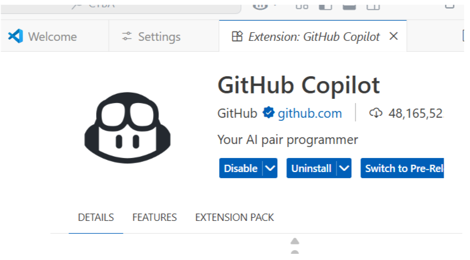
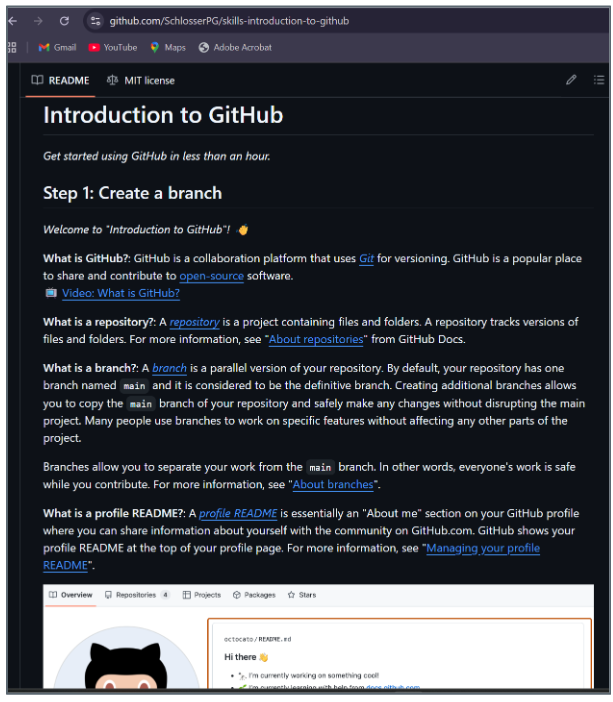
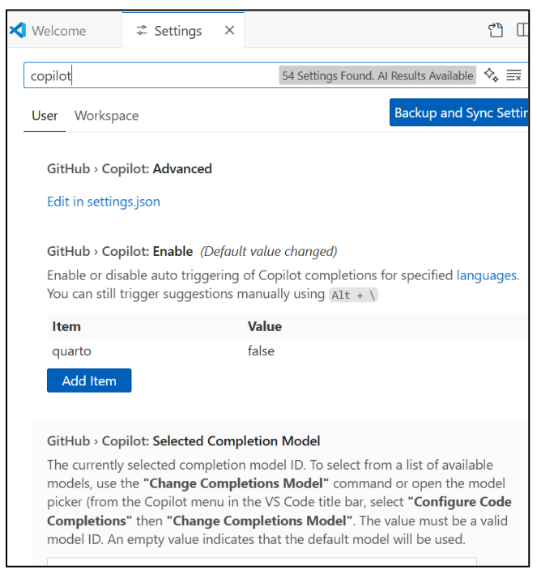

This section introduces **Git** and **GitHub** as foundational tools for **version control**, **collaboration**, and **deployment** in analytics and programming projects. Git is a decentralized version control system that tracks file changes and manages project history locally, while GitHub is a cloud-based platform built on Git for sharing, collaborating, and managing repositories. Together, they allow multiple contributors to work efficiently through commits, branches, merges, and pull requests. GitLab offers similar features but can be self-hosted for greater organizational control.

Students learn to set up Git and GitHub, configure user credentials, and perform essential commands (`git init`, `git add`, `git commit`, `git push`, and others) using VS Code or GitHub Desktop. The module also introduces **GitHub Copilot**, an AI-assisted coding tool that autocompletes and suggests code directly within VS Code.

Best practices covered include writing clear commit messages, pulling frequently to stay synchronized, using `.gitignore` to exclude unnecessary files, and maintaining a stable main branch. Common troubleshooting scenarios are also addressed, including merge conflicts, authentication issues, and accidental commits.

Finally, the module introduces **Render.com**, a platform that connects directly to GitHub for seamless web application deployment. Students link their GitHub repositories to Render to host and automatically update their Dash or analytics applications, gaining hands-on experience with real-world deployment workflows.

::: note
Understanding the prompting paradigm equips you to guide AI models effectively — skills that can be enhanced and shared by leveraging platforms like GitHub to collaborate on prompt libraries, examples, and AI-powered projects.
:::



## Git: Purpose and Core Concepts

Git is a **decentralized version control system** (VCS) designed for tracking file changes, particularly in software projects composed of many small text files. Think of it as a sophisticated "undo history" for your entire project: it records who made each change, when, and why — and lets you travel back to any previous state at any time.

Git works best with plain text files (code, Markdown, CSV). It is less effective for binary files such as Word documents, audio and video files, or virtual machine images, because it cannot show meaningful line-by-line differences for those formats.

The primary way to interact with Git is through the terminal or PowerShell using the `git` command. Note the important distinction: **Git** (capitalized) refers to the system and its concepts, while `git` (lowercase) refers to the command-line tool. IDEs such as Visual Studio and editors such as VS Code offer built-in Git tools; web platforms like GitHub and GitLab add further features including issue tracking, code review, and automated testing pipelines.

## Git vs. GitHub vs. GitLab

These three tools are related but distinct — a common source of confusion for beginners:

-   [**Git**]{style="background-color: yellow;"} — the underlying version control system. It runs entirely on your local machine and works without any internet connection or central server.
-   [**GitHub**]{style="background-color: yellow;"} — acquired by Microsoft in 2018, GitHub is the most popular cloud-based platform for hosting and collaborating on Git repositories. It adds a web interface, pull requests, code review, issue tracking, and integrations with hundreds of tools. Free for public and most private projects.
-   [**GitLab**]{style="background-color: yellow;"} — similar capabilities to GitHub but open-source and can be self-hosted on your organization's own servers, making it a strong choice for organizations with strict data privacy or compliance requirements.

**Analogy:** Git is Microsoft Word (the software); GitHub is Google Drive (the cloud storage and sharing layer built on top of it).

## Getting Started

### Setting Up GitHub



To get started with GitHub, follow these steps:

-   Create a free account at [github.com](https://github.com).
-   If working locally, install Git from [gitforwindows.org](https://gitforwindows.org/).
-   Configure your identity so commits are attributed to you correctly. Run these two commands once — they set your name and email globally for all repositories on your machine:

```{bash}
git config --global user.name "Your Name"
git config --global user.email "you@example.com"
```

-   Optionally, install **GitHub Desktop** for a graphical point-and-click interface instead of the command line — useful when getting started.
-   Set **VS Code** as your preferred editor so Git uses it for commit messages and diff views.

### GitHub Copilot



**GitHub Copilot** is an AI coding assistant that suggests code completions as you type in VS Code. It uses a large language model trained on public code to predict what you are likely to write next, offering "ghost text" suggestions that you can accept with `Tab` or ignore by continuing to type.

To enable Copilot's inline ghost-text suggestions:

-   Open **VS Code Settings** (Ctrl + ,).
-   Search for **Copilot: Inline Suggest**.
-   Ensure that [**Editor › Inline Suggest: Enabled**]{style="background-color: yellow;"} is checked.

## Git and GitHub Lab

**1.** Using the Word/Google Drive analogy from this section, explain what each of the following represents in that analogy: `git commit`, `git push`, `git pull`, and a merge conflict.

::: {.callout-note collapse="true"}
### Show Answer

-   **`git commit`** — saving a version of your Word document locally with a note about what changed. The file is preserved on your machine but not yet shared anywhere.
-   **`git push`** — uploading that saved version from your computer to Google Drive so collaborators can see it.
-   **`git pull`** — downloading the latest version of the shared document from Google Drive to your local machine so your copy is current.
-   **Merge conflict** — the equivalent of two people editing the same sentence in a shared Google Doc simultaneously and then trying to combine their changes. One version must be chosen or both manually reconciled before the document can be finalized.
:::

**2.** When would an organization choose GitLab over GitHub? Identify two industries where self-hosted version control would be a compliance or security requirement rather than just a preference.

::: {.callout-note collapse="true"}
### Show Answer

Organizations choose GitLab when they cannot allow source code or data to reside on a third-party cloud platform. **Defense and government contracting** — classified or controlled-unclassified information (CUI) often cannot leave government-approved infrastructure; a self-hosted GitLab instance on premises satisfies data residency requirements that GitHub (a Microsoft cloud service) does not. **Healthcare and financial services** — HIPAA and PCI-DSS regulations may require that code interacting with protected health or financial data be stored on infrastructure the organization controls, audits, and owns, making self-hosted GitLab the compliant choice over a public SaaS platform.
:::

## Working with Git

### Key Git Concepts

Before working through the commands, it helps to understand the core vocabulary. These seven terms come up constantly:

-   [**Repository (repo)**]{style="background-color: yellow;"} — the container for your project. It holds all your files *and* the complete history of every change ever made. Local repos live on your machine; remote repos live on GitHub.
-   [**Commit**]{style="background-color: yellow;"} — a saved snapshot of your project at a specific point in time. Every commit has a unique ID (a hash like `a3f9b21`) and a message explaining what changed.
-   [**Branch**]{style="background-color: yellow;"} — an independent line of development. Creating a branch lets you work on a new feature without touching the stable `main` branch until you are ready.
-   [**Merge**]{style="background-color: yellow;"} — the process of integrating changes from one branch into another. Git attempts to do this automatically; when it cannot (merge conflict), it asks you to resolve the overlap manually.
-   [**Pull request (PR)**]{style="background-color: yellow;"} — a GitHub-specific feature: a proposal to merge your branch into another, submitted for team review. PRs are the standard code review workflow on collaborative projects.
-   [**Clone**]{style="background-color: yellow;"} — downloading a full copy of a remote repository (including its entire history) to your local machine. `git clone <url>` is how you start working on an existing project.
-   [**Push**]{style="background-color: yellow;"} — sending your committed local changes up to the remote repository on GitHub so others can see and use them.

### Creating Your First Repository

To create a new repository on GitHub, go to your profile, click **New Repository**, and give it a name. Choose whether it should be **public** (visible to everyone) or **private** (visible only to you and collaborators). Do not add a README at this stage — since you will be pushing an existing project from VS Code, starting with a blank repository avoids merge conflicts on the first push.

The full sequence of commands to create and push a project for the first time:

```{bash}
git init                    # initialize a new Git repo in the current folder
git add .                   # stage ALL files for the first commit
                            # (the dot means "everything in the current folder")
git commit -m "Initial commit"
                            # save the snapshot with a descriptive message
git branch -M main          # rename the default branch to "main"
git remote add origin https://github.com/USERNAME/REPO_NAME.git
                            # link your local repo to the GitHub remote
git push -u origin main     # push to GitHub
                            # -u sets "origin main" as the default so future
                            # pushes only need: git push
```

Once your files are committed and pushed, notice the **Source Control** button on the left sidebar of VS Code (the branch icon with a number badge) — it shows how many files have uncommitted changes.

### Best Practices

Adopting good habits early makes collaboration and troubleshooting much easier:

-   [**Write clear commit messages**]{style="background-color: yellow;"} — commit messages are the history of your project. A message like `"Fix login bug"` is far more useful than `"stuff"` or `"update"` when you are debugging six months later.
-   [**Pull frequently**]{style="background-color: yellow;"} — run `git pull origin main` before starting new work to stay synchronized with your team's latest changes. Pulling early prevents large, painful merge conflicts later.
-   [**Use `.gitignore`**]{style="background-color: yellow;"} — exclude sensitive credentials (API keys, `.env` files), large data files, and generated output from being tracked or uploaded. GitHub provides `.gitignore` templates for common project types.
-   [**Keep the main branch stable**]{style="background-color: yellow;"} — develop new features on separate branches (`git checkout -b feature/my-feature`) and only merge into `main` when the code is tested and reviewed.
-   [**Use Issues and Project Boards**]{style="background-color: yellow;"} — GitHub's built-in task tracking tools help teams coordinate work, track bugs, and maintain visibility across a project without leaving the platform.

### Troubleshooting Common Issues

A few problems come up regularly when working with Git and GitHub:

-   **Merge conflicts** — occur when two contributors change the same section of the same file. Git flags the conflict with `<<<<<<<` / `=======` / `>>>>>>>` markers in the file. Open the file, choose which version to keep (or combine them), save, then `git add` and `git commit` to complete the merge.
-   **Authentication errors** — if you see "permission denied" when pushing, the most common fixes are setting up an **SSH key** (preferred) or generating a **personal access token** in your GitHub account settings to use as your password.
-   **Forgetting to pull** — always run `git pull` before starting new work. If you push without pulling first, Git may reject your push because the remote has commits your local repo does not know about.
-   **Accidental commits** — use `git reset HEAD~1` to unstage the last commit while keeping your file changes, or `git revert <commit-hash>` to safely undo a specific commit without rewriting history. Avoid `git reset --hard` on shared branches — it rewrites history and will cause problems for other contributors.

## Working with Git Lab

**1.** A teammate pushes a change to `main` while you are working on a new feature in the same repository. You have not pulled since yesterday. Walk through the exact sequence of Git commands you should run before pushing your own work, and explain what would happen if you pushed without pulling first.

::: {.callout-note collapse="true"}
### Show Answer

**Correct sequence:**

``` bash
git add .
git commit -m "describe your changes"
git pull           # fetch and merge the teammate's changes into your local branch
git push           # now safe to push — remote and local are reconciled
```

**If you push without pulling:** Git compares your local commit history to the remote and detects that the remote has commits your local repo does not know about. It rejects the push with a message like "Updates were rejected because the remote contains work that you do not have locally." You would then need to pull, resolve any conflicts, and push again — the same steps, just forced on you rather than chosen proactively. Pulling first keeps the process clean.
:::

**2.** You committed a sensitive API key to your repository by accident and then pushed it to GitHub. `git reset HEAD~1` is not enough — the key is already in the remote history. What should you do, and why is simply deleting the key from the file and committing again insufficient?

::: {.callout-note collapse="true"}
### Show Answer

Deleting the key from the file and committing a new version is insufficient because Git preserves every prior commit — anyone who clones the repo or browses the commit history on GitHub can still see the exposed key in the old commit. **Correct steps:** (1) immediately revoke or rotate the API key in the service that issued it — assume it is compromised the moment it was pushed publicly; (2) use `git filter-repo` (or BFG Repo Cleaner) to rewrite history and permanently remove the key from all commits; (3) force-push the cleaned history to GitHub with `git push --force`; (4) add the key file or pattern to `.gitignore` to prevent recurrence; (5) store secrets in environment variables or a secrets manager, never in tracked files.
:::

**3.** What is the purpose of a `.gitignore` file, and why would a data analytics project specifically need one? Name three categories of files an analytics project should always exclude.

::: {.callout-note collapse="true"}
### Show Answer

`.gitignore` lists file paths and patterns that Git should never track or commit. **Why analytics projects need it:** analytics work generates large, sensitive, or environment-specific files that should never enter version control. Three categories to always exclude: (1) **Data files** — raw CSVs, Excel files, and database files can be hundreds of megabytes; Git is not designed for binary or large file storage and storing data in a repo can expose sensitive information. (2) **Credentials and secrets** — `.env` files, API keys, and config files containing passwords must never be committed. (3) **Environment and cache files** — virtual environment folders (`venv/`, `__pycache__/`), Jupyter checkpoint folders (`.ipynb_checkpoints/`), and IDE config folders (`.vscode/`) are machine-specific and bloat the repository without providing value to collaborators.
:::

## Deployment with Render.com


**Render.com** is a cloud hosting platform that connects directly to GitHub or GitLab for automatic builds and deployments whenever you push new code. Key features:

-   [**Git-based deployment**]{style="background-color: yellow;"} — connect your repository and Render automatically rebuilds and redeploys on every push to the linked branch.
-   [**Full-stack hosting**]{style="background-color: yellow;"} — run web applications, APIs, static sites, and background jobs on a single platform.
-   [**Built-in security and scaling**]{style="background-color: yellow;"} — automatic HTTPS, DDoS protection, and autoscaling are included at no extra configuration cost.
-   [**Global performance**]{style="background-color: yellow;"} — a CDN for static assets and low-latency infrastructure worldwide.

To connect Render to your course project, create a free account at [dashboard.render.com](https://dashboard.render.com/), then link it to your course GitHub repository. Once connected, any push to your repository will trigger an automatic redeploy of your Dash application.

### Render Dashboard


### Before You Deploy: Required Files

Before Render can build your application, your GitHub repository must contain **three specific files**. Render reads these to understand how to install your dependencies and run your app. Without them, the deployment will fail.

#### `requirements.txt`

This file tells Render which Python packages to install before starting your app. Each package goes on its own line, optionally pinned to a specific version for reproducibility.

For a standard Dash application:

```         
dash
pandas
plotly
gunicorn
```

::: note
`gunicorn` is a production-grade Python web server. It is not needed when running locally, but Render requires it to serve your app in a hosted environment. Without it, Render will not know how to start your server.
:::

#### `app.py` (or your main Python file)

This is the **entry point** of your Dash application. Two changes are required from your development version:

```{python, eval=FALSE}
server = app.server   # expose the Flask server object — gunicorn needs this to start the app

if __name__ == "__main__":
    app.run(debug=False)   # debug=False for production security
```

::: note
`app.run_server()` is deprecated in recent versions of Dash. Use `app.run()` instead. Always set `debug=False` before deploying — leaving debug mode on exposes internal error details and is a security risk in a live environment.
:::

#### `render.yaml` (optional but recommended)

This file gives Render explicit, version-controlled instructions for how to build and start your app.

``` yaml
services:
  - type: web
    name: my-dash-app           # replace with your app's name
    env: python
    buildCommand: "pip install -r requirements.txt"
    startCommand: "gunicorn app:server"
                                # "app" = your filename (app.py)
                                # "server" = the variable name from server = app.server
```

#### Deployment Checklist

Before pushing to GitHub and triggering a Render deploy, confirm all of the following:

-   [**`requirements.txt` is present**]{style="background-color: yellow;"} and includes `gunicorn`.
-   [**`app.run_server()` has been replaced**]{style="background-color: yellow;"} with `app.run(debug=False)`.
-   [**`server = app.server` is defined**]{style="background-color: yellow;"} in your `app.py` so gunicorn can find the entry point.
-   [**Your repository is linked to Render**]{style="background-color: yellow;"} and auto-deploy is enabled on the correct branch.
-   [**No secrets or API keys are hardcoded**]{style="background-color: yellow;"} — store them in Render's **Environment Variables** settings and access them in Python with `os.environ["KEY_NAME"]`.

## Deployment with Render.com Lab

**1.** Explain what gunicorn does and why it is required for a Render deployment but not needed when running a Dash app locally with `app.run()`.

::: {.callout-note collapse="true"}
### Show Answer

When you run `app.run()` locally, Dash uses a lightweight development server built into Flask — it is designed for a single developer, runs in debug mode, and is not suitable for handling concurrent requests from multiple users. **Gunicorn** is a production-grade WSGI server: it manages multiple worker processes, handles concurrent HTTP requests efficiently, and is the standard way to serve Python web applications in hosted environments. Render does not know which command to use to start your app unless you tell it — `gunicorn app:server` says "use gunicorn, find the file `app.py`, and look for the variable named `server` as the entry point." Without gunicorn in `requirements.txt` and the correct start command, Render has no way to launch your application.
:::

**2.** A student deploys their Dash app to Render but left `debug=True` in `app.run()`. What security risk does this introduce, and what else in the deployment checklist protects against exposed secrets?

::: {.callout-note collapse="true"}
### Show Answer

`debug=True` enables Flask's interactive debugger — when an unhandled exception occurs, it displays a full interactive traceback in the browser, including local variable values, file paths, and internal application state. In a production environment accessible to the public, this exposes your code structure, data, and potentially credentials to anyone who can trigger an error. Always set `debug=False` before deploying. The complementary protection for secrets is **Render's Environment Variables settings**: API keys, database passwords, and other sensitive values should never be hardcoded in `app.py` — store them as environment variables in the Render dashboard and retrieve them in Python with `os.environ["KEY_NAME"]`. This way, secrets never appear in your GitHub repository or in error output.
:::

**3.** Describe what happens automatically on Render after you push a new commit to your linked GitHub repository. What is the advantage of this workflow over manually uploading updated files to a hosting server?

::: {.callout-note collapse="true"}
### Show Answer

When you push to the linked branch, Render detects the new commit via a GitHub webhook, pulls the updated code, runs `pip install -r requirements.txt` to install any new or updated dependencies, and then restarts the application using the configured start command — all without any manual intervention. **Advantages over manual upload:** (1) **Consistency** — every deployment follows the same automated process, eliminating the risk of forgetting a step or uploading an outdated file. (2) **Speed** — the cycle from `git push` to live update takes seconds to minutes rather than the minutes-to-hours of manual FTP or file upload workflows. (3) **Traceability** — every deployment is tied to a specific Git commit, so you can see exactly which code version is live and roll back to a previous commit if the new version breaks something.
:::

# Summary and Review

## Using AI

Use the following prompts with a generative AI tool to explore Git, GitHub, and deployment further.

-   What is the difference between Git and GitHub? Could you use Git without GitHub, and what would that look like in practice?
-   Explain the Git staging area. Why does Git require you to `add` files before you `commit` them, rather than committing all changes at once?
-   What is a merge conflict, how does it arise, and what is the correct process for resolving one? Why does Git not resolve conflicts automatically?
-   Why should secrets like API keys never be committed to a Git repository, even a private one? What are the correct alternatives?
-   What does gunicorn do, and why is a production web server necessary for deploying a Python web application when the Flask development server already works locally?
-   What is the Git branching model, and how does working on a feature branch protect the stability of the `main` branch in a team project?

## Summary

This chapter introduced Git and GitHub for version control, collaboration, and deployment — foundational skills for any analytics or development project.

| Topic | Key concepts |
|------------------------------------|------------------------------------|
| Git | Decentralized VCS; tracks changes locally; works offline; best for plain text files |
| GitHub vs. GitLab | GitHub: cloud-hosted, most popular; GitLab: open-source, self-hostable for compliance |
| Core Git workflow | `git init` → `git add` → `git commit` → `git push` → `git pull` |
| Key concepts | Repository, commit, branch, merge, pull request, staging area |
| Best practices | Pull before pushing; write clear commit messages; use `.gitignore`; keep `main` stable |
| Troubleshooting | Merge conflicts, authentication errors, accidental commits (`reset`, `revert`) |
| GitHub Copilot | AI code completion in VS Code; inline suggestions; Tab to accept |
| Render.com | Git-based automatic deployment; rebuilds on every push to linked branch |
| Required deploy files | `requirements.txt` (with gunicorn), `app.py` (with `server = app.server`, `debug=False`), `render.yaml` |
| Secrets in production | Store in Render Environment Variables; access with `os.environ["KEY_NAME"]`; never hardcode |

**What comes next:** The Writing Callbacks and Accessing APIs chapter builds on this deployment foundation — adding interactivity to your Dash applications through callback functions and connecting them to live data via API calls.
