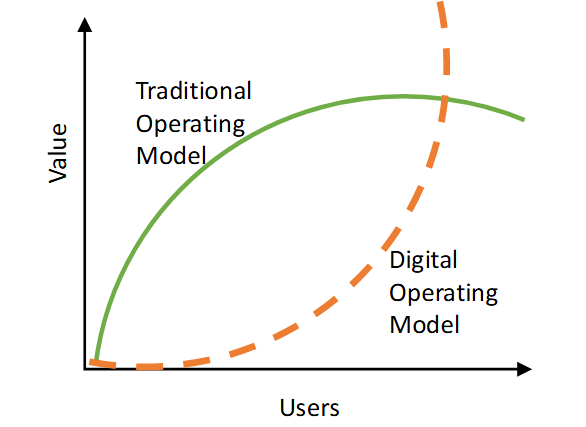
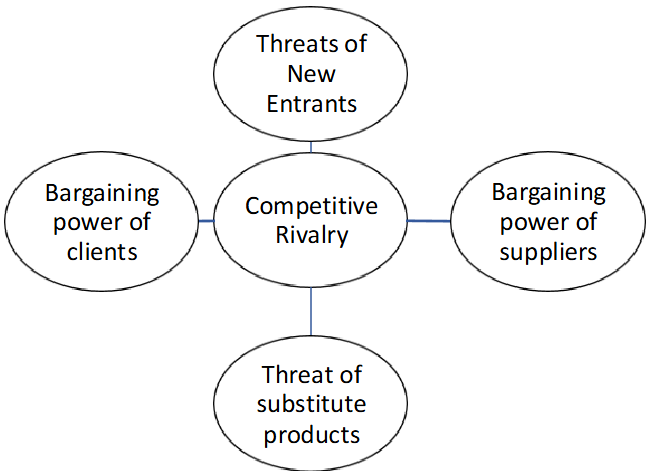

::: callout-important
## A Note on These Materials

This course book is a living document. Content, code examples, readings, and tools are reviewed and updated each year to reflect the rapidly evolving landscape of AI and business analytics. The version you are reading reflects the most recent revision at the time of publication, but specific chapters, libraries, or examples may be updated before or during the semester. Always refer to the version posted on Blackboard for the most current content. If you notice an error or have a suggested improvement, please let your instructor know. And note that many aspects of this material will be further clarified and expanded upon during class discussions to help address any gaps.
:::

## About This Course

**BUAD 5012 — Competing in the Age of AI (CTAI)** is a three-credit MSBA graduate course in the Mason School of Business at the College of William & Mary, taught by Dr. Pamela Galluch Schlosser. It runs as an intensive three-week course during the Fall semester.

This course explores how organizations compete and innovate through business analytics and artificial intelligence. The curriculum moves from foundational strategy and economic theory — how AI reshapes firm boundaries, operating models, and competitive advantage — through the technical and human dimensions of making AI actually work inside an organization. You will learn to apply data-driven models, generative AI, ethical frameworks, and modern data acquisition techniques to real-world business problems. Practical emphasis is placed on augmented analytics, human-centered data storytelling, and developing both technical and organizational readiness for AI adoption. Programming skills in Python are developed throughout, culminating in the ability to build interactive, data-driven dashboards deployed as live web applications.

### What You Will Be Able to Do

By the end of this course, you will be able to:

-   Explain how business analytics and AI create competitive advantage across industries, drawing on frameworks from Iansiti and Lakhani (2020) and Weber and Zwingmann (2024).
-   Evaluate the ethical and cybersecurity implications of AI systems — including bias, hallucination, deepfakes, and autonomous decision-making — and recommend responsible practices.
-   Acquire and integrate data from APIs, web scraping, and other sources for analysis, using Python libraries including `requests`, `BeautifulSoup`, and `pandas`.
-   Develop human-centered data stories that translate analytical results into actionable business insights, applying Wilke's (2019) principles of visualization and Knaflic's storytelling framework.
-   Build interactive analytics tools in Python using **Dash** and **Plotly**, including multi-page dashboards with live API integrations and responsive Bootstrap layouts.
-   Assess organizational readiness for AI adoption and recommend strategies for transformation, using the IPTOP and SPEC frameworks from augmented analytics.

### Tools and Software

All practical work in this course uses **Python** via **Anaconda3** and **VS Code**. You will use Git and GitHub for version control and deployment, and host your final dashboard project on Render.com. No prior web development experience is required.

### Course Materials

The course draws on a curated set of readings spanning strategy, organizational change, ethics, visualization, and applied Python development. Core texts include:

-   Iansiti, M., & Lakhani, K. R. (2020). *Competing in the Age of AI.* Harvard Business Review Press.
-   Weber, W., & Zwingmann, T. (2024). *Augmented Analytics.* O'Reilly Media.
-   Ravindran, S., & Anton, F. (2022). *Will AI Dictate the Future?* Marshall Cavendish.
-   Wilke, C. O. (2019). *Fundamentals of Data Visualization.* O'Reilly Media.
-   Brindha et al. (2025). *Multimodal Generative AI.* Springer.

------------------------------------------------------------------------

## Chapter Overview

This chapter introduces how organizations evolve from competing through business analytics to competing in the age of AI (CTAI). It explains how data-driven decision-making transforms into AI-enhanced systems that learn, scale, and adapt across business functions. The discussion connects classical frameworks — like Porter's Five Forces and the Value Chain — to digital-era dynamics such as network effects, value capture, and platform competition. Drawing on Iansiti and Lakhani (2020), it highlights how firms achieve advantage not just through better data, but through architectures that continuously learn and connect across networks.

::: note
###### *Reference:*

Chapter 6 from **Iansiti, M., & Lakhani, K. R. (2020)** in *Competing in the Age of AI* explains how **artificial intelligence transforms firms** by digitizing activities into **scalable, connectable, and self-improving systems**. The chapter outlines a **strategic framework for AI-driven businesses** that leverages **network and learning effects** while addressing key concepts such as **multihoming, disintermediation, and network bridging**, using real-world examples like **Uber** and **Airbnb**.
:::

## Competitive Business Analytics

**Competitive Business Analytics** means using data, statistical analysis, and predictive modeling to gain a strategic advantage over competitors. It involves making better, faster, and more informed decisions by systematically analyzing data across all areas of the business.

Firms that compete through analytics build capabilities in data collection, storage, analysis, and interpretation, making **data a strategic asset**. These firms develop a culture of testing, learning, and optimization across the entire organization, expressed through four core capabilities:

-   [**Data-driven decisions**]{style="background-color: yellow;"} — relying on insights from data rather than intuition or guesswork.
-   [**Performance improvement**]{style="background-color: yellow;"} — enhancing efficiency, productivity, and outcomes using measurable evidence.
-   [**Predictive power**]{style="background-color: yellow;"} — forecasting future trends or behaviors (e.g., customer churn, sales, demand).
-   [**Competitive differentiation**]{style="background-color: yellow;"} — gaining an edge through smarter operations, marketing, customer targeting, or innovation.

## Where Is the AI in Business Analytics?

Traditional Business Analytics traditionally relies on a hierarchy of analytics types, each answering a progressively more actionable question:

| Analytics Type | Question Answered  | Example                         |
|----------------|--------------------|---------------------------------|
| Descriptive    | What happened?     | Sales dashboard, monthly report |
| Diagnostic     | Why did it happen? | Root cause of a revenue drop    |
| Predictive     | What will happen?  | Customer churn forecast         |
| Prescriptive   | What should we do? | Optimal pricing recommendation  |
| KPIs           | Are we on track?   | Revenue vs. target              |

AI does not replace analytics — it **supercharges** it by making analysis faster, deeper, and more dynamic, allowing businesses to compete not just with better data, but with **better learning**.

## What Does AI Bring to Business?

AI adds **automation, scale, and adaptability** to analytics, allowing businesses to:

-   **Continuously learn** from new data through machine learning — models improve as more data flows through them, without manual reprogramming.
-   **Make real-time decisions** through streaming analytics — reacting to events as they happen rather than in batch reports the next day.
-   **Personalize at scale** through recommendation systems — delivering individualized experiences to millions of customers simultaneously.
-   **Go beyond prediction** to causal and autonomous decision-making — not just forecasting what will happen, but taking action automatically when it does.

## Understanding AI's Impact in Specific Business Domains

AI is reshaping decision-making across every major business function:

-   **Marketing** — customer segmentation, personalization, and targeting.

    -   [**Customer segmentation**]{style="background-color: yellow;"}: grouping customers based on shared characteristics to tailor marketing or product strategies.
    -   [**Personalization**]{style="background-color: yellow;"}: delivering individualized experiences, often powered by AI recommendation systems. *Example: Netflix's "Because you watched…" suggestions.*

-   **Operations** — inventory management, route optimization, demand forecasting.

    -   [**Demand forecasting**]{style="background-color: yellow;"}: predicting future customer demand using historical data and AI models to optimize inventory and supply chain.

-   **Finance** — risk modeling, algorithmic trading, fraud detection.

    -   [**Algorithmic trading**]{style="background-color: yellow;"}: automated financial trading using pre-defined AI rules and models that execute at speeds no human trader can match.
    -   [**Fraud detection**]{style="background-color: yellow;"}: using machine learning to identify unusual transaction patterns that may indicate fraud in real time.

-   **HR** — resume screening, performance prediction, talent analytics.

-   **Healthcare** — diagnostic tools, patient risk prediction.

## Competitive Analytics and AI Impact Lab

**1.** A retail company uses weekly sales reports to track performance and adjusts inventory monthly. Using the four analytics types (descriptive, diagnostic, predictive, prescriptive), explain what each would look like for this company — and then describe how AI supercharges each type.

::: {.callout-note collapse="true"}
### Show Answer

**Descriptive:** the weekly sales report itself — what sold, in what volume, in which store. AI supercharges this by generating real-time dashboards and natural language summaries automatically. **Diagnostic:** investigating why a specific store underperformed last month — correlating weather, promotions, local events, and foot traffic. AI supercharges this by running root-cause analysis across hundreds of variables simultaneously. **Predictive:** forecasting which products will run out of stock in the next two weeks. AI supercharges this by learning from seasonal patterns, promotions, and supply disruptions continuously. **Prescriptive:** recommending exactly how much of each product to reorder, from which supplier, delivered by when. AI supercharges this by optimizing the full supply chain automatically, not just one store at a time.
:::

**2.** AI is said to bring "automation, scale, and adaptability" to analytics. For each of these three properties, identify a specific business scenario in finance or healthcare where that property is the critical differentiator — and explain what would happen without it.

::: {.callout-note collapse="true"}
### Show Answer

**Automation — fraud detection at a bank:** a bank processes millions of transactions per day. An AI model flags suspicious patterns in real time without any analyst involvement. Without automation, the bank would need thousands of analysts watching transactions and most fraud would go undetected until the daily report. **Scale — personalized drug dosing in healthcare:** an AI system recommends individualized dosing for ICU patients based on weight, kidney function, current medications, and real-time vitals — for every patient simultaneously. Without scale, a clinical pharmacist can review a handful of complex cases per day, not an entire hospital. **Adaptability — algorithmic trading:** a trading model continuously updates its strategies as market microstructure shifts, learning from new data without being manually reprogrammed. Without adaptability, a fixed-rule model would decay as market conditions change, generating losses when the rules no longer fit reality.
:::

**3.** Choose one business domain (marketing, operations, finance, HR, or healthcare) and trace how AI changes the decision-making process from beginning to end — starting with raw data and ending with an automated or augmented action.

::: {.callout-note collapse="true"}
### Show Answer

**Operations — demand forecasting for a grocery chain:** Raw data collected: point-of-sale transactions, historical inventory levels, supplier lead times, weather forecasts, local event calendars, competitor promotions. AI processes this data to generate a 7-day SKU-level demand forecast for every store. The system automatically generates purchase orders and routes them to the appropriate supplier when predicted stock will fall below threshold. Store managers receive a daily alert showing only the exceptions — items where the AI's confidence is low or where a human override is recommended. The loop closes when actual sales data flows back to retrain the model weekly. Without AI, demand planners manually review reports and make judgment calls — slower, less granular, and more prone to human bias.
:::

## How AI-Driven Decision-Making Is Transforming Industries

AI-driven decision-making is transforming industries by **enabling faster, more accurate, and more scalable decisions** than were previously possible with traditional methods. AI transforms how firms compete on speed and scale, create personalized experiences, operate with greater efficiency and agility, and continuously learn and improve from data.

## Strong vs. Weak AI

Understanding the distinction between strong and weak AI is important for setting realistic expectations about what today's AI systems can and cannot do.

[**Strong AI**]{style="background-color: yellow;"} (also called Artificial General Intelligence, or AGI) refers to hypothetical computer systems that replicate or simulate human reasoning and behavior across any domain — for example, a single system that can tutor calculus, negotiate a business deal, write a novel, and suggest a recipe, all using the same underlying general intelligence. **Strong AI does not currently exist.**

[**Weak AI**]{style="background-color: yellow;"} (also called narrow AI) refers to systems designed to perform specific tasks traditionally done by humans, without replicating human consciousness or general reasoning. **All AI in widespread use today is weak AI:**

-   **Siri, Alexa, and Google Assistant** — can recognize voice commands, set alarms, or fetch weather updates, but cannot engage in the broad, general reasoning a human uses across unrelated tasks.
-   **ChatGPT (current models)** — excellent at generating language, but does not "understand" the world in any meaningful sense; it predicts which tokens are statistically likely to follow given the input.

## Exploring Weak AI Further

Weak AI is not a limitation to work around — for most business applications, it is entirely **sufficient**. Transformative change does not require human-like general intelligence; it only requires systems that can perform *specific* tasks better, faster, or more consistently than humans.

Tasks like prioritizing content feeds, dynamic pricing, anomaly detection, or analyzing customer behavior can be handled effectively by narrow, imperfect AI. Even without replicating human reasoning, weak AI is already reshaping how firms function and compete across every major industry.

## Transforming Competition

The evolution of *photography* offers a useful analogy for understanding how AI is disrupting industries. Kodak did not fail because a better film company came along — it was displaced by companies (smartphones, digital cameras) operating on entirely different rules with entirely different cost structures.

-   **From disruption to reinvention** — traditional tech disruptions (e.g., film vs. digital photography) replaced older models one-for-one; AI redefines entire industries and operating models simultaneously.
-   **Digital operating models** — AI enables firms to scale, learn, and expand scope rapidly at near-zero marginal cost through algorithmic execution. Adding one million new users costs almost nothing when the product is software.
-   **A new breed of competitors** — companies like Facebook, Tencent, and Amazon were never direct rivals to players like Kodak; they operated on fundamentally different rules and displaced incumbents indirectly by making whole categories of products obsolete.

## Strategic Implications of AI-Driven Firms

AI-driven firms gain structural advantage through three interconnected shifts:

-   [**Value creation shift**]{style="background-color: yellow;"} — AI firms extract value from data, networks, and user interactions, not just products or services. The more users interact, the more data is generated, which improves the AI, which attracts more users — a self-reinforcing cycle.
-   [**Operating model advantage**]{style="background-color: yellow;"} — digital firms overcome traditional complexity limits, enabling near-infinite scalability and adaptability without proportional increases in cost.
-   [**Competitive collision**]{style="background-color: yellow;"} — traditional firms face existential threats not from better versions of themselves, but from companies with fundamentally different architectures and strategies.

##### The collision between traditional and digital operating models

## Strong AI, Weak AI, and Competitive Transformation Lab

**1.** All AI in widespread use today is weak AI. Why does this not prevent transformative business impact? Use two specific examples from different industries to support your argument.

::: {.callout-note collapse="true"}
### Show Answer

Weak AI performs specific, narrow tasks — but those tasks, done at scale and speed, are precisely what generates transformative business value. General intelligence is not the requirement; superior performance on a specific high-value task is. **Example 1 — Netflix recommendation engine:** a narrow model that predicts which content a specific user will watch next. It does not understand storytelling, it does not know what "good" means, and it cannot hold a conversation about the show — but it retains subscribers and reduces churn at a scale no human programming team could match. **Example 2 — JPMorgan's COIN (Contract Intelligence):** a document review system that analyzes loan agreements and extracts key clauses. It does not understand law in any general sense, but it performs in seconds a task that previously took 360,000 hours of lawyer time per year — with fewer errors.
:::

**2.** The Kodak analogy illustrates that AI-driven disruption often comes from firms operating on entirely different rules, not better versions of the incumbent. Identify a current industry where an AI-first entrant could displace an incumbent without competing directly on the incumbent's core product. Explain the mechanism.

::: {.callout-note collapse="true"}
### Show Answer

Answers will vary. **Example — insurance:** an AI-first insurer like Lemonade does not compete with State Farm by selling better-designed policies. It competes by eliminating the claims adjuster entirely through AI-processed claims, dramatically lowering operating costs, pricing risk more precisely through behavioral data, and settling claims in seconds rather than days. The incumbent's advantage (agent relationships, brand recognition, state licenses) is not meaningless — but the AI-first firm's near-zero marginal cost per policy and superior loss prediction erode profitability across the industry over time, not by beating the incumbent at its own game but by making the game economics fundamentally different.
:::

**3.** The three strategic implications of AI-driven firms are value creation shift, operating model advantage, and competitive collision. For a traditional bank facing a fintech challenger, give a specific example of each implication playing out.

::: {.callout-note collapse="true"}
### Show Answer

**Value creation shift:** the fintech (e.g., Chime, Revolut) generates value from transaction data — learning spending patterns, predicting credit risk, and personalizing offers — rather than from lending margins alone. The bank generates value primarily from net interest margin; its data is underutilized. **Operating model advantage:** the fintech has no branch network, no legacy core banking system, and no human loan underwriting process — it can add a million users without proportional cost increases. The bank's cost-to-income ratio is structurally higher. **Competitive collision:** the bank faces a challenger that was never a bank — it is a software company with a banking license, designed from the ground up around algorithms. The bank cannot replicate this by upgrading its mobile app; the entire organizational architecture and cost structure would need to change.
:::

## Business Strategy and Competitive Advantage

AI changes how firms create and sustain competitive advantage. Four foundational concepts anchor this discussion:

-   [**Competitive advantage**]{style="background-color: yellow;"} — a condition or circumstance that puts a company in a favorable or superior business position relative to competitors.
-   [**Porter's Five Forces**]{style="background-color: yellow;"} — a framework for analyzing a company's competitive environment: industry rivalry, threat of new entrants, threat of substitutes, and the bargaining power of buyers and suppliers.
-   [**Network effects**]{style="background-color: yellow;"} — the phenomenon where the value of a product, service, or platform increases as more people use it. *Example: a messaging app with 10 users is far less valuable than one with 10 million.*
-   [**Value capture dynamics**]{style="background-color: yellow;"} — how a firm retains and monetizes the value it creates (e.g., through pricing, data control, or platform fees) rather than having it flow to users or competitors.

## Competitive Advantage

Competitive advantage is increasingly defined by the ability to shape and control networks and harvest the volume and variety of transactions they carry. As Iansiti and Lakhani (2020) argue, advantage moves toward organizations that are most central in connecting businesses, aggregating the data that flows between them, and extracting value through powerful analytics and AI.

Strategy is therefore shifting from **industry analysis** (Porter's Five Forces) to **network analysis** — from managing internal resources to managing the firm's external networks and leveraging the data that flows through them.

> **Discussion:** How do firms gain competitive advantage in the market? What makes them unique?

## Porter's Five Forces Model

Porter's Five Forces is a strategic framework for analyzing the competitive forces that shape an industry and influence its profitability. It helps businesses assess their market position and develop effective competitive strategies.

-   [**Competitive rivalry**]{style="background-color: yellow;"} — the intensity of competition among existing firms. High rivalry limits profitability. *Example: the airline industry, where price competition is fierce.*
-   [**Threat of new entrants**]{style="background-color: yellow;"} — how easy or difficult it is for new competitors to enter the market. High barriers to entry (capital requirements, regulation, brand loyalty) reduce the threat.
-   [**Bargaining power of suppliers**]{style="background-color: yellow;"} — how much power suppliers have to drive up prices or reduce quality. *Example: semiconductor suppliers have high bargaining power over electronics manufacturers.*
-   [**Bargaining power of buyers**]{style="background-color: yellow;"} — the ability of customers to influence pricing and terms. Powerful buyers (large retailers, government clients) can demand lower prices or higher quality.
-   [**Threat of substitutes**]{style="background-color: yellow;"} — the availability of alternative products or services that perform the same function. More substitutes increase competitive pressure. *Example: ride-sharing substitutes for taxi services.*

## The Value Chain and Network Effects

**Value creation dynamics** describe how a platform generates and expands value for its participants — users, complementors, and the platform owner — through interactions, data flows, and network effects. These dynamics reinforce each other, creating self-sustaining growth loops:

-   [**Direct network effects**]{style="background-color: yellow;"} — value increases as more users join the *same* side of the platform. *Example: more people on WhatsApp make it more valuable to each existing user.*
-   [**Indirect network effects**]{style="background-color: yellow;"} — value increases as participation grows on the *other* side of the platform. *Example: more app developers make iOS more valuable to iPhone users, and vice versa.*
-   [**Learning effects**]{style="background-color: yellow;"} — value grows as data accumulates and systems improve. *Example: Netflix recommendations improve as viewing data expands — the platform gets better the more you use it.*
-   [**Complementor contributions**]{style="background-color: yellow;"} — external firms or individuals add value by creating content, apps, or services that enhance the platform. *Example: app developers on Apple's App Store increase platform stickiness and user value.*

## Value Capture Dynamics

The **appropriability of value** refers to the extent to which a firm can capture and retain the economic value created by its platform, rather than having that value flow to users, complementors, or competitors. Even if a platform generates enormous value through network effects, the critical strategic question is: **who gets to keep that value?**

Three examples illustrate different appropriation strategies:

-   **Apple's App Store** — Apple charges developers a commission (historically 30%) on sales. While developers benefit from access to Apple's user base, Apple captures a large share of the total value created.
-   **Google Search** — the platform creates value for users (free search) and advertisers (targeted audiences), but Google appropriates most of the economic value by monetizing through advertising and controlling data flows.
-   **Ride-sharing (Uber/Lyft)** — drivers create much of the service value, but the platform appropriates value by taking a percentage of each fare — without owning the cars or employing the drivers.

## Factors Affecting Appropriability

The degree to which a firm can appropriate value depends on three key factors:

-   [**Control of key assets**]{style="background-color: yellow;"} (data, algorithms, user base) — Google Search captures enormous value because it controls the search algorithm, the user base, and the data flows. Without control of these assets, the ability to appropriate value weakens.

-   [**Switching and multihoming costs**]{style="background-color: yellow;"} — Apple's iOS ecosystem locks users in through high switching costs (iPhones, AirPods, iCloud, App Store purchases). Moving to Android means losing all of this investment. By contrast, ride-hailing switching costs are low — riders can open both Uber and Lyft and choose the cheaper option — so platforms capture less value per transaction.

-   [**Regulation and bargaining power**]{style="background-color: yellow;"} — Apple historically charged a 30% App Store commission, but regulatory pressure and developer pushback (notably from Epic Games and the EU Digital Markets Act) have forced fee reductions in certain cases, demonstrating how external pressure constrains appropriation.

## Multihoming and Value Capture

**Multihoming** refers to users or firms participating in more than one competing platform simultaneously, rather than committing exclusively to one.

Examples of multihoming behavior:

-   A consumer uses both Uber and Lyft to compare prices or availability before requesting a ride.
-   A content creator posts on both YouTube and TikTok to reach different audience segments.
-   A merchant lists products on both Amazon and eBay to capture different customer demographics.

Multihoming matters strategically because:

-   When multihoming costs are **low** (easy to join multiple platforms), competition between platforms intensifies and each platform's power to capture value weakens.
-   When multihoming costs are **high** (due to switching fees, data lock-in, proprietary formats, or exclusive contracts), platforms gain more power to retain users and appropriate a larger share of value.

## Disintermediation and Value Capture

**Disintermediation** occurs when platforms eliminate the middleman, creating direct producer-to-consumer connections and reshaping industries in the process.

-   **Travel booking** — Expedia and Airbnb disintermediate traditional travel agents by letting consumers book directly, eliminating the agent's margin.
-   **Music industry** — Spotify and Apple Music reduce the role of physical distributors and record stores, while also diminishing the leverage of record labels as gatekeepers.
-   **Retail** — direct-to-consumer brands like Warby Parker and Glossier bypass traditional retailers by selling directly through their own platforms, capturing the retailer's margin and owning the customer relationship.

Disintermediation affects appropriability in three ways. First, it threatens **control of key assets** — bypassed intermediaries lose access to user data and customer relationships. Second, it **reduces switching and multihoming costs** by enabling direct connections between producers and consumers, weakening platform pricing power. Third, **regulation can force disintermediation** — open banking rules requiring banks to give fintechs direct access to customer data are a current example.

## Network Bridging and Value Capture

**Network bridging** refers to a platform connecting two or more otherwise separate networks, allowing value to flow between them and creating new growth opportunities. Rather than deepening one network, bridging links distinct user groups, industries, or ecosystems.

-   **LinkedIn** bridges professional networks across industries, enabling recruiters, job seekers, and companies to interact in ways that no single firm's internal HR system could facilitate. A recruiter in finance can find a software engineer in healthcare because LinkedIn spans both networks.
-   **Amazon Marketplace** bridges sellers from diverse industries with millions of global buyers, transforming a retail platform into a multi-industry ecosystem. Sellers gain distribution; buyers gain selection; Amazon captures value from both sides.
-   **Apple's App Store** bridges app developers and iPhone users, creating cross-side network effects that amplify the value of both groups simultaneously. More developers mean more apps; more apps mean more valuable iPhones.

## Platform Strategy Lab

**1.** Using Porter's Five Forces, analyze the competitive position of a grocery delivery platform (like Instacart). For each force, state whether it is high, medium, or low, and explain why.

::: {.callout-note collapse="true"}
### Show Answer

**Competitive rivalry — high:** multiple well-funded players (DoorDash, Uber Eats, Amazon Fresh, retailer-owned delivery) compete on speed, price, and selection with no clear single dominant player. **Threat of new entrants — medium:** capital requirements are significant (logistics, tech, retailer partnerships), but platform infrastructure is commoditizing — a well-funded startup can enter specific markets. **Bargaining power of suppliers — medium:** large grocery chains (Kroger, Costco, Walmart) have leverage because they can build their own delivery infrastructure — Walmart and Amazon already have. Smaller regional grocers have much less power. **Bargaining power of buyers — high:** consumers multihome freely — they use whichever app is cheapest or fastest for each order, with zero switching cost. **Threat of substitutes — high:** consumers can drive to a store, use a different delivery app, or shift to subscription-based meal kits. No single platform has made itself indispensable to buyers.
:::

**2.** Explain the difference between direct and indirect network effects using two platform examples. For each, describe what would happen to the platform's value if one side of the network suddenly shrank by 50%.

::: {.callout-note collapse="true"}
### Show Answer

**Direct network effects — WhatsApp:** value comes from users on the *same* side. If 50% of users leave, the remaining users lose contact with half their connections — value plummets nonlinearly. The platform could enter a death spiral: fewer users make it less valuable, causing more users to leave, accelerating decline. **Indirect network effects — Apple App Store:** value crosses between sides (developers ↔ users). If 50% of developers left, iPhone users would lose access to half the apps available, reducing the appeal of buying an iPhone. Fewer iPhone users would then reduce revenue for the remaining developers, pressuring more to leave — a cross-side collapse. The key difference: direct effects are within-side (more of *us* is better for *us*), while indirect effects are cross-side (more of *them* is better for *us*).
:::

**3.** A media company generates significant value — millions of readers, award-winning journalism — but struggles to appropriate that value because readers use news aggregators and social media to access content for free. Using the three factors affecting appropriability, diagnose the problem and recommend one strategic response for each factor.

::: {.callout-note collapse="true"}
### Show Answer

**Control of key assets — weak:** the media company's content is immediately redistributed by aggregators (Google News, Apple News) and social sharing, so it does not control access to its own audience. **Recommendation:** build a direct subscriber relationship through a paywall or newsletter — forcing readers to engage with the brand directly and generating first-party data the aggregators do not have. **Switching and multihoming costs — very low:** readers can access equivalent news from dozens of sources at zero cost. **Recommendation:** invest in proprietary analysis, investigative journalism, or niche expertise that cannot be easily replicated — differentiation that makes multihoming less satisfying. **Regulation and bargaining power — weak but improving:** platforms have historically distributed news for free while capturing advertising revenue. **Recommendation:** advocate for and participate in frameworks like the Australian News Media Bargaining Code or EU copyright directive that require platforms to compensate publishers, restoring some appropriability through regulation.
:::

# Summary and Review

## Using AI

Use the following prompts with a generative AI tool to explore competitive strategy and AI further.

-   What is the difference between descriptive, diagnostic, predictive, and prescriptive analytics? How does AI change what is possible at each level?
-   Why is weak AI sufficient for most business transformations? What would strong AI (AGI) actually add — and why does it not yet exist?
-   How do direct and indirect network effects differ? Give an example of a platform where both types operate simultaneously.
-   Apply Porter's Five Forces to an industry of your choice. Which force is currently most disruptive, and why?
-   What is the difference between value creation and value appropriation in platform economics? Can a platform create enormous value while appropriating very little of it?
-   How do multihoming and switching costs affect a platform's ability to capture value? Give one example where low multihoming costs severely limited a platform's pricing power.
-   What is network bridging, and why do platforms that bridge separate networks often grow faster than those that deepen a single network?

## Summary

This chapter introduced how organizations compete through business analytics and AI, and the platform dynamics that determine who captures value in digital markets.

| Topic | Key concepts |
|------------------------------------|------------------------------------|
| Competitive business analytics | Data-driven decisions, performance improvement, predictive power, competitive differentiation |
| Analytics hierarchy | Descriptive, diagnostic, predictive, prescriptive, KPIs |
| AI's additions | Automation, scale, adaptability; continuous learning, real-time decisions, personalization |
| Strong vs. weak AI | AGI (hypothetical); narrow AI (all current systems); weak AI is sufficient for most business value |
| Transforming competition | Disruption vs. reinvention; digital operating models at near-zero marginal cost; new breed of competitors |
| Strategic implications | Value creation shift; operating model advantage; competitive collision |
| Porter's Five Forces | Rivalry, new entrants, substitutes, buyer power, supplier power |
| Network effects | Direct (same-side); indirect (cross-side); learning effects; complementor contributions |
| Value capture | Appropriability: who keeps the value created by the platform |
| Appropriability factors | Control of key assets; switching and multihoming costs; regulation and bargaining power |
| Multihoming | Participating in multiple platforms; low costs intensify competition and weaken appropriation |
| Disintermediation | Platforms bypass middlemen; reduces switching costs; can be forced by regulation |
| Network bridging | Connecting separate networks creates cross-side growth loops |

**What comes next:** The Rethinking the Firm chapter examines how AI changes organizational boundaries, operating models, and the nature of competitive advantage in more depth — building on these platform concepts with firm-level strategy.
