This section introduces **Dash**, a Python framework from Plotly for building interactive, web-based dashboards without requiring traditional web development skills. Dash combines **Plotly** for visualizations, **Flask** for the backend, and **React** for the front end, making it ideal for analysts who want to turn Python code into shareable, browser-based applications. The lesson covers Dash's two core modules — `dash.html` (for HTML structure) and `dash.dcc` (for interactive components) — and demonstrates how to create, run, and style a basic app. It explains the difference between static and dynamic content, showing how callbacks update dashboards in real time through APIs, databases, or live streams. Students learn how to build a simple "Hello Dash" app, add headings, paragraphs, and hyperlinks, and apply styling using inline Python dictionaries or external CSS stylesheets. Key design concepts such as borders, padding, margins, and hover effects are introduced to control layout and visual hierarchy.

## Dash

::: note
**Dash** is a Python library for building interactive web applications. Developed by **Plotly**, Dash allows users to create dynamic, data-driven dashboards entirely in Python — no JavaScript, HTML knowledge, or web development background required. It is built on top of **Plotly** for visualizations, **Flask** for managing the web server, and **React** for the front-end interface.
:::

Dash is designed for **data analysts and data scientists** with a basic knowledge of Python. It is ideal for creating **visualizations and dashboards** that can be easily **shared with customers, executives, and other stakeholders** — without needing to email static files or screenshots.

Every Dash app is built on two things:

-   [**`dcc` — Dash Core Components**]{style="background-color: yellow;"} — interactive UI elements like dropdowns, sliders, date pickers, and graphs. These are what users interact with.
-   [**`html` — Dash HTML Components**]{style="background-color: yellow;"} — Python representations of standard HTML elements (headings, paragraphs, divs) used to structure and organize the page.

Interactivity is powered by **callback functions**, which automatically update output components when a user changes an input component.

## Choosing a Visualization Tool

The right tool depends on your goal:

| Tool | Best for | Output |
|------------------------|------------------------|------------------------|
| **Matplotlib** | Quick, static charts for reports or PDFs | Static image |
| **Plotly** | Interactive browser-based charts without a full app | Standalone chart |
| **Dash** | Full web apps with controls, dropdowns, and callbacks | Hosted application |

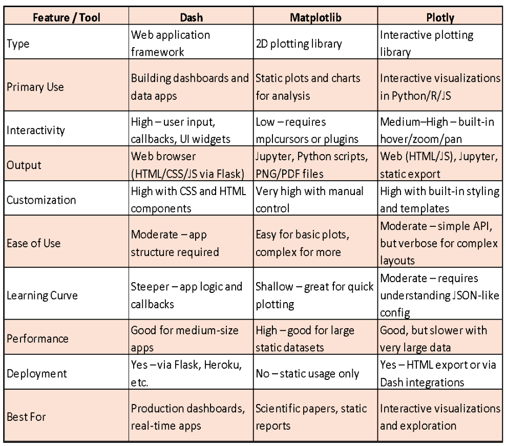

## Static and Dynamic Content

Dash handles both static and dynamic content:

-   [**Static content**]{style="background-color: yellow;"} — files that do not change on the server side: images, PDFs, CSS, and JavaScript. These are served once and do not respond to user interaction.
-   [**Dynamic content**]{style="background-color: yellow;"} — data or components that update in response to user interaction, database queries, API calls, or real-time streaming. This is what makes Dash apps interactive.

Dynamic updates are powered by **callbacks**: Python functions decorated with `@app.callback()` that listen for changes in input components and push new values to output components. Data sources for dynamic content include:

-   **APIs** — fetch fresh external data inside callback functions (e.g., weather, stock prices).
-   **Databases** — query and return results dynamically based on user selections.
-   **Live data streams** — real-time feeds using WebSocket integrations or periodic polling with `dcc.Interval`.

## Creating Your First Dashboard

### Importing Dash

`Dash` is the main class used to initialize your web app. `html` provides access to HTML components like `html.H1`, `html.P`, and `html.Div`.

```{python}
from dash import Dash, html
```

### Initializing the App

`Dash()` creates a new web application instance. You store it in a variable named `app` by convention — most Dash documentation and examples use this name, making it easy to follow along.

```{python}
app = Dash()
```

### Running the App

```{python}
if __name__ == '__main__':
    app.run(debug=True, use_reloader=False)
```

-   `if __name__ == '__main__'` — ensures the server starts only when you run this file directly (not when it is imported by another module). This is a standard Python idiom.
-   `app.run()` — starts the local development server.
-   `debug=True` — enables hot reloading so you can see code changes in the browser without restarting the server.
-   `use_reloader=False` — prevents the reloader from running a second process, which can cause issues in some Jupyter/VS Code environments.

## My First Dashboard

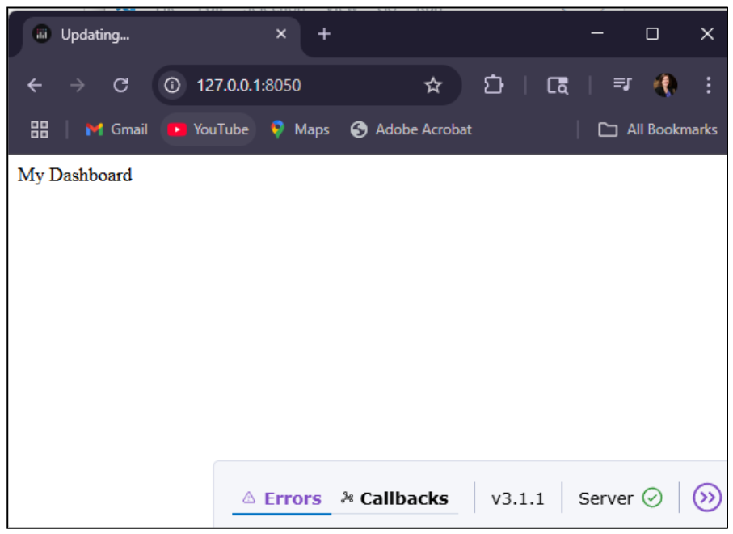{fig-align="center" width="350" height="250"}

When you run the code, Dash starts a local development server. You will see a message in the terminal:

> Dash is running on <http://127.0.0.1:8050/>

`127.0.0.1` is the **loopback address** — it always refers to your own machine. Port `8050` is Dash's default port. You can also access the app at <http://localhost:8050/> — these two addresses are equivalent.

A debug menu will appear in the bottom-right corner of the browser while `debug=True` is set. Press **Ctrl + C** in the terminal to stop the server when you are done testing.

::: note
When deploying to production, set `debug=False` to hide the debug menu and improve security and performance. The debug menu is a development convenience — never leave it on in a live app.
:::

## Adjusting the Layout

Python functions from the `dash.html` module mirror standard HTML elements and are used to build the visual structure of your Dash app. `app.layout` defines everything the user will see.

```{python}
from dash import Dash, html

app = Dash(__name__)
app.title = "My First Dash App"   # sets the browser tab title

app.layout = html.Div([
   html.H1("Hello Dash!"),
   html.P("This is a simple dashboard.")
])

if __name__ == "__main__":
   app.run(debug=True)
```

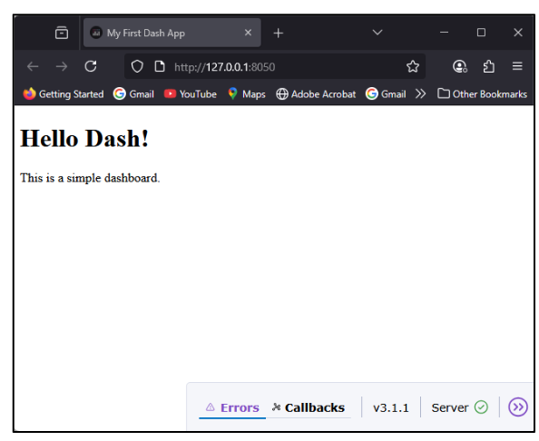{fig-align="center" width="350" height="250"}

`app.title` sets the **browser tab title** — the text you see in the tab at the top of Chrome or Firefox. It corresponds to the HTML `<title>` tag. Note: this is different from `html.H1`, which is the visible heading inside the page.

Key layout components:

-   [**`html.Div()`**]{style="background-color: yellow;"} — a container element (`<div>` tag) used to group and organize other components. Think of it as an invisible box.
-   [**`html.H1()`**]{style="background-color: yellow;"} — creates a large heading (`<h1>` tag). Use `H2` through `H6` for progressively smaller headings.
-   [**`html.P()`**]{style="background-color: yellow;"} — creates a paragraph (`<p>` tag) for regular body text.

## HTML Components Overview

Dash components are organized in a **hierarchical tree** — containers hold other components, which can themselves hold components. The two most commonly used modules are:

-   [**`dash.html`**]{style="background-color: yellow;"} — Dash HTML Components for page structure.
-   [**`dash.dcc`**]{style="background-color: yellow;"} — Dash Core Components for interactivity (introduced when we cover callbacks).

**HTML (HyperText Markup Language)** is the standard markup language for structuring web pages. In Dash, you write HTML using Python functions rather than raw HTML tags — `html.P("Hello")` in Python is equivalent to `<p>Hello</p>` in HTML.

Common HTML elements available in `dash.html`:

| Python                       | HTML equivalent          | Purpose            |
|----------------------------|-------------------------|-------------------|
| `html.H1("text")`            | `<h1>text</h1>`          | Largest heading    |
| `html.P("text")`             | `<p>text</p>`            | Paragraph          |
| `html.Div([...])`            | `<div>...</div>`         | Container/grouping |
| `html.Br()`                  | `<br>`                   | Line break         |
| `html.A("text", href="url")` | `<a href="url">text</a>` | Hyperlink          |

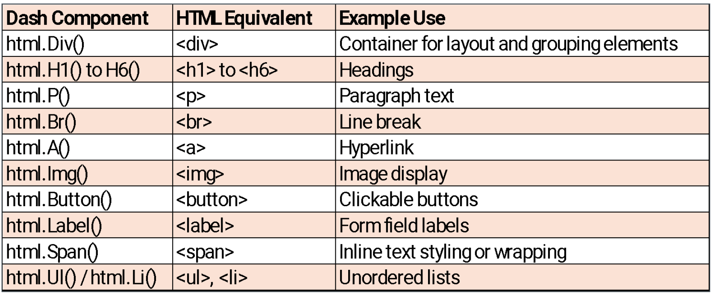

## Adding a Line Break and a Hyperlink

-   [**`html.Br()`**]{style="background-color: yellow;"} — inserts a line break, equivalent to `<br>` in HTML. It adds vertical spacing between elements without starting a new paragraph.

-   [**`html.A("Click here", href="https://example.com")`**]{style="background-color: yellow;"} — creates a clickable hyperlink. The first argument is the visible link text; `href` specifies the destination URL. `target="_blank"` opens the link in a new tab.

```{python}
app.layout = html.Div([
   html.H1("Hello Dash!"),
   html.P("This is a simple dashboard."),
   html.Br(),
   html.A("Click here", href="https://example.com", target="_blank")
])
```

## HTML Elements

In standard HTML, tags define the structure of a web page using the pattern `<tagname>content</tagname>`. In Dash, you use the `dash.html` module to create the same elements in Python — the two are directly equivalent:

```         
HTML:   <p>This is a paragraph</p>
Python: html.P("This is a paragraph")

HTML:   <h1>This is a Heading</h1>
Python: html.H1("This is a Heading")
```

```{python}
from dash import html
```

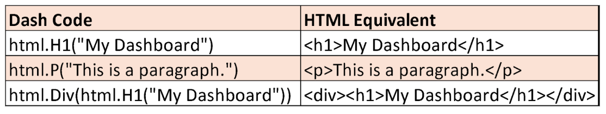

## Dash Layout and HTML Lab

**1.** What is the difference between `app.title` and `html.H1()` in a Dash app? Where does each appear, and why do you need both?

::: {.callout-note collapse="true"}
### Show Answer

`app.title` sets the **browser tab title** — the text that appears in the tab at the top of Chrome or Firefox. It corresponds to the HTML `<title>` tag inside the `<head>` of the page and is not visible in the page content itself. `html.H1()` creates a **visible heading** inside the page body — the large text the user actually reads. You need both because they serve different audiences: `app.title` helps users identify the tab when many are open, while `html.H1` provides the on-screen heading that anchors the page content. Setting only one leaves a gap — either the tab shows a default "Dash" title or the page has no visible heading.
:::

**2.** Write the Dash Python code to build a layout that contains: a large heading saying "Sales Dashboard", a paragraph saying "Q3 2024 Results", a line break, and a hyperlink labeled "Download Report" that opens `https://example.com/report.pdf` in a new tab.

::: {.callout-note collapse="true"}
### Show Answer

``` python
from dash import html

app.layout = html.Div([
    html.H1("Sales Dashboard"),
    html.P("Q3 2024 Results"),
    html.Br(),
    html.A("Download Report",
           href="https://example.com/report.pdf",
           target="_blank")
])
```

`html.Br()` takes no arguments — it is a self-closing tag. `target="_blank"` opens the link in a new tab; omitting it would navigate away from the Dash app in the same tab. The components are passed as a list to `html.Div()`, which groups them in a container `<div>`.
:::

**3.** Explain when you would use `debug=True` versus `debug=False` when running a Dash app, and what risk `debug=True` introduces if left on in a live deployment.

::: {.callout-note collapse="true"}
### Show Answer

Use `debug=True` during **development**: it enables hot reloading (code changes appear in the browser without restarting the server) and displays a debug menu in the bottom-right corner with detailed error tracebacks. Use `debug=False` in **production**: the debug menu exposes internal code structure, file paths, and local variable values to anyone who can trigger an error — a serious security vulnerability in a publicly accessible app. The hot reloader also runs an extra subprocess that can cause instability on some hosting environments (like Render.com). Always set `debug=False` before deploying.
:::

## Styling in Dash

In Dash apps, the `style` parameter applies CSS styling directly to a component using a **Python dictionary**. The keys are CSS property names written in **camelCase** (e.g., `fontSize` instead of `font-size`), and the values are strings.

```{python}
html.H1("Hello Dash", style={
    'color': '#381D5C',          # hex color code for text
    'fontSize': '20px',          # font size
    'backgroundColor': '#E898AA' # background color behind the heading
})
```

HTML color codes and hex values are available at [htmlcolorcodes.com](https://htmlcolorcodes.com/).

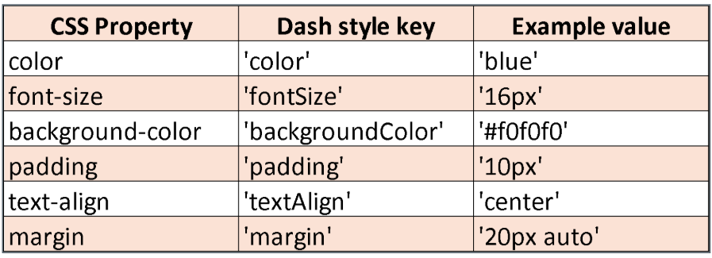

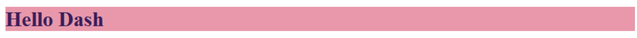

## Borders

The `style` dictionary accepts the following border-related keys:

-   [**`'border'`**]{style="background-color: yellow;"} — shorthand for all border properties at once: `{'border': '1px solid black'}` (width, style, color)
-   [**`'borderWidth'`**]{style="background-color: yellow;"} — sets the border thickness: `{'borderWidth': '2px'}`
-   [**`'borderStyle'`**]{style="background-color: yellow;"} — sets the line style: `{'borderStyle': 'dotted'}` (options: `solid`, `dashed`, `dotted`, `double`)
-   [**`'borderColor'`**]{style="background-color: yellow;"} — sets the border color: `{'borderColor': 'gray'}`
-   [**`'borderRadius'`**]{style="background-color: yellow;"} — rounds the corners: `{'borderRadius': '10px'}` (larger = rounder)

## Padding

**Padding** is the space *inside* the element, between its content and its border — like the margin of a page inside the cover.

-   [**`'padding'`**]{style="background-color: yellow;"} — sets equal padding on all four sides: `{'padding': '15px'}`
-   [**`'paddingTop'`, `'paddingBottom'`, `'paddingLeft'`, `'paddingRight'`**]{style="background-color: yellow;"} — control each side individually.

```{python}
html.P("This is a simple dashboard.",
       style={'border': '1px solid black',
              'padding': '10px'})   # adds space between the text and the border
```

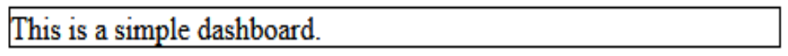

::: note
In Python, all key-value pairs in a dictionary must be separated by commas. Forgetting a comma between style properties is a common source of syntax errors.
:::

## Margin

**Margin** is the space *outside* the element, between its border and neighboring elements — like the white space between paragraphs on a page.

-   [**`'margin'`**]{style="background-color: yellow;"} — sets equal margin on all four sides: `{'margin': '20px'}`
-   [**`'marginTop'`, `'marginBottom'`, `'marginLeft'`, `'marginRight'`**]{style="background-color: yellow;"} — control each side individually.
-   `{'marginLeft': 'auto', 'marginRight': 'auto'}` — horizontally centers a block element within its parent container.

```{python}
html.P("This is a simple dashboard.",
       style={'border': '1px solid black',
              'padding': '20px',   # space inside (between text and border)
              'margin': '50px'})   # space outside (between border and page edge)
```

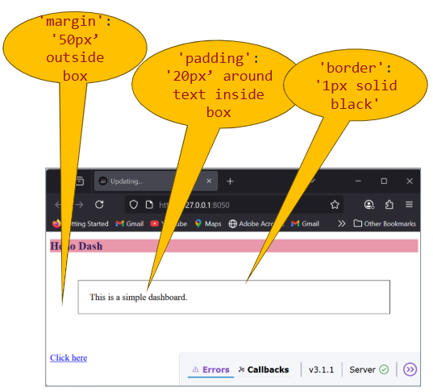{fig-align="center"}

## CSS in Dash: External Stylesheets

Inline `style={}` dictionaries are convenient for quick, component-specific adjustments. For consistent, app-wide styling, use an **external CSS file** in Dash's `assets/` folder.

If you create an `assets/` folder in your working directory and place a `.css` file inside it, Dash automatically loads and applies it to the entire app — no extra configuration needed.

**When to use each approach:**

| Approach | Best for |
|------------------------------------|------------------------------------|
| Inline `style={}` | Small, one-off overrides on a single component |
| External CSS in `assets/` | Consistent styling across the whole app or multiple pages |

## Styling the Body

The CSS below sets global defaults for the entire page:

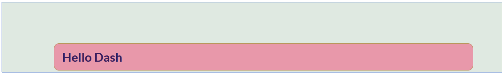

```{css}
body, html {
   padding: 40px;                    /* breathing room around all content */
   background: #dfe9e1;             /* light green-gray background */
   color: #1f1e1e;                  /* dark text color */
   font: 16px Arial, sans-serif;    /* base font size and family */
}
```

## Changing the Paragraph Background Color

```{css}
p {
   background-color: #d4cece;   /* applies to ALL <p> elements in the app */
}
```

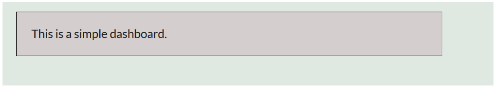

## Styling the Hyperlink

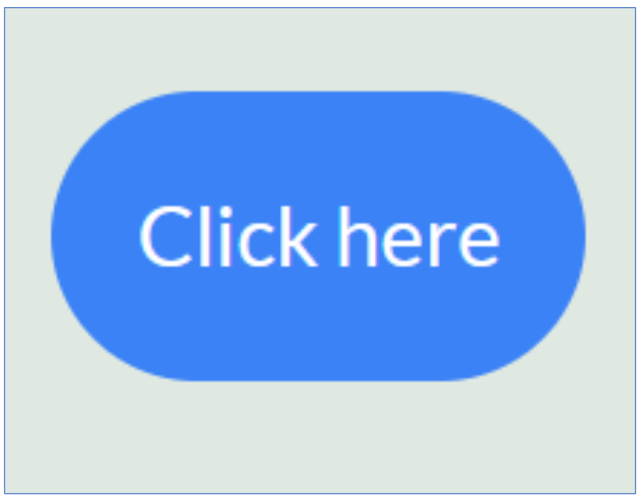{fig-align="center" width="350" height="300"}

The CSS below transforms a plain underlined link into a styled pill-shaped button:

```{css}
/* Rounded, colored hyperlink box */
a {
   display: inline-block;           /* allows padding and width to apply */
   padding: 25px;                   /* space inside the button */
   border-radius: 9999px;           /* large value = pill/capsule shape */
   background-color: #3b82f6;       /* blue background */
   color: #ffffff;                  /* white text */
   text-decoration: none;           /* removes the default underline */
   font-size: 24px;                 /* larger text */
}
```

CSS comments use the `/* comment */` syntax. They are ignored by the browser and are useful for documenting your style choices.

## Adding a Hover Effect

```{css}
/* Change background color when the mouse hovers over the link */
a:hover {
   background-color: #474d59;   /* darker gray on hover */
}
```

CSS offers four **link pseudo-classes** that let you style an anchor element at different interaction states. They should be defined in this order (the LVHA order) to work correctly:

-   [**`:link`**]{style="background-color: yellow;"} — default style of an unvisited link (the user has never clicked it).
-   [**`:visited`**]{style="background-color: yellow;"} — style for a link the user has already clicked (stored in browser history).
-   [**`:hover`**]{style="background-color: yellow;"} — applied while the pointer is over the element. This is the most commonly used.
-   [**`:active`**]{style="background-color: yellow;"} — applied at the instant the element is being clicked (mouse button pressed but not yet released). Useful for visual "press" feedback.

## Styling and CSS Lab

**1.** Write the inline `style` dictionary for an `html.H2` component that sets the text color to `#2c3e50`, font size to `24px`, adds `10px` padding on all sides, and gives it a `2px solid #cccccc` border with `8px` rounded corners.

::: {.callout-note collapse="true"}
### Show Answer

``` python
html.H2("Section Title", style={
    'color':        '#2c3e50',
    'fontSize':     '24px',
    'padding':      '10px',
    'border':       '2px solid #cccccc',
    'borderRadius': '8px'
})
```

CSS property names are written in **camelCase** in Python dictionaries: `fontSize` not `font-size`, `borderRadius` not `border-radius`. All values are strings. Forgetting a comma between any two key-value pairs will raise a `SyntaxError`.
:::

**2.** Explain the difference between padding and margin using the box model. If you want to increase the space between two stacked `html.P` components, which property do you change, and on which element?

::: {.callout-note collapse="true"}
### Show Answer

**Padding** is the space *inside* an element, between its content and its border — adding padding makes the element itself larger while keeping its border in the same position relative to neighbors. **Margin** is the space *outside* an element, between its border and the surrounding elements — adding margin pushes the element away from its neighbors without changing the element's own size. To increase space between two stacked `html.P` components, add `marginBottom` to the first paragraph (or `marginTop` to the second). Changing padding would add space inside each paragraph — between the text and any border — but would not increase the gap between them.
:::

**3.** When should you use an inline `style={}` dictionary versus an external CSS file in `assets/`? Give one scenario where each approach is clearly correct.

::: {.callout-note collapse="true"}
### Show Answer

Use **inline `style={}`** for small, one-off overrides on a single component — for example, centering one specific `html.H1` title: `html.H1("Dashboard", style={'textAlign': 'center'})`. The style applies only to that element and does not need to be reused anywhere else. Use an **external CSS file in `assets/`** for consistent app-wide styling — for example, setting the background color, font family, and base font size for the entire app, or styling all `<p>` elements the same way. Putting these in `assets/style.css` means you change them in one place, and every page of the app updates automatically. Scattering the same style across dozens of inline dictionaries makes the app hard to update and inconsistent.
:::

**4.** What is the LVHA order for CSS link pseudo-classes, and why does the order matter? Write the CSS for a link that is blue by default, purple when visited, and dark gray on hover.

::: {.callout-note collapse="true"}
### Show Answer

LVHA stands for `:link`, `:visited`, `:hover`, `:active` — the order pseudo-classes must be defined to work correctly. CSS applies rules in source order, and later rules override earlier ones when specificity is equal. If `:hover` is defined before `:visited`, hovering over a visited link would apply the unvisited color instead of the hover color, because `:visited` appears later and overrides it.

``` css
a:link    { color: #3b82f6; }          /* blue — unvisited */
a:visited { color: #7c3aed; }          /* purple — visited */
a:hover   { color: #374151; }          /* dark gray — on hover */
a:active  { color: #111827; }          /* near-black — while clicking */
```
:::

# Summary and Review

## Using AI

Use the following prompts with a generative AI tool to explore Dash and HTML styling further.

-   What is the difference between `dash.html` and `dash.dcc`? Give two examples of components from each module and describe when you would use them.
-   Explain the Dash callback data flow in plain language. What is a decorator, and what does `@app.callback()` actually tell Dash to do?
-   What is the difference between static and dynamic content in a Dash app? Give one example of each that a business analyst might build.
-   Explain the CSS box model: what are content, padding, border, and margin, and how do they relate to each other spatially?
-   When should you use inline `style={}` dictionaries versus an external CSS file in `assets/`? What maintenance problems arise from overusing inline styles?
-   What is the difference between an ID selector (`#id`) and a class selector (`.class`) in CSS? When would you use each in a Dash app?

## Summary

This chapter introduced Dash as a Python framework for building interactive web dashboards and covered HTML structure and CSS styling.

| Topic | Key concepts |
|------------------------------------|------------------------------------|
| Dash | Python library by Plotly; built on Flask + React; no JavaScript required |
| Two core modules | `dash.html` — page structure; `dash.dcc` — interactive components |
| Callbacks | Decorator-driven functions that link inputs to outputs; power all interactivity |
| Visualization tool choice | Matplotlib: static; Plotly: standalone charts; Dash: full interactive apps |
| Static vs. dynamic content | Static: files served once; dynamic: updated via callbacks, APIs, or live streams |
| First dashboard | `Dash()`, `app.layout`, `app.run(debug=True)` |
| debug=True vs. False | Development: hot reload + error detail; Production: always False |
| Layout components | `html.Div` (container), `html.H1`–`H6` (headings), `html.P` (paragraph) |
| Hyperlinks and breaks | `html.A(href=, target="_blank")`, `html.Br()` |
| Inline styling | `style={}` Python dict; CSS property names in camelCase; values as strings |
| CSS box model | Content → padding (inside) → border → margin (outside) |
| Borders | `border`, `borderWidth`, `borderStyle`, `borderColor`, `borderRadius` |
| Padding and margin | `padding`, `paddingTop/Bottom/Left/Right`; `margin`, `marginLeft/Right/Top/Bottom` |
| External CSS | Place `.css` in `assets/`; Dash loads automatically; prefer for app-wide styles |
| CSS selectors | ID (`#id`): unique elements; class (`.class`): reusable styles |
| Link pseudo-classes | LVHA order: `:link`, `:visited`, `:hover`, `:active` |

**What comes next:** The Writing Callbacks and Accessing APIs chapter adds interactivity — connecting user inputs to live data sources through callback functions and external API calls.
