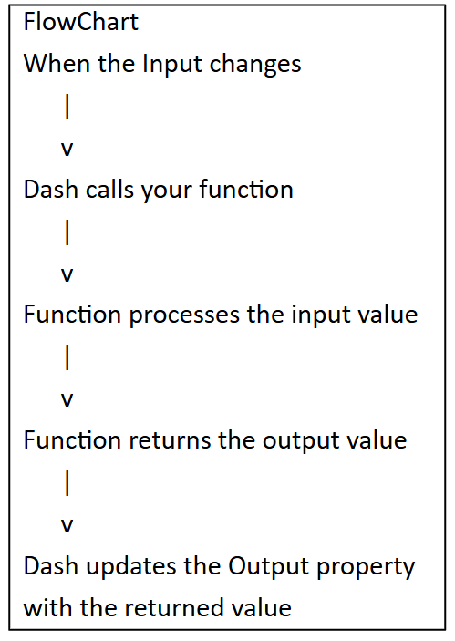
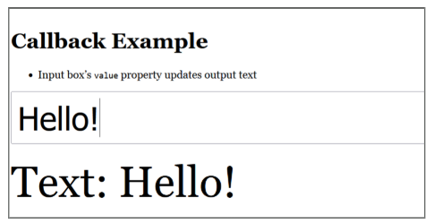
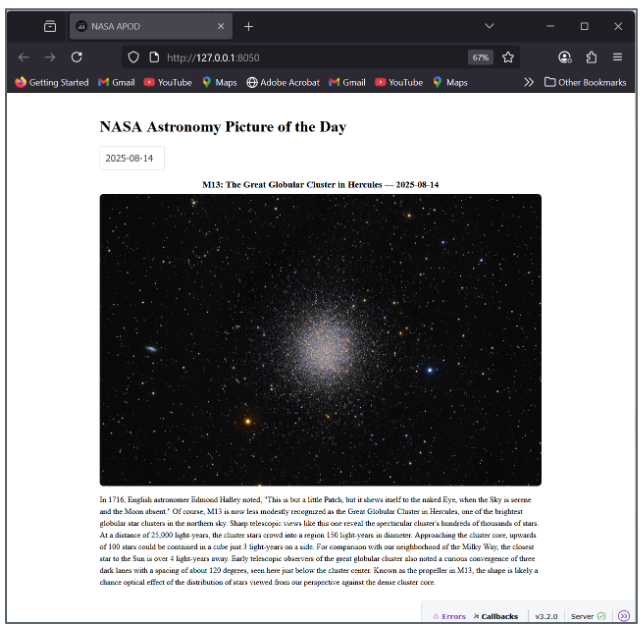

This section explains how callbacks make Dash apps interactive and how to connect them to external APIs. A callback function automatically runs when a user changes an input — such as typing text or selecting a date — and updates outputs like graphs or images in real time. Using the `@app.callback()` decorator, students learn to link inputs and outputs, handle multiple components, and structure interactive workflows with Dash Core Components such as `dcc.Input` and `dcc.DatePickerSingle`.

The lesson concludes with a hands-on example using NASA's Astronomy Picture of the Day (APOD) API. Students build a Dash app that lets users select a date, retrieves NASA's image or video for that day using the `requests` library, and displays the title, media, and explanation. Through this exercise, students learn how to combine callbacks, APIs, and conditional logic to create dynamic, data-driven dashboards.

## Callback Functions

A **callback function** in Python is a function that is automatically executed in response to a specific event or change. In Dash, callback functions link inputs and outputs — when an input component's property changes (for example, a dropdown selection or slider value), the callback runs automatically to update the output component (such as a graph or text display).

Think of callbacks as the nervous system of your Dash app: the layout defines what the user sees; callbacks define how the app responds to what the user does.

> *"If the user changes the dropdown, automatically run the callback function to update the graph."*

The basic structure of a callback function:

```{python}
def function_name(inputs):
    # process the input values
    return outputs   # return value(s) that update the output component(s)
```

The data flow is always:

[**Input component property**]{style="background-color: yellow;"} → **callback function runs** → [**Output component property updated**]{style="background-color: yellow;"}

# Callbacks in Dash: The Basics

```{python}
# Callback syntax template
from dash import Input, Output

@app.callback(
    Output(component_id, component_property),  # where to send the result
    Input(component_id, component_property)    # what triggers the function
)
def function_name(input_object):
    # process the input
    return output_object   # must match the Output(s) declared above
```

Breaking down the parts:

-   [**`@app.callback`**]{style="background-color: yellow;"} — the **decorator** that registers this function as a callback. It tells Dash: "when the Input changes, run the function below and send the return value to the Output."
-   [**`Input`**]{style="background-color: yellow;"} — specifies which component and which property will trigger the function when it changes.
-   [**`Output`**]{style="background-color: yellow;"} — specifies which component and which property should be updated with the function's return value.
-   [**`component_id`**]{style="background-color: yellow;"} — the `id` string you assigned to a layout component (e.g., `id="my-dropdown"`).
-   [**`component_property`**]{style="background-color: yellow;"} — a specific property of that component (e.g., `"value"` for a dropdown, `"children"` for a Div, `"figure"` for a Graph).

## The Callback Function

{fig-align="center" width="260" height="400"}

The function arguments correspond to the `Input`s **in order**, and the return values correspond to the `Output`s **in order**. If you have two Inputs, the function receives two arguments; if you have two Outputs, the function must return two values.

```{python}
@app.callback(
    Output("result-div", "children"),   # first (and only) output
    Input("my-input",    "value")       # first (and only) input
)
def update_result(user_input):          # receives Input value as argument
    processed = user_input.upper()      # do something with it
    return processed                    # returned value goes to Output
```

## Multiple Inputs and Outputs

A single callback can handle multiple inputs and outputs:

-   **Multiple Inputs** — the function runs whenever *any* of the listed inputs change. The arguments arrive in the same order the Inputs are declared.
-   **Multiple Outputs** — return a tuple or list with one value per Output, in the same order they are declared.

```{python}
@app.callback(
    [Output('graph',   'figure'),    # output 1: update the chart
     Output('summary', 'children')], # output 2: update the text summary
    [Input('dropdown', 'value'),     # input 1: dropdown selection
     Input('slider',   'value')]     # input 2: slider position
)
def update_dashboard(selected_category, slider_value):
    # arguments match Input order: selected_category ← dropdown, slider_value ← slider
    fig  = make_figure(selected_category, slider_value)
    text = f"Showing: {selected_category} | Threshold: {slider_value}"
    return fig, text   # return values match Output order
```

## Dash Core Components (`dcc`)

**`dcc`** (Dash Core Components) is a module providing interactive UI elements that users can manipulate to trigger callbacks. Common components include:

| Component              | Purpose                      | Key property  |
|------------------------|------------------------------|---------------|
| `dcc.Input`            | Text or number input box     | `value`       |
| `dcc.Dropdown`         | Select from a list           | `value`       |
| `dcc.Slider`           | Numeric range selector       | `value`       |
| `dcc.DatePickerSingle` | Pick a single date           | `date`        |
| `dcc.Graph`            | Plotly chart container       | `figure`      |
| `dcc.Interval`         | Trigger callbacks on a timer | `n_intervals` |

## Callback Example



The complete app below creates a text input box whose value is mirrored in real time to a large display `Div` — the simplest possible demonstration of a callback in action.

```{python}
# callback_example.py
from dash import Dash, html, dcc, Input, Output, callback

app = Dash(__name__)
app.title = "Callback Example"

app.layout = html.Div(
    style={"maxWidth": 900, "margin": "40px auto", "fontFamily": "Georgia, serif"},
    children=[
        html.H1("Callback Example"),
        html.Ul([
            html.Li(["Input box's ", html.Code("value"), " property updates output text"])
        ]),
        dcc.Input(
            id="text-in",           # ID used in the callback Input()
            type="text",
            placeholder="type here…",
            style={"width": "100%", "fontSize": "48px", "padding": "8px"},
        ),
        html.Div(id="text-out",     # ID used in the callback Output()
                 style={"fontSize": "64px", "marginTop": "20px"}),
    ],
)

@callback(
    Output(component_id="text-out", component_property="children"),
    Input(component_id="text-in",  component_property="value")
)
def show_text(value):
    return f"Text: {value or ''}"   # value or '' prevents an error when the box is empty

if __name__ == "__main__":
    app.run(debug=True)
```

## `dcc.Input`

**`dcc.Input`** renders an HTML input box inside your app. The most important property is `value` — it holds whatever the user has typed and is what you connect to a callback.

```{python}
dcc.Input(
    id="text-in",        # unique ID for callback wiring
    type="text",         # "text", "number", "password", "email", etc.
    placeholder="type here…",
    debounce=False,      # if True, only fires callback when user presses Enter or clicks away
    style={"width": "100%", "fontSize": "48px", "padding": "8px"},
)
```

::: note
`children` is the default first positional argument for `dash.html` components, so `html.Div("Hello")` is equivalent to `html.Div(children="Hello")`. You can omit `children=` when passing it as the first argument.
:::

## Connecting the `dcc` to the Callback

```{python}
@callback(
    Output("text-out", "children"),   # update the text inside the Div with id="text-out"
    Input("text-in",  "value")        # trigger when the value of the Input with id="text-in" changes
)
def show_text(value):
    return f"Text: {value or ''}"
```

Breaking this down:

-   [**`@callback(...)`**]{style="background-color: yellow;"} — registers the function. When `text-in`'s `value` changes, run `show_text` and send the return value to `text-out`'s `children`.
-   [**`Output("text-out", "children")`**]{style="background-color: yellow;"} — `"text-out"` is the component to update; `"children"` is its text content property.
-   [**`Input("text-in", "value")`**]{style="background-color: yellow;"} — `"text-in"` is the component to watch; `"value"` is the property that changes when the user types.
-   **`value or ''`** — `value` is `None` when the input box is empty (the user has not typed anything). The `or ''` pattern safely substitutes an empty string, preventing errors from calling `.upper()` or other string methods on `None`.

::: note
You do not need to write `component_id=` and `component_property=` explicitly. Dash accepts positional arguments: `Output("text-out", "children")` is equivalent to `Output(component_id="text-out", component_property="children")`. Positional syntax is more concise and more commonly seen in practice.
:::

## Callbacks Lab

**1.** What is a decorator in Python, and what does `@app.callback()` specifically tell Dash to do? Explain the data flow in plain language from the moment a user changes an input to the moment the output updates.

::: {.callout-note collapse="true"}
### Show Answer

A **decorator** is a function that wraps another function to extend or modify its behavior — the `@` syntax is Python shorthand for applying it. `@app.callback()` registers the function below it with Dash's reactive framework. In plain language: when Dash starts, it reads all decorated callback functions and builds an internal map of which inputs are connected to which outputs. When a user changes an input component (e.g., types in a text box), Dash detects the change, collects the current values of all declared `Input` properties, calls the decorated function with those values as arguments, and takes the return value(s) and assigns them to the declared `Output` property or properties — updating the page immediately without a full browser reload.
:::

**2.** A callback has two `Input` components and two `Output` components. Write the decorator and function signature only (no body) to wire: Input 1 = `dcc.Dropdown` with `id="region-dd"` and property `"value"`; Input 2 = `dcc.Slider` with `id="year-slider"` and property `"value"`; Output 1 = `dcc.Graph` with `id="sales-chart"` and property `"figure"`; Output 2 = `html.Div` with `id="summary-text"` and property `"children"`.

::: {.callout-note collapse="true"}
### Show Answer

``` python
@app.callback(
    Output("sales-chart",  "figure"),
    Output("summary-text", "children"),
    Input("region-dd",    "value"),
    Input("year-slider",  "value")
)
def update_dashboard(selected_region, selected_year):
    ...
```

The function receives two arguments in the same order as the `Input` declarations: `selected_region` ← `"region-dd"`, `selected_year` ← `"year-slider"`. It must return two values in the same order as the `Output` declarations: `figure` first, `children` second. Returning them in the wrong order will silently assign the wrong value to the wrong component.
:::

**3.** Why does the pattern `value or ""` (or `value or 0`) appear so often in Dash callback functions? What happens if you skip this guard and call `.upper()` on a `None` value?

::: {.callout-note collapse="true"}
### Show Answer

When a `dcc.Input` box is empty, Dash passes `None` as the argument — not an empty string or zero. `None` is not a string or a number, so any string or arithmetic operation on it raises an error. `value or ""` uses Python's short-circuit evaluation: if `value` is `None` (falsy), the expression evaluates to `""` (the right-hand side). If `value` is a non-empty string (truthy), the expression evaluates to `value` unchanged. Without this guard, calling `None.upper()` raises `AttributeError: 'NoneType' object has no attribute 'upper'` — crashing the callback and causing the output component to display a generic "Callback error" message in the browser rather than updating correctly.
:::

# Making a Callback Using NASA's API

### Overview

The goal is to build a Dash app that connects to **NASA's Astronomy Picture of the Day (APOD) API**, letting users pick a date and instantly see the image or video NASA published for that day, along with its title and description.

APOD is a free, public API — no sign-up required for testing with the `DEMO_KEY`, though the demo key has rate limits (30 requests/hour). For heavier use, register for a free key at [api.nasa.gov](https://api.nasa.gov).

### Imports and Constants

```{python}
import datetime as dt
import requests
from dash import Dash, html, dcc, Input, Output, exceptions

API_KEY  = "DEMO_KEY"                           # replace with your own for higher rate limits
APOD_URL = "https://api.nasa.gov/planetary/apod"
MIN_DATE = dt.date(1995, 6, 16)                 # first APOD was published June 16, 1995
TODAY    = dt.date.today()                      # computed at runtime, not hardcoded
```



### Setting the Layout

The layout defines what the user sees. Static in structure but contains placeholder components (identified by `id`) that callbacks will populate with live data.

```{python}
app = Dash(__name__)
app.title = "NASA APOD"

app.layout = html.Div(
    style={"margin": "0 auto", "padding": 20},
    children=[
        html.H1("NASA Astronomy Picture of the Day"),

        # Date picker: user selects which date to view
        dcc.DatePickerSingle(
            id="apod-date",
            min_date_allowed=MIN_DATE,       # earliest valid date
            max_date_allowed=TODAY,          # cannot pick a future date
            date=TODAY,                      # default selection: today
            display_format="YYYY-MM-DD",
            clearable=False,                 # prevent the user from clearing the date
        ),

        # Spinner shown while media is loading; wraps the image/video placeholder
        dcc.Loading(html.Div(id="media",
                             style={"marginTop": 16, "textAlign": "center"})),

        # Placeholder for the text description
        html.Div(id="caption"),
    ],
)
```

Key layout components:

-   [**`dcc.DatePickerSingle`**]{style="background-color: yellow;"} — renders a calendar date picker. Its `date` property (a string in `YYYY-MM-DD` format) is what the callback listens to.
-   [**`dcc.Loading`**]{style="background-color: yellow;"} — wraps a component and shows a loading spinner automatically whenever a callback is updating that component.
-   **`id="media"` and `id="caption"`** — these are empty placeholders; callbacks will fill them with content.

### Making the Callback

```{python}
@app.callback(
    [Output("media",   "children"),   # will receive the image or video component
     Output("caption", "children")],  # will receive the explanation text
    Input("apod-date", "date"),        # triggers when the selected date changes
)
```

### The `show_apod` Function

```{python}
def show_apod(date_str):
    # Guard: if no date is selected, do nothing
    if not date_str:
        raise exceptions.PreventUpdate

    # Convert the date string to a Python date object
    # [:10] slices "2024-01-15T00:00:00" down to "2024-01-15"
    try:
        date_obj = dt.date.fromisoformat(date_str[:10])
    except Exception:
        return "Invalid date.", ""

    # Build query parameters and call the API
    params = {"api_key": API_KEY, "date": date_obj.isoformat()}
    try:
        r = requests.get(APOD_URL, params=params, timeout=10)
        r.raise_for_status()   # raises an exception if status code is not 200
        data = r.json()        # parse JSON response into a Python dictionary
    except requests.RequestException as e:
        return f"API error: {e}", ""
```

What each part does:

-   [**`exceptions.PreventUpdate`**]{style="background-color: yellow;"} — a special Dash exception that stops the callback from running without updating any outputs. Use this instead of returning `None` when there is genuinely nothing to update.
-   [**`date_str[:10]`**]{style="background-color: yellow;"} — the date picker sometimes includes a time component (`T00:00:00`). Slicing to the first 10 characters ensures we always get just `YYYY-MM-DD`.
-   [**`r.raise_for_status()`**]{style="background-color: yellow;"} — raises a `requests.HTTPError` if the server returned an error code (4xx or 5xx). Without this, a failed request would appear to succeed.
-   [**`timeout=10`**]{style="background-color: yellow;"} — prevents the app from hanging indefinitely if the API is slow. 10 seconds is a reasonable threshold.

### Rendering the Media

```{python}
    # Extract fields safely using .get() with defaults
    media_type  = data.get("media_type", "")   # "image" or "video"
    url         = data.get("url", "")
    title       = data.get("title", "APOD")
    explanation = data.get("explanation", "")

    # Render the appropriate component based on media type
    if media_type == "image":
        media = html.Img(
            src=url,
            style={"maxWidth": "100%", "borderRadius": 8},
            alt=title   # alt text for accessibility
        )
    elif media_type == "video":
        media = html.Iframe(
            src=url,
            style={"width": "100%", "height": 500, "border": 0}
        )
    else:
        media = html.Div("Unsupported media type.")

    header = html.H3(f"{title} — {date_obj.isoformat()}",
                     style={"marginBottom": 8})

    # Return TWO values — one for each Output in the callback
    return html.Div([header, media]), explanation

if __name__ == "__main__":
    app.run(debug=True)
```

Why `.get()` with defaults? The NASA API may not include every field for every date (especially very early APOD entries). Using `.get("key", default)` prevents `KeyError` exceptions when a field is absent — a form of **defensive programming** essential for any code calling external APIs.

The function returns **two values** separated by a comma, matching the two `Output`s declared in `@app.callback`. The order matters: the first return value goes to `"media"`, the second to `"caption"`.

## NASA API Callback Lab

**1.** The NASA APOD callback uses `exceptions.PreventUpdate` instead of returning `None` when no date is selected. What is the difference between the two approaches, and why does `PreventUpdate` produce better user experience?

::: {.callout-note collapse="true"}
### Show Answer

Returning `None` from a callback tells Dash to update the output component with the value `None` — which typically clears it or displays nothing, causing a visible blank flash or layout shift. `PreventUpdate` is a special Dash exception that tells Dash: "stop processing this callback entirely and leave all output components exactly as they are." For the APOD app, this means the media and caption areas stay populated with whatever was last displayed while no date is selected, rather than going blank. `PreventUpdate` is the correct tool whenever a callback detects that it has nothing meaningful to return — for example, when a required input has not yet been filled in or when the user's action does not actually require an update.
:::

**2.** The callback uses `r.raise_for_status()` after the API call. What does this method do, and what would happen if you omitted it and the NASA API returned a `403 Forbidden` error?

::: {.callout-note collapse="true"}
### Show Answer

`r.raise_for_status()` inspects the HTTP response status code and raises a `requests.HTTPError` exception if the code indicates failure (4xx client errors or 5xx server errors). Without it, `requests.get()` returns successfully even when the server responded with an error — because the HTTP transaction itself completed. If you omit it and the API returns `403 Forbidden` (e.g., because the demo key has hit its rate limit), `r.json()` would either raise a `JSONDecodeError` (if the error response is not valid JSON) or silently return an error dictionary that does not contain `media_type`, `url`, or `title`. The `.get()` calls would return empty defaults, and the app would display a blank image area with no explanation — a confusing user experience with no visible error message.
:::

**3.** The media rendering uses `data.get("media_type", "")` with a default rather than `data["media_type"]`. Explain why defensive `.get()` calls are especially important when consuming external APIs compared to data you control internally.

::: {.callout-note collapse="true"}
### Show Answer

When you access a dictionary key directly with `data["key"]`, Python raises a `KeyError` if the key is absent — crashing the callback with no output to the user. External APIs introduce field absence as a routine condition, not an edge case: API responses evolve over time (fields are added, deprecated, or conditionally omitted); early historical records in an API may not include fields added later (the first APOD in 1995 predates fields like `copyright` added in later API versions); and error responses often return entirely different JSON structures than success responses. Using `.get("key", default)` returns a safe fallback silently, allowing the function to continue and render a degraded but functional result. With internal data you control, you can enforce a schema — every record is guaranteed to have certain fields. With external APIs, you can only request; the server decides what it returns.
:::

# Summary and Review

## Using AI

Use the following prompts with a generative AI tool to explore callbacks and API integration further.

-   What is a Python decorator, and how does `@app.callback()` use it to register reactive functions in Dash?
-   Explain the Input → callback → Output data flow. What happens inside Dash between the moment a user changes a dropdown and the moment the chart updates?
-   What is `exceptions.PreventUpdate`, and when should you use it instead of returning a default value from a callback?
-   Why do callback functions need to guard against `None` inputs? What Python pattern handles this, and why does `None` appear at all?
-   What is `r.raise_for_status()`, and why is it important when calling external APIs inside a callback?
-   What is defensive programming with `.get()` on API responses, and why is it more important for external APIs than for internal data?

## Summary

This chapter introduced Dash callbacks and showed how to connect them to external APIs for live, data-driven dashboards.

| Topic | Key concepts |
|------------------------------------|------------------------------------|
| Callback concept | Function that runs automatically when an input property changes |
| Data flow | Input property changes → callback runs → return value sent to Output property |
| `@app.callback()` decorator | Registers the function; declares all Inputs and Outputs |
| `Input` / `Output` | Specify component id and property to watch or update |
| Argument and return order | Args match Input order; return values match Output order |
| Multiple inputs/outputs | Any input change triggers the callback; return one value per Output |
| `dcc` components | `dcc.Input`, `dcc.Dropdown`, `dcc.Slider`, `dcc.DatePickerSingle`, `dcc.Graph`, `dcc.Interval` |
| `None` guard | `value or ""` / `value or 0` — protects against empty inputs passing `None` |
| `PreventUpdate` | Stops the callback without changing any output; better than returning `None` |
| `dcc.Loading` | Wraps a component; shows a spinner while its callback is running |
| API calls in callbacks | `requests.get()`, `r.raise_for_status()`, `r.json()` |
| Defensive `.get()` | `data.get("key", default)` — safe key access when external API fields may be absent |
| `date_str[:10]` | Strips time component from ISO datetime strings returned by `dcc.DatePickerSingle` |
| Conditional rendering | `if media_type == "image"` / `elif "video"` — render appropriate component per API response |

**What comes next:** The Creating a Grid Layout in Dash chapter introduces Bootstrap-based responsive layouts — arranging multiple charts, KPI cards, and controls side by side in a professional multi-column dashboard.
