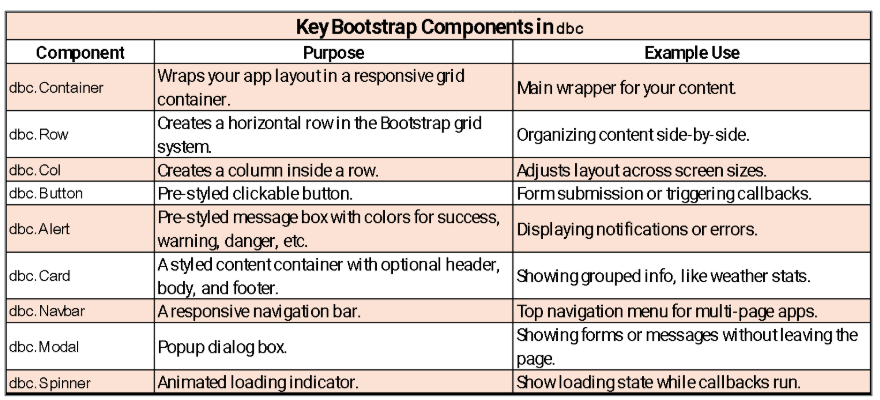
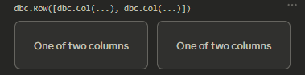
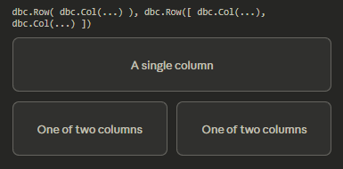
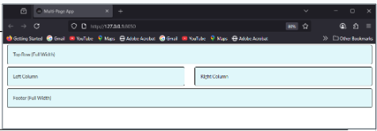
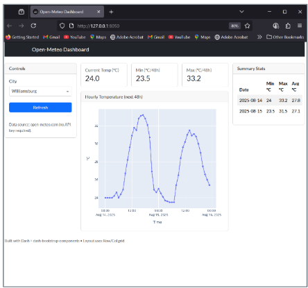
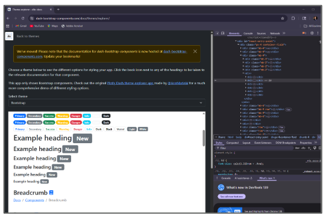

This section demonstrates how to create grid-based layouts in Dash using **Dash Bootstrap Components (dbc)** to make dashboards organized, responsive, and professional. It begins by contrasting Dash's default vertical stacking of components with the flexible row-and-column grid system provided by Bootstrap. Students learn to use `dbc.Row()` and `dbc.Col()` to arrange content horizontally, apply embedded styles or external themes, and control spacing and responsiveness. The lesson then builds a full multi-column dashboard integrating real-world data from the **Open-Meteo API**. Using the `requests` and `pandas` libraries, students fetch 48-hour temperature forecasts for selected Virginia cities and visualize them with Plotly Express. Bootstrap cards display key metrics — current, minimum, and maximum temperature — alongside a line chart and a dynamic summary table, all arranged within a responsive grid.

## Dash Layout and Bootstrap

### Default vs. Grid Layouts

By default, Dash stacks components **vertically** (top to bottom) when you place them inside an `html.Div()` without any grid or flex styling:

```         
Component 1
    ↓
Component 2
    ↓
Component 3
```

This is useful for dashboards where content is consumed in a specific order (filters → charts → details). For side-by-side layouts, you need a grid system:

```         
Component 1 | Component 2 | Component 3
```

# Bootstrap

**Bootstrap** is a popular front-end framework that provides a responsive grid layout, prebuilt UI components, and utility classes. **Dash Bootstrap Components** (`dash-bootstrap-components`, imported as `dbc`) makes Bootstrap available inside Dash apps.

Bootstrap's grid system is built on **12 equal units per row**. You control each column's width with `md=N`, where `N` is the number of units that column occupies:

| `md=` value | Width                   | Common use                            |
|-----------------|----------------------|----------------------------------|
| `md=12`     | Full width (100%)       | Title rows, footers                   |
| `md=6`      | Half width (50%)        | Two equal columns                     |
| `md=4`      | One-third width (33%)   | Three equal columns (e.g., KPI cards) |
| `md=3`      | One-quarter width (25%) | Narrow sidebars                       |

The two core layout components are:

-   [**`dbc.Row()`**]{style="background-color: yellow;"} — a horizontal container. Only `dbc.Col()` components should be its direct children.
-   [**`dbc.Col()`**]{style="background-color: yellow;"} — where content actually lives. Its `md=N` parameter controls its share of the 12-column grid.

## Top Components in `dbc`



## Grid Layout Examples

### Example 1 — Two Equal Columns

When no `md=` is specified, Bootstrap divides the space equally among the columns.



```{python}
import dash_bootstrap_components as dbc
from dash import html

dbc.Row([
    dbc.Col(html.Div('One of two columns')),   # no md set → splits evenly (effectively md=6 each)
    dbc.Col(html.Div('One of two columns'))
])
```

### Example 2 — One Full-Width Row, Then Two Columns



```{python}
import dash_bootstrap_components as dbc
from dash import html

dbc.Row(
    dbc.Col(html.Div('A single column'))   # one Col inside → takes full 12-column width
),
dbc.Row([
    dbc.Col(html.Div('One of two columns')),
    dbc.Col(html.Div('One of two columns'))
])
```

## Building a Two-Column App

### Applying a Bootstrap Theme

`dash_bootstrap_components` lets you apply a full Bootstrap theme via an external stylesheet, instantly giving your app Bootstrap's grid, typography, and utility classes — no custom CSS required. Swap themes (e.g., `dbc.themes.COSMO`, `LUX`, `MATERIA`, `CYBORG`) for a different visual style while still overriding specifics in `assets/style.css`.

```{python}
from dash import Dash, html
import dash_bootstrap_components as dbc

app = Dash(__name__, external_stylesheets=[dbc.themes.BOOTSTRAP])
app.title = "Multi Layout App"
```

### Embedded Styles

**Embedded styles** are Python dictionaries passed directly to the `style` prop. Use them for quick, component-specific overrides. For consistent app-wide styling, use an external stylesheet in `assets/` instead.

```{python}
box_style = {
    "border":          "2px solid black",
    "borderRadius":    "5px",
    "margin":          "5px",
    "padding":         "20px",
    "backgroundColor": "#e0f7fa"
}
```

### Full Two-Column Layout

```{python}
app.layout = dbc.Container([
    # Row 1: full width — width=12 uses all 12 Bootstrap columns
    dbc.Row(
        dbc.Col(html.Div("Top Row (Full Width)", style=box_style), width=12)),

    # Row 2: two equal columns — Bootstrap splits automatically when md is not set
    dbc.Row([
        dbc.Col(html.Div("Left Column",  style=box_style)),
        dbc.Col(html.Div("Right Column", style=box_style))
    ]),

    # Row 3: full-width footer
    dbc.Row(dbc.Col(html.Div("Footer (Full Width)", style=box_style), width=12))

], fluid=True)  # fluid=True = full browser width; omit for a fixed max-width container

if __name__ == "__main__":
    app.run(debug=True)
```



::: note
`dbc.Container(fluid=True)` makes the layout span the full browser width. Without `fluid=True`, Bootstrap applies a fixed maximum width with padding on both sides — appropriate for text-heavy pages but not for dashboards that should fill the screen.
:::

# Multi-Layout Weather App

## Imports and City Coordinates

```{python}
# MultiLayoutWeather.py
import requests
import pandas as pd
from dash import Dash, html, dcc, Input, Output
import dash_bootstrap_components as dbc
import plotly.express as px

# Each city maps to (latitude, longitude) — used to call the weather API
CITY_COORDS = {
    "Williamsburg":    (37.2707,  -76.7075),
    "Richmond":        (37.5407,  -77.4360),
    "Virginia Beach":  (36.8529,  -75.9780),
    "Roanoke":         (37.27097, -79.94143),
    "Charlottesville": (38.0293,  -78.4767)
}
```



## Fetching the Hourly Temperature

`fetch_hourly_temp(lat, lon)` returns a 48-row DataFrame — one row per hour — of forecast temperature data for a given location.

```{python}
def fetch_hourly_temp(lat: float, lon: float) -> pd.DataFrame:
    """Fetch next-48-hours hourly temperature from Open-Meteo (no API key required)."""
    url = (
        "https://api.open-meteo.com/v1/forecast"
        f"?latitude={lat}&longitude={lon}"
        "&hourly=temperature_2m&forecast_days=2&timezone=auto"
    )
    r = requests.get(url, timeout=15)
    r.raise_for_status()                             # raise exception on HTTP error (4xx/5xx)
    data = r.json()["hourly"]                        # extract the nested hourly block from JSON
    df = pd.DataFrame({
        "time":   data["time"],
        "temp_C": data["temperature_2m"]             # _2m = measured 2 meters above ground level
    })
    df["time"] = pd.to_datetime(df["time"])          # convert ISO 8601 strings to datetime objects
    return df
```

## Bootstrap Grid Layout Lab

**1.** Bootstrap's grid is based on 12 units per row. Write the `dbc.Row` and `dbc.Col` structure for a layout with: a full-width header row, then a row with a narrow left sidebar (3 units), a wide center chart area (6 units), and a narrow right panel (3 units). What must the column widths in any row sum to?

::: {.callout-note collapse="true"}
### Show Answer

Column widths must sum to **12** (or be left unset for equal auto-distribution).

``` python
dbc.Container([
    dbc.Row(
        dbc.Col(html.Div("Header"), width=12)
    ),
    dbc.Row([
        dbc.Col(html.Div("Sidebar"),    md=3),
        dbc.Col(html.Div("Chart"),      md=6),
        dbc.Col(html.Div("Right Panel"), md=3),
    ])
], fluid=True)
```

3 + 6 + 3 = 12. If the columns do not sum to 12, Bootstrap either truncates the last column or leaves empty space. Using `md=` sets the width at medium screen sizes and above; on smaller screens Bootstrap may stack them vertically depending on the theme configuration.
:::

**2.** What is the difference between `dbc.Container(fluid=True)` and `dbc.Container()` (without `fluid`)? When would you choose each in a dashboard context?

::: {.callout-note collapse="true"}
### Show Answer

`dbc.Container()` without `fluid` applies a **fixed maximum width** with automatic padding on both sides — the content is centered and does not stretch beyond a defined breakpoint (typically around 1140px on large screens). This is appropriate for text-heavy pages or content where readability is the priority. `dbc.Container(fluid=True)` makes the layout **span the full browser width** — the content fills the entire viewport regardless of screen size. This is the standard choice for dashboards, where charts and tables should use all available horizontal space. Most Dash dashboards use `fluid=True`.
:::

**3.** The weather app's `fetch_hourly_temp` function uses `r.raise_for_status()` and returns a pandas DataFrame. If the Open-Meteo API is temporarily unavailable and returns a `503 Service Unavailable` error, what happens in the current code, and how would you modify the callback to handle this gracefully?

::: {.callout-note collapse="true"}
### Show Answer

In the current code, `r.raise_for_status()` raises a `requests.HTTPError`, which propagates up through `fetch_hourly_temp` and crashes the callback — the user sees a "Callback error updating..." message in Dash's debug mode, or a blank output. To handle this gracefully, wrap the `fetch_hourly_temp` call inside the callback in a `try/except` block:

``` python
try:
    df = fetch_hourly_temp(lat, lon)
except requests.RequestException as e:
    error_msg = html.Div(f"Unable to fetch weather data: {e}",
                         style={"color": "red"})
    return {}, "--", "--", "--", error_msg
```

This returns a blank figure, placeholder KPI values, and a visible error message in the table area — far better than a silent crash. Always wrap external API calls in callbacks with error handling so users receive informative feedback rather than a broken dashboard.
:::

# Theme, Navbar, and CSS

## Theme Explorer

Browse available Bootstrap themes at [dash-bootstrap-components.com/docs/themes/explorer](https://www.dash-bootstrap-components.com/docs/themes/explorer/). Use **Ctrl + I** (browser inspector) to identify specific Bootstrap class names or CSS values you want to apply or override.



## CSS: IDs vs. Classes

A single external stylesheet in `assets/` is best practice for multi-page apps: centralized, consistent, and updated in one place.

|              | **ID**                  | **Class**             |
|--------------|-------------------------|-----------------------|
| CSS selector | `#my-id`                | `.my-class`           |
| Applied to   | One unique element      | Many elements         |
| Specificity  | Higher (wins conflicts) | Lower                 |
| In Dash      | Also wires callbacks    | Shared visual styling |

Prefer **classes** for reusable styles; reserve **IDs** for unique elements or callback targets.

## Building the Navbar

Bootstrap utility classes let you style elements without writing custom CSS:

```{python}
app = Dash(__name__, external_stylesheets=[dbc.themes.BOOTSTRAP])
app.title = "Open-Meteo Dashboard"

navbar = html.Div(
    [
        html.H3("Open-Meteo Dashboard", className="text-white"),
        html.Span("Public API – Multi-column layout", className="text-white"),
    ],
    className="navbar navbar-dark bg-dark mb-4 px-3"
    #          ↑ base     ↑ light text  ↑ dark bg ↑ bottom margin ↑ horizontal padding
)
```

# Building Dashboard Components

## Controls Panel

```{python}
controls = dbc.Card([
    dbc.CardHeader("Controls"),
    dbc.CardBody([
        dbc.Label("City"),
        dcc.Dropdown(
            id="city-dd",
            options=[{"label": k, "value": k} for k in CITY_COORDS.keys()],
            # "label" = what the user sees; "value" = what the callback receives
            value="Williamsburg",
            clearable=False,
        ),
        html.Br(),
        dbc.Button("Refresh", id="refresh", n_clicks=0, className="w-100"),
        # w-100 = Bootstrap class: full width within the parent container
        html.Hr(),
        html.Small(
            "Data source: open-meteo.com (no API key required).",
            className="text-muted",
        ),
    ])
], className="mb-3")   # mb-3 = Bootstrap margin-bottom spacing utility
```

## KPI Cards and Chart

A **KPI card** is a small Bootstrap card that displays a single summary metric — a label and a large number. Each card's `id_` is updated by the callback.

```{python}
def kpi_card(title, id_):
    """Creates a Bootstrap Card to display a single KPI value."""
    return dbc.Card(
        dbc.CardBody([
            html.H6(title, className="text-muted mb-1"),   # muted label text
            html.H3(id=id_, className="mb-0"),              # large value updated by callback
        ]),
        className="h-100",   # stretch to match the tallest card in the row
    )

kpi_row = dbc.Row(
    [
        dbc.Col(kpi_card("Current Temp (°C)", "kpi-now"), md=4),
        dbc.Col(kpi_card("Min (°C/48h)",      "kpi-min"), md=4),
        dbc.Col(kpi_card("Max (°C/48h)",      "kpi-max"), md=4),
    ],
    className="g-3 mb-3",
    # g-3 = gutter spacing between columns; mb-3 = margin below this row
)

chart_card = dbc.Card([
    dbc.CardHeader("Hourly Temperature (next 48h)"),
    dbc.CardBody(dcc.Graph(
        id="temp-chart",
        config={"displayModeBar": False}   # hide the Plotly modebar toolbar
    )),
])
```

## Stats Table and Full Layout

```{python}
table_card = dbc.Card([
    dbc.CardHeader("Summary Stats"),
    dbc.CardBody(html.Div(id="stats-table")),   # filled dynamically by the callback
])

app.layout = dbc.Container(
    [
        navbar,
        dbc.Row(
            [
                dbc.Col(controls,              md=3),   # left:   3/12
                dbc.Col([kpi_row, chart_card], md=6),   # center: 6/12 (KPIs above chart)
                dbc.Col(table_card,            md=3),   # right:  3/12
            ],
            # 3 + 6 + 3 = 12 — columns must sum to 12 (or leave unset for auto-equal split)
            className="g-3",
        ),
        html.Footer(
            html.Small(
                "Built with Dash + dash-bootstrap-components • Layout uses Row/Col grid",
                className="text-muted",
            ),
            className="mt-4",   # top margin separating footer from content
        ),
    ],
    fluid=True,
)
```

## Callbacks and Data

### The Update Callback

```{python}
@app.callback(
    [
        Output("temp-chart",  "figure"),    # 1. line chart figure
        Output("kpi-now",     "children"),  # 2. current temp text
        Output("kpi-min",     "children"),  # 3. min temp text
        Output("kpi-max",     "children"),  # 4. max temp text
        Output("stats-table", "children"),  # 5. daily summary table
    ],
    [Input("city-dd", "value"), Input("refresh", "n_clicks")],
)
def update(city, _):
    # _ is the Python convention for "I receive this argument but don't use it"
    # The refresh button triggers a re-run, but the click count itself is not needed
    lat, lon = CITY_COORDS[city]
    df = fetch_hourly_temp(lat, lon)

    # KPI values extracted from the DataFrame
    now  = df.iloc[0]["temp_C"]     # first row = current hour's temperature
    tmin = df["temp_C"].min()       # minimum over the full 48-hour forecast
    tmax = df["temp_C"].max()       # maximum over the full 48-hour forecast

    # Line chart
    fig = px.line(df, x="time", y="temp_C", markers=True, title=None)
    fig.update_layout(
        margin=dict(l=10, r=10, t=10, b=10),
        yaxis_title="°C",
        xaxis_title="Time"
    )
```

### Building the Stats Table and Returning Results

```{python}
    # Aggregate hourly data into a daily summary table
    summary = (
        df.assign(Date=df["time"].dt.date)    # extract just the date from each datetime
        .groupby("Date")["temp_C"]
        .agg(["min", "max", "mean"])
        .round(1)
        .rename(columns={"min": "Min °C", "max": "Max °C", "mean": "Avg °C"})
        .reset_index()
    )
    table = dbc.Table.from_dataframe(
        summary,
        striped=True,    # alternating row shading for readability
        bordered=False,
        hover=True       # highlight row on mouse hover
    )

    fmt = lambda x: f"{x:.1f}"   # format a float to 1 decimal place (e.g., 22.3456 → "22.3")
    return fig, fmt(now), fmt(tmin), fmt(tmax), table
    # Return order must match Output order: chart, kpi-now, kpi-min, kpi-max, stats-table

if __name__ == "__main__":
    app.run(debug=True)
```

## Dashboard Components and Callbacks Lab

**1.** The weather app callback returns five values in a specific order. What would happen if you accidentally swapped the `kpi-min` and `kpi-max` return values, and how would you debug it?

::: {.callout-note collapse="true"}
### Show Answer

The KPI cards would display incorrect values — the card labeled "Min (°C/48h)" would show the maximum temperature and vice versa. The dashboard would still run without errors because the data types match (both are formatted strings), making this a **silent logic error** — one of the hardest bugs to catch. **How to debug:** compare the KPI card labels to the Output order in the `@app.callback` decorator. The Output declarations are `kpi-now`, `kpi-min`, `kpi-max`, `stats-table` — the return statement must match exactly: `return fig, fmt(now), fmt(tmin), fmt(tmax), table`. Adding a print statement inside the callback (`print(tmin, tmax)`) and comparing to what the cards display quickly isolates the swap.
:::

**2.** The `kpi_card` function is defined outside the app layout and called three times to build the KPI row. What is the advantage of this pattern over writing three separate `dbc.Card` components inline in the layout?

::: {.callout-note collapse="true"}
### Show Answer

The function pattern follows the **DRY (Don't Repeat Yourself)** principle. Writing three `dbc.Card` blocks inline means any change to the card style or structure (adding a unit label, changing the class, adjusting padding) must be made in three places — and it is easy to make the change in two but miss the third, introducing inconsistency. With a function, the structure is defined once, tested once, and updated in one place. The function also makes the layout code more readable — `kpi_card("Current Temp (°C)", "kpi-now")` is self-documenting, while a full inline `dbc.Card([dbc.CardBody([...])])` block obscures intent with boilerplate.
:::

# Summary and Review

## Using AI

Use the following prompts with a generative AI tool to explore grid layouts and Bootstrap further.

-   How does Bootstrap's 12-column grid work? What happens when column widths in a row do not sum to 12?
-   What is the difference between `dbc.Container(fluid=True)` and a fixed-width container? When would you use each?
-   What is a Bootstrap theme, and how do you apply one to a Dash app? How do Bootstrap utility classes (like `text-muted`, `mb-3`, `w-100`) differ from custom CSS?
-   What is a KPI card, and why is it a common pattern in business dashboards? How do you wire one to a callback?
-   Explain the `lambda` function used in the weather app: `fmt = lambda x: f"{x:.1f}"`. What does it do, and when is a lambda appropriate versus a full `def` function?
-   Why is error handling inside API-calling callbacks important? What should a well-handled API error look like from the user's perspective?

## Summary

This chapter introduced responsive grid layouts using Dash Bootstrap Components and built a full multi-column weather dashboard with live API data.

| Topic | Key concepts |
|------------------------------------|------------------------------------|
| Default vs. grid layout | Default: vertical stacking; Bootstrap grid: rows and columns |
| Bootstrap 12-column grid | `dbc.Row()` and `dbc.Col(md=N)`; columns in a row should sum to 12 |
| Common `md=` values | 12 = full, 6 = half, 4 = one-third, 3 = one-quarter |
| `dbc.Container` | `fluid=True` = full browser width; default = fixed max-width centered |
| Bootstrap themes | Applied via `external_stylesheets=[dbc.themes.THEME]`; swap for different visual style |
| CSS IDs vs. classes | `#id` = unique element + callback target; `.class` = reusable shared styles |
| Bootstrap utility classes | `text-muted`, `mb-3`, `w-100`, `g-3`, `h-100` — styling without custom CSS |
| Navbar | `html.Div(className="navbar navbar-dark bg-dark")` — Bootstrap utility class styling |
| KPI cards | `dbc.Card` + `dbc.CardBody`; `id=` wired to callback Output |
| `dbc.Table.from_dataframe` | Converts pandas DataFrame to a Bootstrap-styled HTML table |
| Open-Meteo API | Free weather API; no key required; returns hourly temperature forecast |
| `fetch_hourly_temp` | Calls API, parses JSON, returns 48-row DataFrame with time and temp_C |
| Callback with 5 outputs | Return order must match Output declaration order exactly |
| `lambda` formatter | `fmt = lambda x: f"{x:.1f}"` — concise single-use formatting function |

**What comes next:** The Setting Up Multiple Pages chapter extends the single-page dashboard into a multi-page application — adding navigation, shared styling, and per-page layouts and callbacks.
