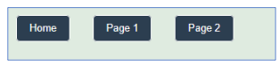

This section introduces how to structure and build **multi-page Dash applications**. Students begin by organizing a project shell with an `app.py` entry file, a `pages/` folder for page layouts, and an `assets/` folder for shared CSS. Using `dash.register_page()`, each page is defined with a layout and a URL path, while the main app layout in `app.py` includes a navigation bar and a `dash.page_container` that automatically renders the selected page.

The project demonstrates two distinct page designs:

-   **Page 1** implements a responsive grid layout using custom CSS classes for top, middle, and footer blocks.
-   **Page 2** introduces interactivity and API integration with a callback that retrieves and displays random cat facts from a public API using `requests`.

By the end, students can design organized, scalable Dash apps with multiple pages, shared styling, and dynamic content powered by callbacks and APIs.

## Project Structure

### Building the Project Shell

Before writing any Dash code, set up a clean and organized project structure. A well-organized project makes the application easier to maintain, extend, and style as it grows.

```
my_dash_app/
│
├── app.py           ← main entry point; run this file to start the app
├── pages/           ← one .py file per page
│   ├── home.py
│   ├── page1.py
│   └── page2.py
│
└── assets/          ← Dash automatically loads CSS from here
    └── style.css
```

Key rules:

-   `app.py` lives at the **root** of the project.
-   `pages/` holds one Python file per page; Dash scans this folder automatically when `use_pages=True`.
-   `assets/` holds CSS, images, and other static files; Dash loads them automatically without any import statements.
-   Only `app.py` should contain `app.run(...)` — **never** add a run command inside a page file.

### Initializing the App

```{python}
import dash
from dash import dcc, html
import dash_bootstrap_components as dbc

app = dash.Dash(
    __name__,
    use_pages=True,                       # scan pages/ folder for registered pages
    suppress_callback_exceptions=True,    # prevent errors for components not yet on screen
    title="Multi-Page-App"
)

server = app.server   # expose the Flask server — required for Render/gunicorn deployment
```

-   [**`use_pages=True`**]{style="background-color: yellow;"} — tells Dash to automatically discover and register all pages in the `pages/` folder. Without this, Dash is a single-page app.
-   [**`suppress_callback_exceptions=True`**]{style="background-color: yellow;"} — when a user is on Page 1, Page 2's components do not exist in the DOM yet. Without this flag, Dash raises errors for callbacks that reference those absent components.
-   [**`server = app.server`**]{style="background-color: yellow;"} — exposes the underlying Flask server object so that gunicorn (and Render.com) can start the app. This line is required for deployment.

::: note
The original code had `supress_callback_exceptions=True` (one `p`). The correct spelling is `suppress_callback_exceptions=True`. A misspelled keyword argument is silently ignored by Python — exception suppression would not be active.
:::

## Registering Pages

### `dash.register_page()`

Each file in `pages/` calls `dash.register_page()` to declare itself as a page, then defines a `layout` variable with its content.

```{python}
# home.py — the app's home page (root URL)
import dash
from dash import html

dash.register_page(__name__, path="/")

layout = html.Div([
    html.H2("Welcome to the Home Page"),
    html.P("This is a simple multipage Dash project.")
])
```

```{python}
# page1.py
import dash
from dash import html

dash.register_page(__name__, path="/page1", name="Page 1")

layout = html.Div([...])
```

```{python}
# page2.py
import dash
from dash import html

dash.register_page(__name__, path="/page2", name="Page 2")

layout = html.Div([...])
```

::: note
The original code used `__name_` (single trailing underscore). `__name__` (double underscore on each side) is the correct built-in Python variable. `__name_` is undefined and raises a `NameError` at import time.
:::

Key arguments to `dash.register_page()`:

| Argument | Purpose | Example |
|---|---|---|
| `__name__` | Uniquely identifies the page by its module | `__name__` |
| `path` | Sets the URL for this page | `path="/page1"` |
| `name` | Sets the display name for navigation links | `name="Page 1"` |

## The App Layout (`app.py`)

### Navigation and Page Container

The `app.py` layout ties everything together: a **navigation bar** for switching between pages, and a **page container** that automatically renders whichever page the user has navigated to.

```{python}
app.layout = html.Div([
    dbc.NavbarSimple(
        children=[
            dbc.NavLink("Home",   href="/",      active="exact"),
            dbc.NavLink("Page 1", href="/page1", active="exact"),
            dbc.NavLink("Page 2", href="/page2", active="exact"),
        ],
        brand="Multi-Page App",
    ),
    dash.page_container
    # This is where each page's layout variable is rendered
    # It updates automatically when the user clicks a navigation link
])

if __name__ == "__main__":
    app.run(debug=True)
```

-   [**`dbc.NavbarSimple`**]{style="background-color: yellow;"} — creates a top navigation bar. `brand=` sets the app name displayed on the left side of the bar.
-   [**`dbc.NavLink(..., active="exact")`**]{style="background-color: yellow;"} — a clickable nav link. `active="exact"` highlights the link only when the URL matches exactly — without this, the Home link (`"/"`) would appear active on every page because all paths start with `/`.
-   [**`dash.page_container`**]{style="background-color: yellow;"} — a special Dash component that acts as a slot: it renders the `layout` variable of whatever page the user is currently viewing.

## Styling with `style.css`

### Global Styles

The `assets/style.css` file applies to every page in the app. The stylesheet below sets a background color, typography defaults, and transforms plain hyperlinks into styled button-like elements.

In CSS, [**`!important`**]{style="background-color: yellow;"} forces a property to override any conflicting rules, regardless of selector specificity. Use it only when necessary — overuse makes stylesheets difficult to reason about.



```{css}
body {
    background-color: #DFEBE0 !important;   /* force green-tint background even if Bootstrap overrides it */
    font-family: Arial, sans-serif;
}

h2 {
    color: #2c3e50;
}

p {
    font-size: 16px;
    line-height: 1.4;
}

/* Style all <a> tags as button-like elements */
a {
    display: inline-block;   /* allow padding to apply */
    margin: 18px;
    text-decoration: none;   /* remove underline */
    border: 2px solid #ffffff;
    border-radius: 6px;
    padding: 10px 20px;
    background-color: #2c3e50;
    color: #ffffff;
}

a:hover {
    text-decoration: underline;
    background-color: #65Ab6E;   /* green on hover */
}
```

## Page 1: Grid Layout

### Layout File

Page 1 organizes content into three zones using a combination of **Flexbox** (for vertical stacking) and **CSS Grid** (for the two-column middle section).

```{python}
import dash
from dash import html

dash.register_page(__name__, path="/page1", name="Page 1")

layout = html.Div([
    html.Div("Top Row: with 1 Column",  className="block block-top"),

    html.Div([
        html.Div("Middle Left",  className="block"),
        html.Div("Middle Right", className="block")
    ], className="row-2"),

    html.Div("Footer", className="block block-footer")

], className="page1-grid")
```

### CSS Classes for Page 1

```{css}
/* Outer container: stacks the three zones (top, middle, footer) vertically */
.page1-grid {
    display: flex;
    flex-direction: column;   /* stack children top → middle → footer */
    padding: 12px;
    gap: 12px;                /* space between zones */
}

/* Middle zone: splits into two equal side-by-side columns */
.row-2 {
    display: grid;
    grid-template-columns: 1fr 1fr;   /* two equal fractions of available width */
    gap: 12px;
}

/* Shared block appearance */
.block {
    border: 2px dashed #cbd5e1;
    border-radius: 8px;
    background-color: #F5F7FA;
    color: #334155;
    min-height: 120px;
    display: flex;
    align-items: center;        /* vertically center content */
    justify-content: center;    /* horizontally center content */
    font-weight: 600;
}

/* Modifier classes — adjust height only */
.block-top    { min-height: 150px; }
.block-footer { min-height: 80px;  }

/* Responsive: collapse to single column on screens narrower than 768px (tablets/phones) */
@media (max-width: 768px) {
    .row-2 { grid-template-columns: 1fr; }
}
```

CSS concepts used here:

-   [**`.page1-grid`**]{style="background-color: yellow;"} — `display: flex; flex-direction: column` stacks the three zones vertically with consistent gaps.
-   [**`.row-2`**]{style="background-color: yellow;"} — `display: grid; grid-template-columns: 1fr 1fr` splits the middle section into two equal columns. `1fr` means "one fraction of available space."
-   [**`.block`**]{style="background-color: yellow;"} — shared styling applied to all content zones: dashed border, rounded corners, centered content.
-   [**`@media (max-width: 768px)`**]{style="background-color: yellow;"} — a media query that collapses the two-column layout to a single column on narrow screens (tablets and phones).

## Page 2: Callback and API

### Layout and Callback

Page 2 demonstrates a live API call triggered by a button click. The entire page — layout and callback — lives in a single `page2.py` file, with no `app.run(...)`.

```{python}
from dash import html, register_page, dcc, callback, Output, Input
import requests

register_page(__name__, path="/page2", name="Page 2")

layout = html.Div([
    html.H2("Page 2", className="page-title"),
    html.P("Click to fetch a random cat fact from a public API",
           className="page-subtitle"),
    html.Button("Get Cat Fact", id="btn-cat", n_clicks=0),
    dcc.Loading(html.Div(id="cat-fact"))
    # dcc.Loading wraps the output — shows a spinner while the callback is running
], className="page2-wrap")


@callback(
    Output("cat-fact", "children"),
    Input("btn-cat", "n_clicks"),
    prevent_initial_call=True   # do NOT fire on page load (n_clicks=0); wait for a real click
)
def get_cat_fact(n):
    try:
        r = requests.get("https://catfact.ninja/fact", timeout=5)
        r.raise_for_status()                              # raise on HTTP error
        fact = r.json().get("fact", "No fact found.")    # safely extract the fact
        return html.Div(fact)
    except requests.RequestException as e:
        return html.Div(f"Error contacting API: {e}")   # show a readable error message
```

::: note
`prevent_initial_call=True` is essential here. Without it, Dash fires the callback immediately on page load with `n_clicks=0` — calling the API before the user has done anything. Adding `prevent_initial_call=True` ensures the callback only runs on an actual button click.
:::

### Page 2 CSS

```{css}
/* Page 2 container */
.page2-wrap {
    max-width: 840px;
    margin: 0 auto;    /* horizontally center the content */
    padding: 16px;
}

.page-title {
    font-size: 28px;
    color: #1f2937;    /* dark slate */
    margin-top: 6px;
}

.page-subtitle {
    color: #475569;    /* medium slate — lighter than the title */
    margin-top: 14px;
}
```

### Styling the Button and Result Area

ID selectors (`#id`) are used here because these are **unique elements** — there is only one button and one result container on this page. Classes would be appropriate if the same style needed to apply to multiple elements.

```{css}
/* ID selectors: # prefix for IDs, . prefix for classes */

#btn-cat {
    display: inline-block;
    font-size: 18px;
    padding: 10px 18px;
    border: 2px solid #1f2937;
    border-radius: 8px;
    background-color: #0ea5e9;   /* blue */
    color: #ffffff;
}

#btn-cat:hover {
    background-color: #1b4355;   /* darker blue on hover */
}

#cat-fact {
    display: block;
    margin-top: 14px;
    padding: 14px 16px;
    background-color: #ffffff;
    color: #0f172a;
    font-size: 18px;
    line-height: 1.5;
    border: 2px solid #1f2937;
    border-radius: 8px;
    min-height: 72px;   /* prevents layout shift when the box is empty */
}
```
