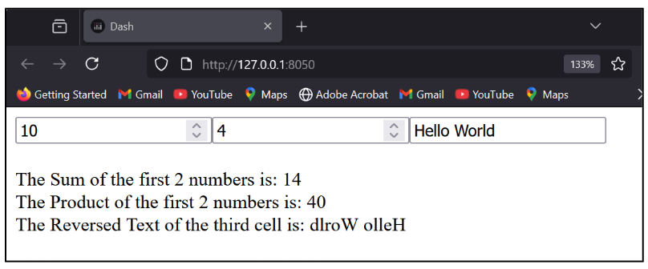
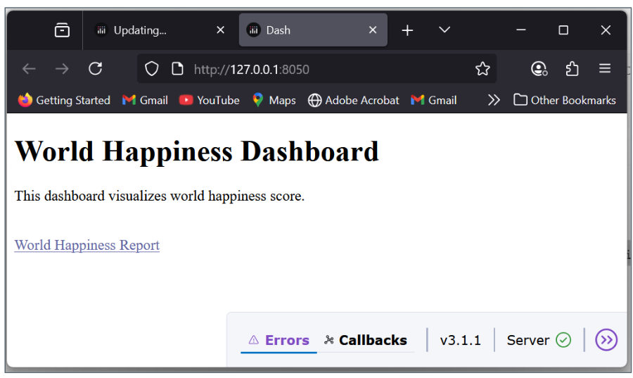
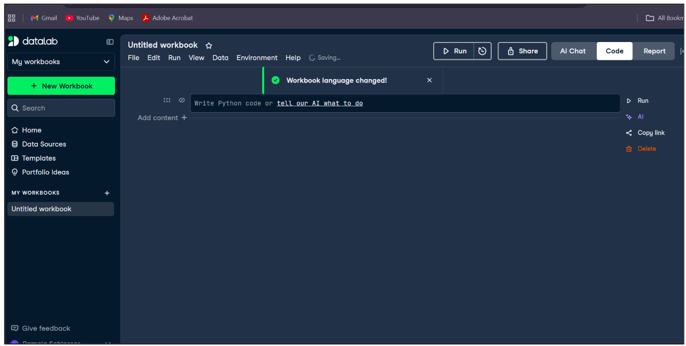

This section introduces how to work with multiple inputs and outputs in Dash callbacks, enabling you to build more interactive and coordinated applications. Rather than linking each input to a single output, you will learn how to design callbacks that respond to several user inputs at once and update multiple components simultaneously. This approach is essential for creating scalable, efficient dashboards where different elements stay synchronized and react together to user behavior.

# Callback

Callbacks can have **multiple inputs and outputs**, allowing you to update several components in response to a single input event — or to wire several independent interactions into one coordinated function. The general pattern: declare all Outputs first, then all Inputs, then write the function whose arguments correspond to the Inputs and whose return values correspond to the Outputs.

```{python}
@app.callback(
    Output(output_id1, output_property1),   # output 1
    Output(output_id2, output_property2),   # output 2
    Output(output_id3, output_property3),   # output 3
    Input(input_id1,  input_property1),     # input 1 → first argument
    Input(input_id2,  input_property2),     # input 2 → second argument
    Input(input_id3,  input_property3)      # input 3 → third argument
)
def function_name(input_value1, input_value2, input_value3):
    result1 = some_operation(input_value1)
    result2 = another_operation(input_value2)
    result3 = yet_another_operation(input_value3)
    return result1, result2, result3   # must match Output order
```



## A Simple App with Three Callbacks

This example builds a minimal Dash app with three input boxes — two for numbers and one for text — and three output `Div`s that update in real time. The key rules:

-   Each `dcc.Input` component has a unique `id` (`'input1'`, `'input2'`, `'input3'`).
-   Each `html.Div` has a unique `id` (`'output1'`, `'output2'`, `'output3'`).
-   The `@app.callback` decorator declares three [**Outputs**]{style="background-color: yellow;"} (the `children` property of each output `Div`) and three [**Inputs**]{style="background-color: yellow;"} (the `value` property of each input box).
-   Whenever **any** input value changes, Dash calls the function and expects **three return values** in the same order as the declared Outputs.

```{python}
from dash import Dash, html, dcc, Input, Output, callback

app = Dash()

app.layout = html.Div([
    dcc.Input(id='input1', type='number', placeholder='Enter a number'),
    dcc.Input(id='input2', type='number', placeholder='Enter another number'),
    dcc.Input(id='input3', type='text',   placeholder='Enter some text'),

    html.Div(id='output1', style={'marginTop': '20px'}),
    html.Div(id='output2'),
    html.Div(id='output3')
])

@app.callback(
    Output('output1', 'children'),   # result1 → output1
    Output('output2', 'children'),   # result2 → output2
    Output('output3', 'children'),   # result3 → output3
    Input('input1',  'value'),       # num1 ← input1
    Input('input2',  'value'),       # num2 ← input2
    Input('input3',  'value')        # text ← input3
)
```

### Handling None Values and Computing Results

When a `dcc.Input` box is empty, Dash passes `None` as the argument value — not `0` or `""`. Always guard against `None` before doing arithmetic or string operations.

```{python}
def update_outputs(num1, num2, text):
    # Replace None with safe defaults before any computation
    num1 = num1 or 0    # None → 0; any number stays as-is
    num2 = num2 or 0
    text = text or ""   # None → empty string

    result1 = f"Sum of the two numbers: {num1 + num2}"
    result2 = f"Product of the two numbers: {num1 * num2}"
    result3 = f"Reversed text: {text[::-1]}"
    # text[::-1] is Python slice notation for reversing a sequence
    # "hello" → "olleh"

    return result1, result2, result3

if __name__ == '__main__':
    app.run(debug=True)
```

## Multiple Callbacks Lab

**1.** In the three-callback example, what happens if the user fills in `input1` and `input2` but leaves `input3` empty? Walk through the `None` guard logic and state exactly what each output will display.

::: {.callout-note collapse="true"}
### Show Answer

`input3` is empty, so Dash passes `None` as the third argument (`text`). The guard `text = text or ""` substitutes an empty string. **Output 1** (`result1`): `num1` and `num2` each have values (say `5` and `3`), so `num1 = 5 or 0` → `5`, `num2 = 3 or 0` → `3`. Result: `"Sum of the two numbers: 8"`. **Output 2** (`result2`): `"Product of the two numbers: 15"`. **Output 3** (`result3`): `text[::-1]` on an empty string `""` returns `""`. Result: `"Reversed text: "` (the label appears with nothing after it). The callback completes successfully — no error — because every `None` was replaced before any operation was attempted.
:::

**2.** The three-callback app declares all three `Input` components before the `@app.callback` decorator, not inside a separate layout function. What problem would arise if two Input components were given the same `id`, and how does Dash catch it?

::: {.callout-note collapse="true"}
### Show Answer

Dash component `id` values must be unique across the entire app. If two components share the same `id` (e.g., two `dcc.Input` boxes both with `id='input1'`), Dash raises a `DuplicateIdError` at startup — before the server even starts — describing which `id` is duplicated. This is caught at initialization because Dash builds an internal component registry keyed by `id` when the layout is first set. The callback system uses these `id` strings to route data, so ambiguity in `id` would make it impossible to determine which component's value to send to which callback argument.
:::

## The World Happiness App

### Starting with a Hyperlink

**`html.A()`** is the Dash equivalent of the HTML `<a>` anchor tag, used to create hyperlinks.

```{python}
from dash import Dash, html

app = Dash()

app.layout = html.Div([
    html.H1("World Happiness Dashboard"),
    html.P("This dashboard visualizes world happiness scores."),
    html.Br(),
    html.A(
        "World Happiness Report",           # visible link text
        href="https://worldhappiness.report/",
        target="_blank",                    # open in a new tab; omit to open in current tab
        style={'color': '#6065a3', 'textDecoration': 'underline'}
    )
])
```

### Inline Styling Reminder

Inline styling uses a Python dictionary. Two CSS rules to remember:

-   CSS property names are written in [**camelCase**]{style="background-color: yellow;"} in Python (`textDecoration`) rather than kebab-case (`text-decoration`) as in CSS files.
-   Values are strings: `'#6065a3'`, `'underline'`, `'20px'`.

### Full Initial Layout

```{python}
from dash import Dash, html

app = Dash()

app.layout = html.Div([
    html.H1("World Happiness Dashboard"),
    html.P("This dashboard visualizes world happiness scores."),
    html.Br(),
    html.A("World Happiness Report",
           href="https://worldhappiness.report/",
           target="_blank",
           style={'color': '#6065a3', 'textDecoration': 'underline'})
])

if __name__ == '__main__':
    app.run(debug=True, use_reloader=False)
```



## Extending the App: Data, Layout, and Callbacks

### Imports and Data Preparation

```{python}
from dash import Dash, html, dcc, Input, Output
import pandas as pd
import plotly.express as px

# Load the dataset — adjust the path if needed
df = pd.read_csv('data/world_happiness.csv')

# Rename columns for clarity and consistent casing
df = df.rename(columns={
    "country":     "Country",
    "year":        "Year",
    "Life Ladder": "Happiness Score"   # "Life Ladder" is the raw column name in the dataset
})

df['Year'] = df['Year'].astype(int)    # ensure Year is an integer for sorting and dropdown use

app = Dash(__name__)
app.title = "World Happiness Dashboard"
```

### App Layout

```{python}
app.layout = html.Div(
    style={'padding': '20px', 'backgroundColor': '#FAF3DD'},
    children=[
        html.H1("World Happiness Dashboard", style={'textAlign': 'center'}),
        html.P("Explore global happiness trends by year.", style={'textAlign': 'center'}),

        html.Div([
            dcc.Dropdown(
                id='year-dropdown',
                options=[{'label': str(year), 'value': year}
                         for year in sorted(df['Year'].unique())],
                # sorted() ensures years appear in chronological order in the dropdown
                value=df['Year'].max(),   # default: most recent year in the dataset
                clearable=False,
                style={'width': '50%'}
            )
        ], style={'textAlign': 'center', 'marginBottom': '30px'}),

        dcc.Graph(id='happiness-map'),      # choropleth map — populated by callback
        dcc.Graph(id='top-bottom-bar'),     # bar chart — populated by callback

        html.Div([
            html.A("World Happiness Report Data Source",
                   href="https://worldhappiness.report/",
                   target="_blank",
                   style={'textAlign': 'center', 'display': 'block', 'marginTop': '20px'})
        ])
    ]
)
```

The `id` values (`'year-dropdown'`, `'happiness-map'`, `'top-bottom-bar'`) are the contract between layout and callbacks. If you change an `id` here, you must update it in the callback too.

### The Callback

```{python}
@app.callback(
    [Output('happiness-map',  'figure'),   # output 1: choropleth map figure
     Output('top-bottom-bar', 'figure')],  # output 2: bar chart figure
    [Input('year-dropdown',   'value')]    # trigger: whenever the selected year changes
)
def update_charts(selected_year):
    # Filter the full dataset to only the selected year
    filtered_df = df[df['Year'] == selected_year]
```

::: note
`filtered_df` is defined inside the callback function using the `selected_year` input. It is not a global variable — it is created fresh each time the user selects a different year. This is the standard pattern: filter or transform the global `df` DataFrame inside the callback based on user inputs.
:::

### Making the Choropleth Map

A **choropleth map** shades geographic regions in proportion to a statistical variable — darker or more intense colors indicate higher values. It is ideal for showing spatial distribution and geographic trends at a glance.

```{python}
    map_fig = px.choropleth(
        filtered_df,
        locations="Country",
        locationmode="country names",       # match country names to Plotly's built-in geography
        color="Happiness Score",
        hover_name="Country",               # show country name on hover
        color_continuous_scale="viridis",   # perceptually uniform color scale
        title=f"Happiness Score by Country — {selected_year}"
    )

    # Tight margins so the map fills the card area
    map_fig.update_layout(margin=dict(l=0, r=0, t=40, b=0))
```

### Filtering Top and Bottom Countries

```{python}
    # Combine the 10 highest and 10 lowest scorers into one DataFrame
    top_bottom = pd.concat([
        filtered_df.nlargest(10,  'Happiness Score'),   # 10 highest scores
        filtered_df.nsmallest(10, 'Happiness Score')    # 10 lowest scores
    ])
    # pd.concat stacks them vertically — result has 20 rows
```

### Building the Bar Chart

```{python}
    bar_fig = px.bar(
        top_bottom.sort_values('Happiness Score'),   # sort so bars go low → high
        x='Happiness Score',
        y='Country',
        orientation='h',                             # horizontal bars: countries on y-axis
        color='Happiness Score',
        color_continuous_scale='BrBG',               # brown–white–green diverging scale
        title=f"Top and Bottom 10 Countries by Happiness Score — {selected_year}"
    )
    bar_fig.update_layout(yaxis={'categoryorder': 'total ascending'})
    # 'total ascending' ensures the chart renders bars in score order (not alphabetical)

    return map_fig, bar_fig   # two return values match the two declared Outputs

if __name__ == '__main__':
    app.run(debug=True)
```

### Running the Server

`app.run(debug=True)` starts the Dash development server. With `debug=True`:

-   The server **hot-reloads** automatically when you save code changes.
-   **Detailed error messages** appear in the browser if something breaks.

The `if __name__ == '__main__'` guard ensures the server only starts when the script is run directly, not when it is imported as a module by another file — this is a standard Python idiom.

## Using DataLab for Working with Groups

DataLab provides tools for collaborative data exploration, allowing teams to work with and analyze grouped data across shared notebooks and dashboards.



## World Happiness App Lab

**1.** The World Happiness callback filters `df` inside the function using `filtered_df = df[df['Year'] == selected_year]`. Why is `df` defined at the module level (outside the callback) rather than loaded fresh on every callback call, and what risk does reading from a global DataFrame introduce in a multi-user production environment?

::: {.callout-note collapse="true"}
### Show Answer

`df` is loaded once at startup because reading a CSV file and parsing it into a DataFrame is a relatively expensive operation — doing it on every callback call would add hundreds of milliseconds of latency to every user interaction, especially for larger datasets. Loading once and filtering inside the callback is the standard pattern: the global `df` is read-only (the callback never writes to it), so concurrent reads from multiple users are safe. **Risk in multi-user production:** if the callback ever *modified* the global `df` (e.g., `df.drop(...)` in place), simultaneous requests from different users could corrupt each other's data — a race condition. The safe rule is: global DataFrames are read-only; any transformation produces a new local variable (`filtered_df`) that lives only for the duration of that callback invocation.
:::

**2.** The choropleth map uses `locationmode="country names"` to match data to geographies. What would happen if a country name in the dataset did not exactly match Plotly's built-in country name list (e.g., "United States" vs. "United States of America"), and how would you detect and fix it?

::: {.callout-note collapse="true"}
### Show Answer

Plotly would silently drop any row whose `Country` value does not match its internal name list — the country simply would not appear on the map, with no error or warning. **Detection:** after rendering, visually inspect the map for missing countries you expect to see. Programmatically, compare `df['Country'].unique()` against Plotly's accepted country names (available in the Plotly documentation or via `import plotly.express as px; px.data.gapminder()['country'].unique()`). **Fix:** use a dictionary to remap non-standard names before passing to `px.choropleth`:

``` python
name_fixes = {"United States": "United States of America", "South Korea": "Korea, South"}
df['Country'] = df['Country'].replace(name_fixes)
```

Always apply the fix to the DataFrame once at load time (before the callback) so it does not re-run on every user interaction.
:::

**3.** The bar chart uses `pd.concat([filtered_df.nlargest(10, 'Happiness Score'), filtered_df.nsmallest(10, 'Happiness Score')])`. What does `pd.concat` do here, and what would the chart look like if the year selected had fewer than 20 countries in the dataset?

::: {.callout-note collapse="true"}
### Show Answer

`pd.concat` **stacks two DataFrames vertically** — it takes the 10-row "top" DataFrame and the 10-row "bottom" DataFrame and produces a single 20-row DataFrame with all rows from both. The bar chart then visualizes all 20 countries ranked by happiness score. **If fewer than 20 countries exist for the selected year:** `nlargest(10, ...)` and `nsmallest(10, ...)` will return however many rows are available — if only 15 countries have data, you get at most 10 from the top and 5 from the bottom (or overlapping rows if some countries appear in both). `pd.concat` handles this gracefully — it produces a smaller DataFrame without errors. The chart renders with fewer bars, which is correct behavior. No code change is needed to handle this edge case.
:::

# Summary and Review

## Using AI

Use the following prompts with a generative AI tool to explore multiple callbacks and data visualization further.

-   What is the general pattern for a Dash callback with multiple inputs and outputs? How must the function arguments and return values correspond to the declared Inputs and Outputs?
-   Why must all component `id` values be unique in a Dash app? What error occurs if two components share the same `id`?
-   What is the `None` guard pattern in Dash callbacks, and why does an empty `dcc.Input` box pass `None` rather than an empty string?
-   Why is a global DataFrame loaded once at module level rather than inside the callback function? What rule must you follow to keep it safe in a multi-user environment?
-   What is a choropleth map, and what does `locationmode="country names"` do? What happens when a country name in the data does not match Plotly's built-in list?
-   What does `pd.concat` do, and how is it used to combine the top and bottom 10 countries into a single bar chart DataFrame?
-   What does `yaxis={'categoryorder': 'total ascending'}` do to a horizontal bar chart? Why is this important for readability?

## Summary

This chapter demonstrated advanced callback patterns — multiple inputs and outputs in a single callback — and built a full World Happiness data visualization dashboard.

| Topic | Key concepts |
|------------------------------------|------------------------------------|
| Multiple outputs pattern | Declare all Outputs, then all Inputs; return values must match Output order exactly |
| Multiple inputs | Any input change triggers the callback; arguments match Input declaration order |
| `None` guards | `value or 0` / `value or ""` — protect against empty inputs passing `None` |
| Duplicate `id` error | `DuplicateIdError` raised at startup; all component IDs must be unique |
| `text[::-1]` | Python slice notation for reversing a string |
| `html.A()` | Dash hyperlink component; `href=` sets URL; `target="_blank"` opens new tab |
| camelCase in `style={}` | `textDecoration` not `text-decoration`; all values are strings |
| Global DataFrame | Load once at module level; read-only in callbacks; transformations create local copies |
| `filtered_df` pattern | Filter global `df` inside callback; never modify the global in place |
| `px.choropleth` | Geographic map shaded by variable; `locationmode="country names"` matches to geography |
| `pd.concat` | Stacks DataFrames vertically; used to combine top + bottom 10 countries |
| `nlargest` / `nsmallest` | Pandas methods returning top/bottom N rows by a column value |
| `sort_values` + `orientation='h'` | Horizontal bar chart; sort before plotting for visual order |
| `categoryorder: 'total ascending'` | Ensures bar chart renders in value order, not alphabetical |
| `if __name__ == '__main__'` | Standard guard; ensures `app.run()` only fires when script is run directly |
| DataLab | Collaborative data exploration tool for grouped data analysis across shared notebooks |

**What comes next:** The course summary ties all the technical and strategic threads together — from platform competition and AI ethics through data acquisition, dashboard development, and deployment — preparing you for the final project.
