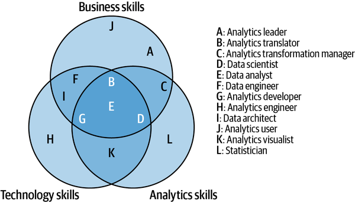
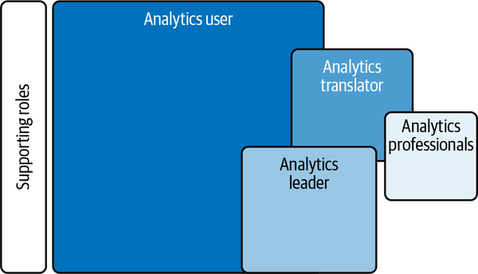
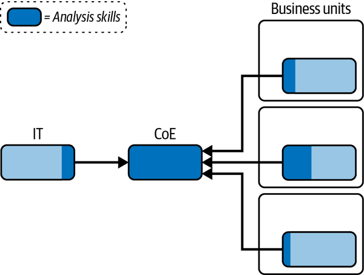
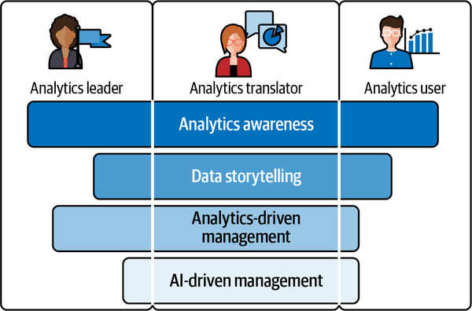
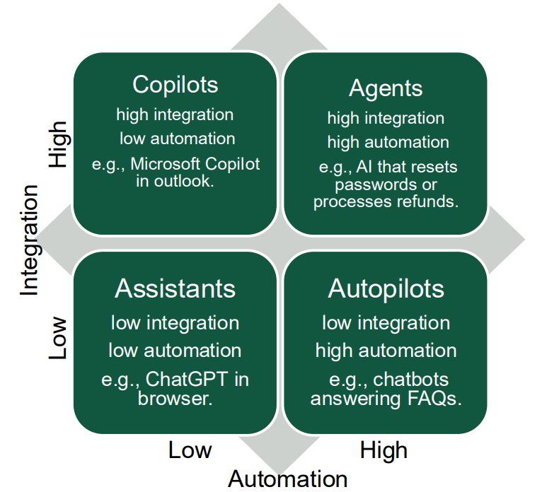
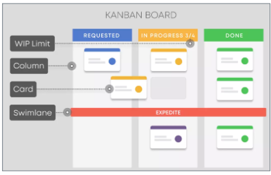

This section introduces the concept Augmented Analytics (AA) in relationship to preparing people. Preparing people for AA means aligning technical, organizational, and human readiness. Chapter 4 of *Augmented Analytics* (Weber & Zwingmann, 2024) emphasizes that transformation succeeds only when analytics becomes part of everyday work — supported by leadership, literacy, and structured enablement. The chapter outlines four key personas — leaders, translators, users, and professionals — each requiring tailored skills and programs. A **Center of Excellence (CoE)** anchors this effort by coordinating strategy, training, and governance, ideally evolving from a centralized model to a federated structure that balances expertise with local ownership.

This section also introduces **workflow augmentation**, where insights are embedded directly into processes through copilots, adaptive assistants, and collaborative tools, rather than delivered via static dashboards. This shift demands cultural change, strong API-based infrastructure, and a curated use-case library to share lessons and scale innovation. Finally, Weber and Zwingmann highlight human barriers — bias, overconfidence, and learned helplessness — and stress that sustainable analytics maturity depends on cultivating data literacy, storytelling, and a belief that people, not just technology, drive transformation.

::: note
###### *Reference:*

Chapters 4 and 5 from **Weber, W., & Zwingmann, T. (2024).** *Augmented Analytics.*\
O'Reilly Media, Inc.\
Available at: <https://learning.oreilly.com/library/view/augmented-analytics/9781098151713/>
:::

## Preparing People and the Organization

Preparing people and the organization for Augmented Analytics means building both the skills and the culture needed to embed analytics into daily decision-making. Leaders must champion data-driven practices, analytics translators must bridge business and technical teams, and employees need at least analytics awareness to trust and act on insights. A Center of Excellence (CoE), executive sponsorship, and structured training ensure that AA is not just a technology upgrade but an organizational transformation.

Three principles guide this work:

-   Focus on **roles and personas** — leaders, translators, users, and professionals — to structure the analytics transformation. Different roles need different skills; a one-size training program does not work.
-   Build both **technical readiness** (data infrastructure and processes) and **human readiness** (mindset, skills, and awareness). Technology without cultural change fails; cultural change without infrastructure also fails.
-   Establish a **Center of Excellence (CoE)** to drive transformation, ideally business-anchored and federated over time. A CoE is an organizational unit set up to concentrate expertise, best practices, and resources around a specific domain or strategic priority.

## The Four Analytics Personas

### Tailoring Augmented Analytics for Different Roles

Four distinct personas shape the analytics transformation. Each requires a different investment in training, tools, and enablement:

-   [**Analytics Leader**]{style="background-color: yellow;"} — champions a data-driven culture and aligns insights with organizational strategy. Needs to understand AI's strategic potential without necessarily building models themselves.
-   [**Analytics Translator**]{style="background-color: yellow;"} — bridges the gap between business and technical teams, identifying valuable use cases and ensuring they deliver measurable business value. Often the most critical — and hardest to develop — role.
-   [**Analytics User**]{style="background-color: yellow;"} — the majority of the workforce. Consumes insights to make better day-to-day decisions. Does not need deep technical skills, but does need enough analytics awareness to trust and act on data.
-   [**Analytics Professional**]{style="background-color: yellow;"} — the technical experts who build, deploy, and maintain analytics solutions. Includes data engineers, data scientists, and BI developers.

## The Center of Excellence

### What a CoE Does

A CoE is the organizational unit dedicated to coordinating the analytics transformation. During the **Data Active** maturity phase, it collects and connects the loose threads of analytics activity that emerge organically across the organization — before they become silos.

Core responsibilities include:

-   Promoting [**data literacy**]{style="background-color: yellow;"} and data liberalization across the organization — making data accessible to more people.
-   Building quick-win use cases — often called [**"lighthouse" projects**]{style="background-color: yellow;"} — that demonstrate visible, early value and build momentum.
-   Creating shared governance frameworks and a data-driven culture.
-   Supporting business units and connecting their analytics strategies into a coherent whole.
-   Inspiring people across the company to take ownership of analytics rather than treating it as the IT department's job.

### Approaches to Organizing a CoE

Three structural models exist, each suited to a different stage of organizational maturity:

**Decentralized approach** — common in early-stage, Data Reactive organizations. Business units develop analytics independently, often using ad hoc tools (Excel, VBA, Python, R). Each team has high autonomy and domain knowledge but no coordination. The result: duplicated effort, inconsistent data definitions, and no shared infrastructure. This approach is tempting but unsustainable without stronger coordination.

**Centralized approach** — a single CoE or IT unit manages analytics, reporting, and infrastructure for the entire organization. This produces efficient, consistent solutions but creates a bottleneck: business units wait for the central team, which lacks deep domain knowledge and produces generic outputs. Works for early stages or small organizations, but limits growth and responsiveness over time.

**Federated approach** — a hybrid that balances centralized expertise with decentralized ownership. The CoE starts as a strong driver, then gradually shifts routine analytics responsibility to business units as data literacy grows, while retaining a center for advanced challenges, governance, and standards. This model builds a stronger data culture and faster responsiveness, but requires strong governance and patience. It is the most effective path to **Data Progressive** (stage 3) maturity.

## People, Personas, and the Center of Excellence Lab

**1.** A regional hospital system wants to improve its use of analytics. For each of the four analytics personas, describe one concrete skill gap they would need to close and one program type from the enablement table that would address it.

::: {.callout-note collapse="true"}
### Show Answer

**Analytics Leader** — skill gap: understanding what AI-driven diagnostics can and cannot do, so they can sponsor the right projects without setting unrealistic expectations. Program: executive roundtable with peer leaders from other health systems who have deployed similar tools. **Analytics Translator** — skill gap: translating clinical workflow problems into well-scoped data problems that a data scientist can actually model. Program: ThinkLab workshop pairing translators with data scientists on a live use case. **Analytics User** — skill gap: enough awareness to trust and act on a risk score surfaced in their EHR, rather than ignoring it or overriding it reflexively. Program: short e-learning module embedded in onboarding explaining what the model does and does not predict. **Analytics Professional** — skill gap: clinical domain knowledge to understand why a feature (e.g., lab value trend) matters for the target outcome. Program: ongoing cross-functional training sessions with clinical staff.
:::

**2.** A manufacturing company is Data Reactive — most analytics is done ad hoc in Excel by whoever has time. The CEO has just endorsed a data strategy initiative. Which CoE structure would you recommend as a starting point, and why? When should the company transition to a different model?

::: {.callout-note collapse="true"}
### Show Answer

Start with a **centralized CoE**: the organization has no shared infrastructure, no data standards, and no analytics culture. A centralized team can establish governance, build a shared data platform, define common metrics, and deliver early wins (lighthouse projects) that demonstrate value quickly. The CEO's endorsement provides the executive sponsorship without which a CoE cannot function. **Transition point:** once business units have built enough data literacy to own their own analytics use cases, and once the CoE has established the governance frameworks they can follow, gradually move to a **federated model** — the CoE becomes a center of expertise and standards rather than a central delivery team. This typically happens during the move from Data Active to Data Progressive maturity.
:::

## Human Barriers to Analytics Adoption

Three psychological barriers consistently slow analytics adoption — and they cannot be solved by better technology alone:

-   [**Inherent bias**]{style="background-color: yellow;"} — we are often unaware of our own knowledge gaps because of the Dunning-Kruger effect: the less we know, the more confident we tend to be that we know it. We don't know what we don't know, which makes it hard to ask the right questions.
-   [**Perceived solvability**]{style="background-color: yellow;"} — people often assume that complex problems can be solved without rigorously testing approaches. In AI environments this is especially common, because the technology produces impressive-seeming results in ways that feel like magic. Organizations must help people understand that finding the right solution involves structured iteration, validation, and often failure before success.
-   [**Learned helplessness**]{style="background-color: yellow;"} — repeated mistakes or negative experiences can lead individuals to believe they are incapable of improving. This often develops when people are asked to work with data tools that are not designed for their skill level. Organizations must create early wins and build on them to instill the belief that effort leads to progress.

## Cultivating Data Literacy

### The Four Competencies

Weber and Zwingmann identify four key competencies that collectively constitute organizational data literacy:

-   [**Analytics awareness**]{style="background-color: yellow;"} — helps non-specialists understand data processes, quality, visualization, and core AI/ML concepts. Fosters realistic expectations for AI projects and effective communication with data professionals. *This is the minimum floor for every employee.*
-   [**Storytelling with data**]{style="background-color: yellow;"} — translates complex insights into clear, audience-appropriate narratives. Requires mastering visualization, decluttering, and tailoring tone and context to make data compelling and actionable. *Essential for translators and analysts who present to decision-makers.*
-   [**Data-driven management**]{style="background-color: yellow;"} — managers must commit to analytics strategy, ensure data integrity, and integrate analytics into decision-making rather than overriding it with intuition. *Essential for all managers.*
-   [**Leading in the age of AI**]{style="background-color: yellow;"} — leaders need to progress from AI awareness to active engagement. Competencies include identifying AI opportunities, managing AI project lifecycles, and integrating AI into business strategy. *Essential for executives and senior leaders.*

### Enablement Programs by Role

Different roles require different levels of investment in data literacy:

| Role | Minimum Literacy Level | Program Types |
|------------------------|------------------------|------------------------|
| Analytics user | Analytics awareness | Workshops, e-learning, onboarding modules |
| Analytics translator | High literacy | Deep dives, ThinkLabs, mentoring, project presentations |
| Analytics leader | Awareness + storytelling + leadership AI | Executive roundtables, leadership summits, peer learning |
| Analytics professional | Full technical competency | SQL, Python, R, statistics, ML, ongoing technical training |

## Human Barriers and Data Literacy Lab

**1.** A data science team presents a churn prediction model to the sales leadership team. The VP of Sales says "the model shows 72% of at-risk customers are in the West region, but I know from experience that's wrong — the real issue is pricing." Using the three human barriers, diagnose what psychological dynamic is most likely at work, and explain how the organization should respond.

::: {.callout-note collapse="true"}
### Show Answer

The most likely barrier is a combination of **confirmation bias** (the VP is dismissing data that contradicts a pre-existing belief about pricing) and **inherent bias** (Dunning-Kruger: high confidence in a domain-knowledge-based intuition without recognizing what the data can see that intuition cannot). The VP is not necessarily wrong — pricing may be a contributing factor — but rejecting the model entirely based on gut feel rather than evidence is exactly the pattern augmented analytics must overcome. **Organizational response:** do not argue with the VP's experience; validate it. Ask the data science team to test whether pricing is a significant predictor in the model — it may be, and the VP's insight could improve the model. This converts the VP from a critic to a collaborator. Demonstrating that the model can incorporate their knowledge (rather than replace it) is the practical path to adoption.
:::

**2.** The four data literacy competencies are analytics awareness, storytelling with data, data-driven management, and leading in the age of AI. A chief marketing officer announces that her team will launch a personalization campaign powered by a machine learning model — but when the model recommends a different audience segment than expected, she overrides it without investigating. Which competency is most underdeveloped, and what would building that competency look like?

::: {.callout-note collapse="true"}
### Show Answer

**Data-driven management** is most underdeveloped. A manager with strong data-driven management skills commits to analytics strategy, ensures data integrity, and integrates model recommendations into decision-making rather than overriding them with intuition when they produce surprising results. Building this competency means: (1) establishing a norm that overrides require a documented rationale and a review of the model's reasoning; (2) creating feedback loops so the CMO can see over time whether her overrides improved or worsened campaign outcomes; (3) involving the CMO in model reviews so she understands what the model was trained on and why it segmented the audience as it did — building confidence through transparency rather than demanding blind trust.
:::

## Workflow Augmentation

### What Augmented Workflows Are

A **workflow** is the repeatable sequence of steps, tasks, and decisions employees follow to achieve a business outcome. Augmented Analytics succeeds only when insights are **embedded inside workflows**, not delivered separately in dashboards that require users to seek them out.

The difference matters: a static dashboard that a sales rep must open and interpret is a tool; an alert that surfaces inside the CRM at the moment the rep opens an account record is augmentation.

### Five Types of Workflow Augmentation

The five types represent a progression from simple rule-following to sophisticated human-AI collaboration:

-   [**Fixed-rule, high-confidence augmentation**]{style="background-color: yellow;"} — automated actions triggered when preset conditions are met. Works best for routine, well-defined tasks with clear right answers. *Example: automatically routing a claims form when a risk score exceeds a threshold.*
-   [**Idea and insight enrichment**]{style="background-color: yellow;"} — surfaces predictions, benchmarks, and visualizations to support human decision-making. Acts as a "copilot" that shows relevant context without making the final call. *Example: showing an underwriter a benchmark risk score alongside a new application.*
-   [**Conversational augmentation**]{style="background-color: yellow;"} — uses generative AI and LLMs in interactive assistants that respond to natural language queries. *Example: GitHub Copilot for coding; an AI chat tool for summarizing a complex contract.*
-   [**Contextual (adaptive) augmentation**]{style="background-color: yellow;"} — learns from users' role, history, and current task to tailor what it surfaces. *Example: a recommendation system that adapts to a user's past decisions.*
-   [**Collaborative augmentation**]{style="background-color: yellow;"} — enhances teamwork through shared dashboards, repositories, and integrated chatbots. *Example: an Azure chatbot integrated into Microsoft Teams for real-time compliance support.*

## Finding Workflows to Augment

### The Analytics Use-Case Approach

Use the **Analytics Use-Case Approach**: a structured pipeline that moves an initiative from idea to production, with formal evaluation gates at each stage:

| Stage            | Purpose                                                  |
|------------------|------------------------------------------------------|
| Idea             | Identify the opportunity and business problem            |
| Concept          | Define scope, stakeholders, and expected value           |
| Proof of concept | Test the approach on a small scale with real data        |
| Prototype        | Build a working version with a limited user group        |
| Pilot            | Deploy to a broader audience and measure impact          |
| Product          | Scale to full production with monitoring and maintenance |

Each phase evaluates **risk**, **ROI**, and **maturity** before committing additional resources. The approach prevents organizations from investing heavily in use cases that fail at a basic proof-of-concept level.

### Automation vs. Integration

Workflows also vary along two dimensions — the degree of **automation** (how much is done without human involvement) and the depth of **integration** (how deeply embedded in existing systems). These two axes produce four categories of AI workflow:

The recommended approach is to start with **assistants and copilots** — which support humans without replacing them — before scaling to autopilots and fully autonomous agents. This builds organizational trust and allows time to validate the AI's judgment before increasing its autonomy.

## Workflow Augmentation and Use Cases Lab

**1.** A financial services firm wants to augment its loan underwriting process. Map this workflow to the most appropriate type of augmentation from the five types, and explain why you would not start with full automation.

::: {.callout-note collapse="true"}
### Show Answer

**Best fit — idea and insight enrichment (copilot):** the underwriter receives an AI-generated risk score, comparable loan performance benchmarks, and flagged anomalies in the application alongside the case — but makes the final lending decision themselves. This is appropriate because loan decisions have legal, ethical, and regulatory dimensions that require explainability and human accountability. **Why not start with full automation (fixed-rule):** automated approval/rejection in lending requires demonstrable fairness across demographic groups and regulatory approval in most jurisdictions — the firm needs to validate model performance, build audit trails, and earn regulator trust before removing the human from the loop. Starting with a copilot allows the firm to measure model accuracy against underwriter decisions, build the evidence base, and gradually increase automation as confidence grows.
:::

**2.** Using the six-stage Analytics Use-Case Approach (Idea → Concept → Proof of Concept → Prototype → Pilot → Product), explain what would happen if an organization skipped directly from Concept to Pilot for a new AI-powered customer service chatbot.

::: {.callout-note collapse="true"}
### Show Answer

Skipping the PoC and Prototype stages means the organization deploys to a live customer audience without having validated the model on real data at small scale (PoC) or tested the interface with a limited user group (Prototype). **Likely consequences:** the chatbot handles common queries adequately but fails on edge cases that were never tested — generating wrong answers or frustrating responses that damage customer trust before the team has had the opportunity to fix them. Without a Prototype stage, the UX has not been tested with actual agents or customers, so the interface may be confusing, the handoff to a human agent may be broken, and the tone may be inappropriate for the brand. These failures at scale are far more costly — in customer churn and remediation effort — than catching them in a controlled PoC with a small dataset. The stage gates exist precisely to surface these problems cheaply before broad exposure.
:::

## The Use-Case Library

A **use-case library** is a central repository that tracks all analytics initiatives from idea to deployment. It creates organizational memory: when a business unit builds a successful use case, the library captures the approach so others can replicate or adapt it rather than starting from scratch.

Benefits include transparency, ongoing monitoring, cross-team innovation sharing, cultural motivation, and stakeholder visibility. Well-run libraries typically include [**Kanban boards**]{style="background-color: yellow;"} for tracking progress across stages, evaluation matrices for comparing use-case ROI, and documentation templates to standardize how lessons are captured.

A **Kanban board** is a visual workflow management tool that represents work items as cards on columns (e.g., Backlog → In Progress → Review → Done). It makes bottlenecks immediately visible and helps teams prioritize without lengthy status meetings.

## Technical and Organizational Requirements

Flexible, vendor-independent integration is best achieved through **APIs and microservices** using REST, Python, or R.

[**REST (Representational State Transfer)**]{style="background-color: yellow;"} is an architectural style for designing web services that communicate over HTTP. Its key benefit is **decoupling**: the front-end application (a Dash dashboard, a mobile app, an IoT device) does not need to know how the back-end analytics engine works — it just makes a request and receives a response. This allows analytics capabilities to be consumed by any application without rebuilding the core logic each time.

In the context of augmented workflows, REST APIs are recommended because they are **modular** (each endpoint does one thing well), **secure** (authentication and authorization are well-established), and **reusable** (the same API can power a dashboard, a chatbot, and a mobile alert simultaneously).

Common implementation challenges include:

-   **Legacy systems** — older enterprise software often lacks modern API interfaces.
-   **IT dependencies** — analytics teams frequently depend on IT gatekeepers for infrastructure changes.
-   **Governance and security** — ensuring that API access is logged, audited, and permissioned appropriately.
-   **Regulatory compliance** — particularly in healthcare and finance, data cannot flow freely between systems.

To address these, Weber and Zwingmann propose **analytics contracts** — formal agreements, similar to data contracts, that define how an analytics capability can be discovered, accessed, consumed, and trusted. They bring the discipline of software engineering (versioning, documentation, SLAs) to analytics integrations.

# Summary and Review

## Using AI

Use the following prompts with a generative AI tool to explore preparing people and organizations for analytics further.

-   What is the difference between the four analytics personas — leader, translator, user, and professional? Why is the translator often described as the hardest role to develop?
-   What are the three CoE structural models, and what conditions determine which is most appropriate at each stage of analytics maturity?
-   How do the three human barriers to analytics adoption — inherent bias, perceived solvability, and learned helplessness — interact with each other? Can solving one make another worse?
-   What is the difference between a data-driven and an insight-driven organization? What specific design choices close that gap?
-   How do the five types of workflow augmentation differ in terms of human involvement? What organizational conditions must be in place before an organization can safely deploy fixed-rule automation?
-   What is the purpose of the Analytics Use-Case Approach's stage gates? What risk does each gate address, and what is the cost of skipping them?
-   Why do Weber and Zwingmann recommend REST APIs and analytics contracts for augmented workflow integration? What does "decoupling" mean in this context and why does it matter for scalability?

## Summary

This chapter examined how organizations prepare people and build the structures needed to make augmented analytics succeed in practice.

| Topic | Key concepts |
|------------------------------------|------------------------------------|
| Three preparation principles | Roles and personas; technical + human readiness; Center of Excellence |
| Four analytics personas | Leader, translator, user, professional — each needs different skills and enablement |
| CoE structures | Decentralized (early stage), centralized (consistent but bottlenecked), federated (best long-term path) |
| CoE responsibilities | Data literacy promotion, lighthouse projects, governance, cross-unit coordination |
| Human barriers | Inherent bias (Dunning-Kruger), perceived solvability, learned helplessness |
| Four literacy competencies | Analytics awareness, storytelling with data, data-driven management, leading in the age of AI |
| Enablement by role | Users: e-learning; translators: ThinkLabs and mentoring; leaders: roundtables; professionals: technical training |
| Five augmentation types | Fixed-rule, idea/insight enrichment (copilot), conversational, contextual/adaptive, collaborative |
| Use-Case Approach | Idea → Concept → PoC → Prototype → Pilot → Product; gates evaluate risk, ROI, and maturity |
| Automation vs. integration axes | Determines whether AI assists, augments, or replaces human decision-making |
| Use-case library | Organizational memory; Kanban tracking; evaluation matrices; documentation templates |
| REST APIs | Decoupled, modular, reusable; analytics capabilities consumed by any front end |
| Analytics contracts | Formal agreements governing discoverability, access, consumption, and trust of analytics capabilities |

**What comes next:** The Intro to Dash and HTML chapter begins the practical Python development work — building the interactive dashboards that deliver augmented analytics to end users.
