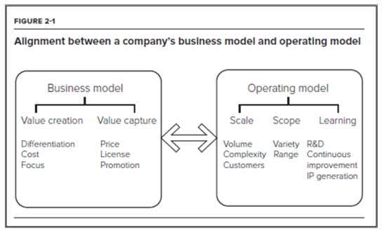
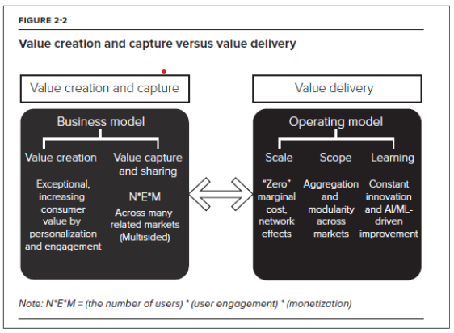

This section explores how artificial intelligence is redefining what it means to be a firm in the digital era. It contrasts traditional, asset-based organizations with AI-driven enterprises that scale through data, algorithms, and continuous learning. Becoming an "AI company" is less about technology adoption and more about transforming strategy, culture, and operations to enable algorithmic decision-making and experimentation at scale. Drawing on Iansiti and Lakhani (2020), the section highlights how AI-ready firms build digital infrastructure, data maturity, and agile operating models that support learning loops, eliminate human bottlenecks, and turn intelligence into a core strategic asset.

::: note
###### *Reference:*

Chapter 2 from **Iansiti, M., & Lakhani, K. R. (2020).** *Competing in the Age of AI.* Harvard Business Review Press. Focuses on how **AI reshapes the boundaries, structure, and strategy of firms**.
:::

## What Does It Mean to Become an AI Company?

Becoming an AI company is not just about adopting new tools — it is about transforming how your organization thinks, decides, and operates. AI-driven firms require deep organizational transformation across mission, data architecture, governance, and product-centric agility. Success depends not on adopting AI tools in isolation, but on embedding AI into the firm's strategy and operating model.

Companies that treat AI as a bolt-on tool — mere automation or one-off projects — miss the real value. Companies that use AI as a **strategic driver** reshape their competitive boundaries, industry positioning, and the very nature of how they create value.

## Becoming an AI Company

AI is not just a feature; it reshapes how decisions are made and work is executed. This requires moving beyond basic automation to a new **AI-driven operating model**. Firms must shift from human-centric to algorithm-centric workflows, which demands reimagining roles, processes, and accountability structures.

AI success is powered by data-driven thinking, agility, and a culture of continuous experimentation — organizations must learn to value evidence over intuition and learning over certainty. This transformation also requires new teams, roles, and cross-functional collaboration, with leadership that fosters trust in algorithmic decision-making and promotes transparency throughout the organization.

## AI Readiness

**AI readiness** refers to an organization's ability to successfully adopt, implement, and scale AI technologies to enhance operations, decision-making, and value creation. A truly AI-ready organization is not just equipped with technology — it is aligned across strategy, talent, and process to extract real value from AI.

Five dimensions define readiness:

-   [**Digital infrastructure**]{style="background-color: yellow;"} — cloud platforms, computing power, and integration tools that support AI systems.
-   [**Data maturity**]{style="background-color: yellow;"} — accessible, high-quality, well-organized data pipelines that AI systems can learn from.
-   [**Talent and culture**]{style="background-color: yellow;"} — teams with AI/ML skills and a culture that supports experimentation, agility, and data-driven decision-making.
-   [**Leadership commitment**]{style="background-color: yellow;"} — executives who understand AI's strategic importance and invest accordingly.
-   [**Experimentation and learning**]{style="background-color: yellow;"} — the mindset and capability to test, measure, and refine AI applications over time.

## AI Readiness and the 350-Firm Study

The 350-firm study analyzed over 350 organizations, measuring their AI maturity across digital infrastructure, data integration, analytics use, and AI deployment — and demonstrated a strong positive correlation between higher AI maturity and superior financial performance. The study spanned sectors including manufacturing, consumer goods, financial services, and retail.

Key findings:

-   Used an AI maturity index built from approximately 40 business processes.
-   Tracked progression from siloed data to integrated AI factories.
-   Showed that leaders in AI maturity significantly outperformed laggards — top firms achieved a 55% gross margin compared to 37% for laggards, with similar gaps in net income and pre-tax earnings.

## Key Factors for AI Maturity

Four factors emerged as central to AI readiness:

-   [**Digital infrastructure**]{style="background-color: yellow;"} — scalable, cloud-based systems and modern IT architecture that support real-time data processing and AI deployment across the enterprise.
-   [**Data accessibility and quality**]{style="background-color: yellow;"} — integrating siloed data into centralized platforms with strong governance to ensure data is usable, secure, and valuable for AI-driven decision-making.
-   [**Talent and leadership alignment**]{style="background-color: yellow;"} — recruiting and empowering cross-functional teams — technical, strategic, and governance leaders — to drive transformation with clarity and collaboration.
-   [**Experimentation capability**]{style="background-color: yellow;"} — the ability to test and iterate AI applications quickly through agile methods, supported by modular architectures and a culture that embraces continuous learning.

## Operating Models in the Age of AI

> *"Strategy, without a consistent operating model, is where the rubber meets the air."* — loosely attributed Italian proverb

Traditional firms are built around physical assets and labor. AI-driven firms are built around **data, algorithms, and digital platforms**. This shift fundamentally transforms how firms scale, diversify, and learn.

**Traditional operating model** — optimized for production efficiency and coordination, with physical supply chains, human decision-making, and growth that requires proportional increases in people and assets. Adding capacity means hiring people, building facilities, and acquiring equipment.

**AI-driven operating model** — built on an **AI factory**: a data pipeline that feeds algorithms, which generate decisions, which feed back into the pipeline as new training data. Operations are embedded into digital platforms, and growth comes from user interactions generating data, automated decisions at scale, and algorithms that continuously improve with use.

::: note
An **AI factory** is Iansiti and Lakhani's term for the operational core of an AI-driven firm: a system in which data flows continuously from user interactions into machine learning models, which produce decisions and recommendations at scale, which generate new data that further trains the models. It is called a "factory" because, like a manufacturing plant, it takes raw inputs (data) and produces standardized outputs (predictions and decisions) — but it scales at near-zero marginal cost and improves automatically over time. Examples include Google's search ranking system, Amazon's product recommendation engine, and Netflix's content suggestion algorithm.
:::

## Scale and Scope Economies

[**Scale economies**]{style="background-color: yellow;"} are the cost advantages that companies gain as they increase output. AI amplifies these dramatically:

-   **Traditional scaling** requires more factories, workers, and capital — costs grow roughly in proportion to output.
-   **AI-driven scaling** adds more data and users at minimal marginal cost — serving 10 million users costs almost the same as serving 1 million once the model is built.
-   *Example:* Ant Financial handles millions of loan decisions daily without adding loan officers or branch offices.

[**Scope economies**]{style="background-color: yellow;"} are efficiencies gained by offering multiple products or services using shared infrastructure:

-   **Traditional diversification** adds costly coordination layers — each new product line requires its own people, processes, and supply chains.
-   **AI-driven diversification** reuses the same data, algorithms, and infrastructure across many domains simultaneously.
-   *Example:* Amazon applies its AI capabilities to retail recommendations, AWS cloud services, logistics optimization, and Prime Video content suggestions — all built on the same underlying data and algorithmic infrastructure.

### AI Readiness and Operating Models Lab

**1.** The 350-firm study found that top AI maturity firms achieved a 55% gross margin compared to 37% for laggards. Which of the five AI readiness dimensions do you think is the hardest to build, and why? What would a company have to change — beyond buying new software — to develop that dimension?

::: {.callout-note collapse="true"}
### Show Answer

Answers will vary; strong responses will focus on **culture and talent** or **experimentation capability** as the hardest dimensions — not infrastructure or technology. Infrastructure can be purchased; talent and culture must be grown. A company hiring ten data scientists without changing how decisions are made, how hypotheses are formed, or how failure is treated will see those data scientists underutilized within a year. Building experimentation capability requires changing governance structures (who approves a test, how long it runs, what counts as success), incentive systems (rewarding learning rather than just positive outcomes), and leadership behavior (executives who ask "what did we learn?" not just "did it work?"). These changes take years and cannot be bought or outsourced.
:::

**2.** Describe the AI factory model in your own words. What are the four stages of the data loop, and how does each stage feed the next? Use a real-world example other than Google or Amazon to illustrate.

::: {.callout-note collapse="true"}
### Show Answer

The AI factory is a self-reinforcing system in which data flows continuously through four stages: (1) **User interactions** generate raw data — every action, choice, or search is logged. (2) **Machine learning models** train on this data to make predictions or decisions. (3) **Decisions and recommendations** are served back to users at scale with minimal human involvement. (4) **New data** is generated by user responses to those decisions, which flows back into stage 1 and retrains the models. **Real-world example — Spotify:** listeners stream music (stage 1: interaction data). Spotify's recommendation models learn which songs people skip, replay, or save (stage 2: model training). Discover Weekly playlists are generated for each of 600 million users every Monday (stage 3: algorithmic decisions at scale). How users respond to those playlists — what they save, skip, or share — generates new behavioral data (stage 4: feedback loop). Each cycle makes the next week's recommendations more accurate.
:::

**3.** How do scale economies and scope economies work differently in an AI-driven firm compared to a traditional one? Give a concrete example of each for a hypothetical AI-first insurance company.

::: {.callout-note collapse="true"}
### Show Answer

**Scale economies — AI vs. traditional:** a traditional insurer scales by hiring more underwriters, claims adjusters, and agents — costs grow roughly proportionally with customers. An AI-first insurer (like Lemonade) scales by improving its models: once the underwriting algorithm is built, processing one million policy applications costs almost the same as processing one thousand. Marginal cost approaches zero. **Concrete example:** adding 100,000 new home insurance policies requires no additional underwriting headcount — the model handles the risk scoring automatically. **Scope economies — AI vs. traditional:** a traditional insurer entering the auto insurance market must build separate teams, processes, and systems. An AI-first insurer reuses its core data infrastructure, risk modeling platform, and customer behavioral data across home, auto, and renters products simultaneously. **Concrete example:** behavioral data from a home insurance policyholder (payment history, claim frequency, response time) is immediately informative for pricing an auto policy for the same person — no duplicate data collection or separate modeling stack required.
:::

## Business Model and Operating Model

###### Adapted from Figure 2-1, "The AI factory," in Iansiti & Lakhani (2020, p. 38)

## The Continuous Learning Model

The learning function of an operating model is essential to driving continuous improvement and developing new products and services over time. In practice, this means:

-   Running frequent **A/B tests** on products, pricing, or interfaces.
-   Using controlled trials to evaluate new algorithms, workflows, or customer journeys.
-   Building feedback loops that connect experimentation results directly back into product design and decision-making.

::: note
**A/B testing** (also called split testing) is a controlled experiment in which two versions of something — Version A (the current version) and Version B (the proposed change) — are shown to different groups of users simultaneously. The performance of each version is measured on a defined metric (click-through rate, conversion rate, time on page, etc.), and the better-performing version is adopted. *Example:* Netflix tests two different thumbnail images for the same film — one showing the lead actor, one showing an action scene — and measures which generates more clicks. Because the two groups see the versions at the same time, A/B tests control for seasonal and contextual confounds that would distort before-and-after comparisons.
:::

Each user interaction generates data, which refines algorithms, which improves service, which attracts more users — a **positive feedback loop**. Once this loop is running, the firm's competitive position strengthens automatically over time.

*Concrete example of a positive feedback loop:* A user searches on Google for "best running shoes." Google records the query, the links clicked, and how long the user spent on each page. This data updates the ranking algorithm. The improved algorithm surfaces better results for the next user searching the same term. Better results attract more searches. More searches generate more data. The cycle repeats — Google's search quality improves continuously without any single engineer deciding each ranking change.

Continuous experimentation shifts decision-making from intuition-driven to evidence-based, enabling firms to learn quickly, adapt strategies, and improve performance at scale.

## Strategic Implications

Continuous experimentation and learning create five compounding strategic advantages:

-   [**Agility as competitive advantage**]{style="background-color: yellow;"} — firms can pivot quickly as markets, customer preferences, and technologies shift.
-   [**Data-informed strategy**]{style="background-color: yellow;"} — strategic choices are validated with real-world results, not assumptions.
-   [**Scalable learning loops**]{style="background-color: yellow;"} — experimentation feeds back into product design, operations, and business models.
-   [**Reduced risk of large failures**]{style="background-color: yellow;"} — small, fast experiments minimize costly mistakes while accelerating innovation.
-   [**Cultural shift**]{style="background-color: yellow;"} — leaders and teams adopt a mindset where "failing fast" is acceptable if it generates learning.

### Continuous Learning and Strategic Implications Lab

**1.** The Google search feedback loop is described as a positive feedback loop. Explain each step of the loop using the exact example from the text, and then identify one condition that could cause the loop to become a *negative* feedback loop (where more data degrades rather than improves performance).

::: {.callout-note collapse="true"}
### Show Answer

**The loop:** A user searches for "best running shoes" → Google records the query, the links clicked, and time spent on each page → this data updates the ranking algorithm → the improved algorithm surfaces better results for the next user → better results attract more searches → more searches generate more data → the cycle repeats. **Negative feedback condition:** if the behavioral data being fed back is systematically biased — for example, if click patterns reflect popularity rather than quality, or if a narrow demographic's preferences dominate the training signal — the algorithm could learn to reinforce popular-but-poor results at the expense of accurate ones. This is sometimes called a "filter bubble" or "engagement trap": optimizing for clicks rather than satisfaction causes the model to recommend increasingly sensationalized or algorithmically-gamed content, which attracts more clicks of that type, further reinforcing the degraded signal. More data makes the model better at the wrong objective.
:::

**2.** What is the difference between tactical AI and strategic AI? A mid-size logistics company is using AI to automatically route delivery trucks. Is this tactical or strategic? What additional changes would be required to make it strategic?

::: {.callout-note collapse="true"}
### Show Answer

**Tactical AI** applies AI to a specific operational goal — it does things better but does not reshape the business model. **Strategic AI** reshapes how value is created, delivered, or captured — AI becomes the foundation of a new enterprise architecture. **Current state — tactical:** automated route optimization reduces fuel costs and delivery times but is siloed within the operations team. The business model (asset-heavy truck fleet, human dispatchers, fixed customer contracts) is unchanged. AI is a tool improving one process. **To make it strategic:** the company would need to use the data generated by routing — delivery patterns, customer location density, demand seasonality — to build new capabilities: dynamic pricing that changes based on real-time demand, a platform that sells spare route capacity to third-party shippers, predictive demand forecasting that allows customers to optimize their own supply chains. AI becomes the core product, not an efficiency tool. The business model shifts from "we own trucks and move packages" to "we operate a learning logistics network."
:::

**3.** What organizational or cultural barriers might prevent a company from trusting algorithmic decisions, and which of the five strategic implications — agility, data-informed strategy, scalable learning loops, reduced failure risk, or cultural shift — is most directly undermined by each barrier?

::: {.callout-note collapse="true"}
### Show Answer

**Barrier 1 — HiPPO culture (Highest Paid Person's Opinion):** executives override model recommendations with intuition, especially when the model's output is surprising. Most directly undermines **data-informed strategy** — strategy is based on seniority rather than validated evidence. **Barrier 2 — fear of accountability:** employees are reluctant to let an algorithm make a consequential decision because if something goes wrong, responsibility is unclear. Most directly undermines **cultural shift** — failing fast requires that learning, not blame, follows a failed experiment. **Barrier 3 — lack of model transparency:** frontline staff cannot explain why the algorithm recommended a particular action and therefore distrust it. Most directly undermines **scalable learning loops** — if humans override the model consistently, behavioral data reflects human preferences rather than model output, breaking the feedback loop. **Barrier 4 — siloed data ownership:** departments protect their data as a source of internal power, preventing the integrated data pipelines that AI requires. Most directly undermines **agility as competitive advantage** — the firm cannot pivot on evidence it cannot access.
:::

## Removing the Human Bottleneck

Human decision-making is often too slow, too limited in scale, and too inconsistent for the speed and complexity of digital environments. AI removes these bottlenecks to enable greater speed, scale, and consistency across operations. Examples include algorithmic trading in finance, recommendation engines in retail, fraud detection, and dynamic pricing. Organizations that automate core decision processes gain greater efficiency, adaptability, and competitive advantage in AI-driven markets.

## The Irresistible Digital Bicycle

> *"We see ourselves more akin to an Apple, a Tesla, or a Nest or a GoPro — where it's a consumer product that has a foundation of sexy hardware technology and sexy software technology."* — John Foley, founder and CEO, Peloton

The bicycle is one of the most efficient machines ever invented: it amplifies human physical power so dramatically that a person on a bike can travel faster and farther with less energy than almost any other animal or machine at low speed. Iansiti and Lakhani use this analogy to describe what AI does for cognitive work.

Just as the bicycle amplified human **physical** power, AI amplifies human **cognitive** power — the ability to process data, recognize patterns, make decisions, and solve problems. A single analyst augmented by machine learning can evaluate millions of records in seconds; an algorithm can personalize experiences for millions of users simultaneously. Like bicycles, AI tools are becoming widely accessible and affordable — not just for large firms but for startups and individuals. And crucially, AI does not just make existing tasks more efficient; it creates new possibilities for innovation, strategy, and value creation that were simply not feasible before.

The Peloton quote illustrates the stakes: companies that recognize they are in the business of building AI-augmented products — not just hardware or software — position themselves to create self-improving systems that get better with every use.

## Tactical vs. Strategic Use of AI

**Tactical AI** means applying AI to specific, short-term operational goals — automating customer service, improving demand forecasting, or streamlining data entry. Tactical use is incremental, often siloed within departments, and relatively easy to implement without changing the organization's core strategy. Value is immediate but limited; it does not fundamentally change the business model. AI in this mode is a **tool**.

**Strategic AI** means adopting AI in a way that reshapes the organization's long-term direction, business model, or competitive advantage. Strategic adoption involves aligning AI with the company's mission, investing in infrastructure and talent, rethinking how value is created and delivered, and often reimagining entire workflows or offerings. Value is compounding, as AI drives new platforms, ecosystems, and industry leadership. AI in this mode becomes the **foundation of a new enterprise architecture**.

The summary: tactical AI is about doing things better; strategic AI is about doing better things.

## Discussion Questions

> **Can every company become an AI company, or are some better suited than others?**

> **What organizational or cultural barriers might prevent a company from trusting algorithmic decisions?**

## Value Creation and Capture vs. Value Delivery

###### Adapted from Figure 2-2, "Value creation and capture versus value delivery," in Iansiti & Lakhani (2020, p. 39)

## What Makes a High Performer?

Firms excelling across digital infrastructure, data quality, talent, and experimentation capability consistently showed stronger growth and profitability, with adaptability and learning as central advantages.

> **Which factor — infrastructure, data, talent, or experimentation — do you think is hardest to build? Why?**

> **What metrics or indicators might you use to assess a company's AI readiness?**

## Implementation Scenarios for AI in the Enterprise

AI delivers value across four primary use cases: **automation** (streamlining repetitive tasks and decisions), **personalization** (tailoring customer experiences at scale), **forecasting and optimization** (enhancing planning with predictive analytics), and **recommendation systems** (driving engagement and sales through AI-curated suggestions).

> **Which AI use case would bring the most value in a retail company? What about in healthcare?**

> **How might implementing AI in one area (e.g., personalization) affect customer trust or privacy concerns?**

## The World's Toughest AI Business

Healthcare is widely regarded as the most challenging arena for AI adoption, for four interconnected reasons:

-   [**Complexity of data**]{style="background-color: yellow;"} — medical data is highly fragmented (scattered across hospitals, insurers, labs, and wearables), sensitive (governed by strict privacy laws), and often unstructured (clinical notes, radiology images, physician dictation).

    ::: note
    **HIPAA** (the Health Insurance Portability and Accountability Act) is the primary U.S. federal law governing the privacy and security of protected health information (PHI). It restricts who can access, store, transmit, and use patient data, and imposes substantial penalties for violations. Any AI system that processes clinical records, diagnostic images, or treatment histories must comply with HIPAA — which significantly constrains where data can be stored, how models can be trained, and who can see outputs. This is a major reason why healthcare AI deployments are slower and more complex than in other industries.
    :::

-   [**High stakes**]{style="background-color: yellow;"} — mistakes carry life-or-death consequences, unlike most other industries where errors affect profits but not lives. A misclassified loan is costly; a misdiagnosis can be fatal.

-   [**Regulatory environment**]{style="background-color: yellow;"} — strict FDA oversight for clinical AI tools, HIPAA compliance for data handling, and institutional review requirements make experimentation, scaling, and deployment far slower than in other sectors.

-   [**Trust and adoption**]{style="background-color: yellow;"} — doctors, patients, and regulators must trust AI recommendations before they will act on them. A physician who does not understand why an algorithm flagged a patient as high-risk is unlikely to follow its recommendation. Building that trust requires clinical validation studies, explainability, and time.

Success in healthcare AI requires deep integration of data, multidisciplinary expertise, and careful governance — making it the ultimate test of an organization's AI readiness.

### Implementation and Healthcare AI Lab

**1.** Healthcare is described as "the world's toughest AI business." Rank the four challenges — data complexity, high stakes, regulatory environment, and trust and adoption — in order of difficulty for a hospital system deploying an AI-based sepsis prediction model. Justify your ranking.

::: {.callout-note collapse="true"}
### Show Answer

Ranking will vary; a strong answer addresses how the challenges interact. **Likely ordering:** (1) **Data complexity** — hardest first because the sepsis model must integrate real-time EHR data, lab results, vital signs, and nursing notes from multiple systems, many of which use different standards, are incomplete, or require de-identification before training. Without clean, integrated data, none of the other work can begin. (2) **Trust and adoption** — clinicians are the ultimate users; a sepsis alert that fires too often gets ignored (alarm fatigue); one that fires too rarely gets blamed for missed diagnoses. Building calibrated trust requires clinical validation, transparent explainability, and a change management program. This is often the hidden killer of technically sound AI tools. (3) **Regulatory environment** — FDA oversight for clinical decision support, HIPAA for data handling, and IRB review for research use add significant lead time. These are real but somewhat predictable constraints with established playbooks. (4) **High stakes** — not a separate challenge so much as the reason the other three are so difficult. The stakes raise the bar for every other dimension but do not add independent implementation complexity.
:::

**2.** The Irresistible Digital Bicycle analogy compares AI's amplification of cognitive work to the bicycle's amplification of physical power. Using this analogy, explain why a single analyst augmented by machine learning can outperform a team of unaided analysts — and identify one limit of the analogy.

::: {.callout-note collapse="true"}
### Show Answer

**Why one augmented analyst outperforms a team:** a bicycle does not make you faster by adding more legs — it transforms the mechanics of locomotion. Similarly, ML does not make an analyst faster by letting them work longer hours; it transforms the nature of analysis itself. A model can evaluate 10 million customer records for churn signals in seconds — a task that would take a team of analysts months of manual work. The analyst's unique contribution shifts to problem framing, interpretation, and judgment about edge cases — high-value cognitive work that the model cannot do. One analyst with the right model can therefore produce insights at a scale and speed that a team without models cannot match. **Limit of the analogy:** a bicycle amplifies what you can already do with your legs — it does not change the destination you can reach. AI, in its more transformative applications, does change the destination: it enables entirely new products, business models, and decisions that were not feasible before. The bicycle analogy captures augmentation but understates transformation.
:::

# Summary and Review

## Using AI

Use the following prompts with a generative AI tool to explore AI firm transformation further.

- What is the AI factory model, and how does it differ from a traditional operating model in terms of scaling, learning, and cost structure?
- What are the five dimensions of AI readiness, and why is culture harder to build than infrastructure? What organizational changes — beyond technology — does AI readiness require?
- What is the difference between scale economies and scope economies in an AI-driven firm? How does shared data infrastructure enable both simultaneously?
- What is an A/B test, and why does it matter for a continuous learning operating model? What is the risk of running A/B tests without a clear hypothesis?
- What is the difference between tactical and strategic AI? Can a company move from tactical to strategic AI without changing its leadership team or business model?
- Why is healthcare considered the most challenging environment for AI deployment? How do the four barriers interact with each other?
- What is the "digital bicycle" analogy, and where does it succeed and where does it fall short as a description of AI's impact?

## Summary

This chapter examined how AI reshapes the structure, strategy, and operating model of the firm — from AI readiness through continuous learning to the unique challenges of healthcare AI.

| Topic | Key concepts |
|---|---|
| Becoming an AI company | Not tool adoption — transformation of strategy, culture, and operating model |
| AI readiness | Digital infrastructure, data maturity, talent/culture, leadership commitment, experimentation |
| 350-firm study | Higher AI maturity → stronger margins; leaders: 55% gross margin vs. 37% for laggards |
| Key maturity factors | Infrastructure, data accessibility/quality, talent/leadership alignment, experimentation capability |
| Traditional vs. AI operating model | Physical assets + labor vs. data + algorithms + digital platforms |
| AI factory | Data → models → decisions → new data → loop; scales at near-zero marginal cost |
| Scale economies | Marginal cost of serving each additional user approaches zero once model is built |
| Scope economies | Same data, algorithms, and infrastructure reused across multiple domains simultaneously |
| Continuous learning | A/B testing, feedback loops, evidence-based iteration; positive feedback loop compounds advantage |
| Five strategic implications | Agility, data-informed strategy, scalable learning loops, reduced failure risk, cultural shift |
| Human bottleneck | AI removes speed, scale, and consistency limits of human decision-making |
| Digital bicycle | AI amplifies cognitive power as bicycle amplifies physical power |
| Tactical vs. strategic AI | Tactical: does things better; strategic: does better things — new architecture and business model |
| Healthcare AI challenges | Data complexity, high stakes, regulatory environment (FDA/HIPAA), trust and adoption |

**What comes next:** The Human-Centered Storytelling chapter examines how to communicate analytical findings effectively — choosing the right visual, eliminating misleading design choices, and building data narratives that drive decisions.
