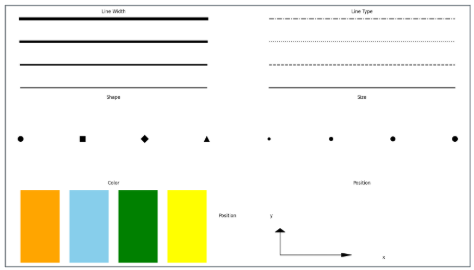
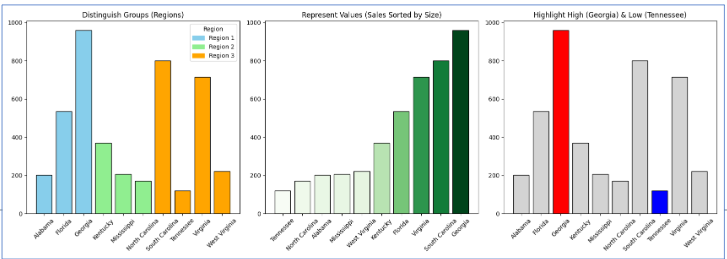
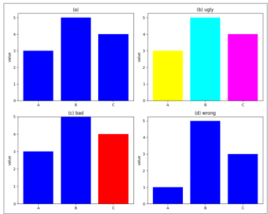
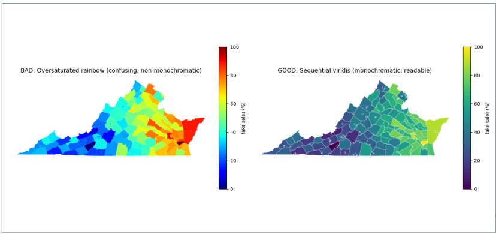
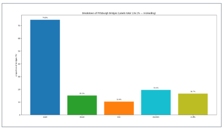
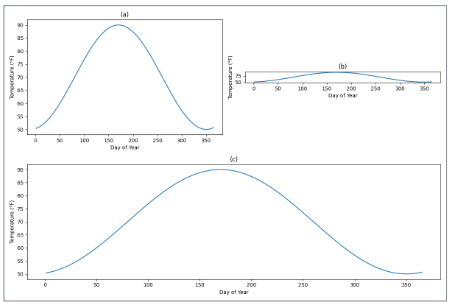
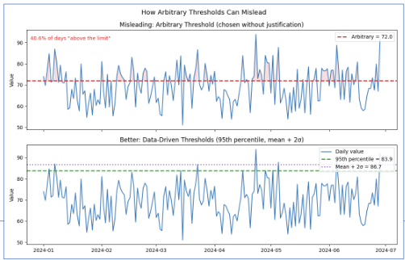
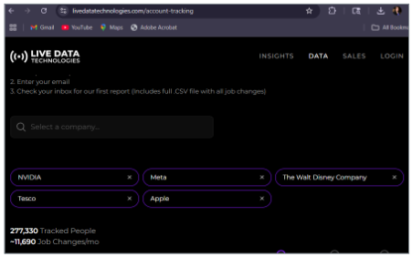

This section frames data visualization as human-centered storytelling: choosing visuals that are truthful, interpretable, and purposeful for a specific audience. Building on Wilke (2019), it links aesthetic choices — position, color, shape, and size — to human perception, then pairs them with sound research methods. It distinguishes description, prediction, and explanation while identifying common pitfalls such as bad proportions, misleading color scales, and poor aspect ratios. The section also addresses how to separate correlation from causation, surface confounds and subgroup effects, and recognize reasoning errors including cherry-picking, arbitrary thresholds, and misread axes. Finally, it introduces a practical storytelling workflow — Who/What/How → Big Idea → 3-Minute Story — so that graphics do more than decorate: they clarify decisions and drive action.

::: note
###### *Reference:*

Wilke, C. O. (2019). *Fundamentals of Data Visualization.*\
O'Reilly Media. ISBN: 9781492031086.
:::

## Data Visualization and Why Good Research Methods Matter

Wilke (2019) argues that data visualization combines both art and science. A visualization must accurately represent the data without misleading, while also being visually appealing and interpretable. These two requirements are in tension: misrepresentation — such as making unequal values appear similar — undermines the scientific integrity of the work, while poor aesthetics — distracting colors or imbalanced design — obscure the message and hinder interpretation.

## The Role of Research Methods in Data Visualization

Good visualization is inseparable from good research methodology. The purpose of the analysis shapes every design decision:

-   [**Describe behavior**]{style="background-color: yellow;"} — identify trends, patterns, and outcomes in data. Use visualizations to summarize patterns clearly for a specific audience. *Example: a bar chart of weekly active users across product features.*
-   [**Predict behavior**]{style="background-color: yellow;"} — use past data to anticipate future actions or outcomes. Design visuals that highlight trends and forecasts to support informed decisions. *Example: a line chart projecting next quarter's sales based on the past 12 months.*
-   [**Explain behavior**]{style="background-color: yellow;"} — go beyond correlation to investigate causal relationships. Ground visualizations in methods that distinguish causation from correlation and avoid misleading graphics. *Example: a side-by-side chart comparing control vs. treatment group outcomes with confidence intervals labeled.*
-   [**Understand behavior**]{style="background-color: yellow;"} — build a deeper, contextual understanding of why patterns occur. Use storytelling and layered visuals to clarify motivations, environments, or external influences. *Example: a dashboard combining time, geography, and user segment to explain why sales dropped in one region.*

## Aesthetics and Types of Data

Visual properties — called **aesthetics** — are the perceptual channels through which data values are communicated to the viewer:

-   [**Position**]{style="background-color: yellow;"} — the most perceptually precise aesthetic; data points are placed at specific locations along perpendicular, evenly-spaced axes. Humans are more accurate at judging position than any other visual property.
-   [**Size**]{style="background-color: yellow;"} — represents magnitude through the area or diameter of elements. *Example: bubble charts where larger circles represent larger populations.*
-   [**Color**]{style="background-color: yellow;"} — encodes categories or values using distinct hues or continuous scales.
-   [**Shape**]{style="background-color: yellow;"} — differentiates groups using markers such as circles, squares, diamonds, and triangles. Particularly useful for black-and-white or color-blind-accessible charts.
-   [**Line width**]{style="background-color: yellow;"} — encodes values through thickness, from thin to thick.
-   [**Line type**]{style="background-color: yellow;"} — distinguishes categories using solid, dashed, dotted, or dash-dot styles.

## Color in Data Visualization

Color serves three fundamental purposes in data visualization:

-   [**Distinguish groups**]{style="background-color: yellow;"} — use color to separate categories without a natural order, such as countries on a map or product brands. *Each category gets a distinct, equally prominent hue.*
-   [**Represent values**]{style="background-color: yellow;"} — use continuous color scales to show quantitative data such as income, temperature, or speed. *Lighter = lower, darker = higher (or vice versa).*
-   [**Highlight**]{style="background-color: yellow;"} — use a single accent color to draw attention to the key element that supports the narrative, leaving everything else muted.

## Common Pitfalls of Color Use

Color is powerful but must be purposeful, clear, and non-distracting. Poor color choices obscure or distort data:

-   [**Encoding too much information**]{style="background-color: yellow;"} — assigning unique colors to more than about six or seven categories overwhelms the viewer. Use direct labeling or group categories instead.
-   [**Distracting color choices**]{style="background-color: yellow;"} — coloring for decoration or using overly saturated hues draws attention away from the data. *Example: rainbow-colored bars where each bar is a different hue for no analytical reason.*
-   [**Misleading color scales**]{style="background-color: yellow;"} — nonmonotonic scales like rainbow distort value differences and emphasize arbitrary features of the data. A **monochromatic** scheme (different shades of one hue) encodes ordered data honestly; a **non-monochromatic** scheme (multiple distinct hues) is better suited to categorical data with no natural ordering.
-   [**Not designing for color-vision deficiency**]{style="background-color: yellow;"} — approximately 8% of men and 0.5% of women have some form of color-vision deficiency. Always test your palette with a simulator. Common deficiencies include red–green (deuteranomaly/protanomaly) and, less commonly, blue–yellow (tritanomaly).

## The Good, The Bad, The Ugly, and The Wrong

Wilke (2019) offers a useful taxonomy for evaluating visualization quality:

-   [**Good**]{style="background-color: yellow;"} — the chart is clear, accurate, and honest. The aesthetic choices serve the data.
-   [**Ugly**]{style="background-color: yellow;"} — aesthetic problems exist (poor color, cluttered axes, low-resolution fonts), but the chart is otherwise clear and correct.
-   [**Bad**]{style="background-color: yellow;"} — perception problems: the chart is unclear, confusing, overly complicated, or unintentionally misleading in how it represents the data.
-   [**Wrong**]{style="background-color: yellow;"} — mathematical or factual problems: the chart is objectively incorrect (e.g., a pie chart whose slices sum to more than 100%).

## Monochromatic vs. Non-Monochromatic Color Scales

::: note
###### *Data Source:*

U.S. Census Bureau. (2023). *TIGER/Line Shapefiles: Counties (2023) \[Shapefile\].*\
U.S. Department of Commerce.\
Available at: <https://www.census.gov/geographies/mapping-files/time-series/geo/tiger-line-file.html>
:::

A **monochromatic** scale (varying shades of one hue) encodes a single ordered dimension honestly — the viewer's eye naturally reads darker as "more." A **non-monochromatic** scale (multiple hues) is better for distinguishing unordered categories where no shade should appear more important than another.

## Bad Proportions: Pie Chart

The figure combines **two variables** — construction material (steel, wood, iron) and era of construction (crafts = before 1870, modern = after 1940). The chart is **wrong** because the percentages add up to more than 100%. The problem arises from overlap between the two variables: all modern bridges are made of steel, and most crafts bridges are made of wood. When overlapping categories are mixed into a pie chart, the slices cannot represent mutually exclusive parts of a whole — making the visualization mathematically invalid.

::: note
###### *Data Source:*

Yoram Reich and Steven J. Fenves, via the UCI Machine Learning Repository (Dua & Karra Taniskidou, 2017).
:::

## Bad Proportions: Bar Chart

Displaying the same data as a bar chart avoids the mathematical invalidity — bar heights do not need to add up to 100% — but the chart is still **bad** because it fails to show the overlap between groups. The viewer cannot see that modern bridges are also steel, or that most crafts bridges are wood. The relationship between the two variables — era and material — is invisible.

## How to Fix That Chart

To correctly visualize the relationship between construction material and era, the designer should:

-   **Separate the two variables** rather than mixing them into a single chart.
-   **Use a visualization that shows joint distributions** — such as a grouped bar chart, stacked bar chart, or mosaic plot — that displays how the categories overlap.
-   **Make overlaps explicit** — clarify in a title or annotation that some categories share membership.
-   **Ensure proportions are mutually exclusive** — within each grouping, values should sum correctly.

### Visualization Fundamentals Lab

**1.** A colleague creates a pie chart showing the market share of five smartphone brands that sums to 112%. Using Wilke's taxonomy (Good, Ugly, Bad, Wrong), classify this chart and explain why — then describe what the correct fix would be.

::: {.callout-note collapse="true"}
### Show Answer

This is **Wrong** — it contains a mathematical error. A pie chart represents parts of a whole; slices must be mutually exclusive and sum to 100%. A chart summing to 112% means either the categories overlap (a brand appearing in two slices), the percentages were calculated incorrectly, or the data source conflates different measurement periods. **Fix:** verify the underlying data first. If the categories genuinely overlap (e.g., some customers use multiple brands), a pie chart is the wrong chart type entirely — use a grouped bar chart showing each brand's share independently. If the data is simply miscalculated, correct the percentages and ensure they sum to 100%. If market share data is unavailable and the percentages represent survey responses (where respondents could choose multiple brands), display them as a bar chart with a note that values do not sum to 100%.
:::

**2.** A business intelligence chart shows monthly website visits over 12 months. The y-axis runs from 94,000 to 98,000, making a 2% growth look like a near-vertical spike. Which of the six aesthetics is being manipulated, and does this make the chart Wrong, Bad, or Ugly? What is the correct fix?

::: {.callout-note collapse="true"}
### Show Answer

**Position** is the manipulated aesthetic — the y-axis origin is truncated rather than starting at zero, compressing the scale so small absolute differences appear large. This makes the chart **Bad** (not Wrong) — it is not mathematically incorrect (the numbers are accurate) but it is **perceptually misleading**: it creates a false impression of rapid growth where the actual change is modest. The chart is still interpretable if the viewer reads the axis carefully, but most viewers do not — they read the visual pattern first. **Fix:** for a bar chart, always start the y-axis at zero — truncating a bar chart axis is never acceptable. For a line chart showing a trend over time, starting the y-axis at a non-zero value can be appropriate, but the truncation should be visually signaled (a broken axis symbol) and the title should not imply dramatic change if the actual growth is small.
:::

**3.** A marketing team creates a chart using eight distinct bright colors to represent eight product categories. Which color pitfall does this violate, and what two alternatives would be more effective?

::: {.callout-note collapse="true"}
### Show Answer

This violates **encoding too much information** with color — more than six or seven distinct hues overwhelm viewers' ability to distinguish and remember which color represents which category, especially in smaller chart elements. Two more effective alternatives: (1) **Direct labeling:** remove the legend entirely and label each data series or bar directly with its category name — the label and the data element are in the same place, eliminating the need to match colors to a legend. (2) **Highlight + mute:** if the story focuses on one or two categories (e.g., "our top two products drove 60% of growth"), color those two in distinct accent colors and render all other categories in the same neutral gray — the viewer's eye goes immediately to what matters and the comparison is unambiguous.
:::

## Reasoning Errors in Data Visualization

Schmidt et al. (2023) examined how individuals mislead with charts through logical and interpretive manipulations — going beyond simple visual distortions. The researchers collected 9,958 Twitter posts containing COVID-19 data visualizations and categorized real-world examples of misleading argumentation strategies.

::: note
###### *Reference:*

Schmidt, A., Väänänen, K., Goyal, T., Kristensson, P. O., Peters, A., Mueller, S., Williamson, J. R., & Wilson, M. L. (Eds.). (2023).\
*Proceedings of the 2023 CHI Conference on Human Factors in Computing Systems.*\
Association for Computing Machinery.\
<https://doi.org/10.1145/3544548>
:::

Seven reasoning errors were identified:

1.  [**Misreading charts**]{style="background-color: yellow;"} — drawing incorrect conclusions due to visual distortions or misinterpretation of chart elements.
2.  [**Cherry-picking**]{style="background-color: yellow;"} — selecting only certain data points so the conclusion fits the limited evidence, even though it would not hold with a more complete dataset.
3.  [**Arbitrary thresholds**]{style="background-color: yellow;"} — judging a phenomenon against a benchmark chosen without clear justification, either as a number or as a visual marker on the chart.
4.  [**Data quality issues**]{style="background-color: yellow;"} — using data that is incomplete, inconsistent, or uncertain without communicating those limitations to the audience.
5.  [**Ignoring statistical nuance**]{style="background-color: yellow;"} — overlooking key statistical details to make an argument appear stronger than it is.
6.  [**Misrepresenting scientific research**]{style="background-color: yellow;"} — misusing or oversimplifying scientific studies, undermining public understanding and trust.
7.  [**False causal claims**]{style="background-color: yellow;"} — inferring cause-and-effect from visual patterns without proper experimental or statistical support, especially dangerous when combined with cherry-picked data.

## Misreading Charts: Coordinate Systems and Axes

Misreading charts means drawing incorrect conclusions due to visual distortions or misinterpretation of chart elements. Two key factors determine how clearly viewers read a chart:

**Coordinate systems** — whether axes are linear, logarithmic, or polar changes the apparent shape of the data. A linear y-axis that does not start at zero can visually exaggerate small differences; a log scale compresses large differences that might otherwise dominate the chart.

**Aspect ratio** — the ratio of a chart's width to its height. This matters because human perception is more sensitive to angles and slopes than to absolute lengths. The same dataset presented as a wide, flat chart reads as "slow, gradual change," while the same dataset as a tall, narrow chart reads as "rapid, dramatic change" — even though the numbers are identical.

*Example:* A line chart showing monthly website visits with an aspect ratio of 10:1 (very wide) might appear nearly flat — suggesting stable growth. The same chart with an aspect ratio of 2:1 (taller) would show a steep upward slope for the same data. Neither is "wrong," but the choice shapes the story the viewer walks away with. Wilke recommends using the **banking to 45°** principle: choose the aspect ratio so that the average slope of the lines in the chart is approximately 45 degrees, which gives the most accurate visual impression of the rate of change.

## Cherry-Picking

Cherry-picking involves selecting only certain data points so that the conclusion fits the limited evidence, even though it would not hold with a more complete dataset. It takes two common forms:

-   **Cherry-picking individual data points** — *Example: citing one study that shows a treatment works while ignoring five studies that show it does not.*
-   **Cherry-picking the time frame** — *Example: showing stock market performance only from the trough of a recession to the peak of a recovery to make returns look spectacular, omitting the preceding crash.*

## Arbitrary Thresholds

An arbitrary threshold is a benchmark chosen without clear, principled justification — either as a specific number or as a visual marker on a chart — used to make a pattern appear significant when no objective threshold exists. *Example: drawing a horizontal line on a chart at the number 100 to imply that values below it represent "failure," when 100 was chosen for convenience rather than any analytical or regulatory reason.*

## Data Quality Issues

Data quality issues arise when data is incomplete, inconsistent, or uncertain — particularly during fast-changing situations — and these limitations are not communicated to the viewer. A prominent example is the Johns Hopkins COVID-19 dashboard: it became a critical pandemic-tracking tool but faced significant early challenges from inconsistent and incomplete case reporting across U.S. counties and international jurisdictions, which created apparent "spikes" that were artifacts of reporting delays rather than actual surges in infections.

## Misrepresenting Scientific Research

**Scientific literacy** is the ability to understand and evaluate scientific information well enough to make informed judgments as a non-expert. Its goal is calibrated trust — neither accepting all scientific claims uncritically nor rejecting science entirely.

Misrepresentation occurs when research findings are oversimplified, cherry-picked, or presented without proper context, leading non-experts to draw misleading conclusions. *Example: a headline claiming "Scientists discover coffee prevents cancer" based on a single observational study, when the study actually found a weak correlation in one specific population and explicitly did not establish causation.* A scientifically literate reader would ask: Was this a randomized controlled trial or an observational study? How large was the effect? Has it been replicated?

## Ignoring Statistical Nuance

Ignoring statistical nuance means presenting an overall summary that obscures important variation. Three forms are especially common:

-   [**Subgroup differences**]{style="background-color: yellow;"} — variations across age, sex, geography, or health status that may be obscured by overall averages. *Example: a medication that lowers blood pressure by 10 points on average may lower it by 15 points in younger adults but by only 3 points in older adults — the average conceals a clinically significant difference.*
-   [**Causation vs. correlation**]{style="background-color: yellow;"} — correlation means two variables move together; it does not prove that one causes the other. Observational studies can identify associations but cannot reliably establish causation without additional evidence or experimental design.
-   [**Confounding factors**]{style="background-color: yellow;"} — variables related to both the independent variable and the outcome that create misleading associations. *Example: if coffee drinkers also tend to be employed full-time and have better access to healthcare, a longer lifespan in that group might have nothing to do with coffee.*

## Correlation vs. Causation

**Correlation** measures the strength and direction of the linear relationship between two variables. Intuitively, a correlation of +1.0 means the two variables move in perfect lockstep upward; -1.0 means one rises exactly as the other falls; 0 means no linear relationship.

More formally: correlation is calculated as the covariance of two variables divided by the product of their standard deviations. The result is always a number between -1 and +1 called the **correlation coefficient** (often written as *r*). In plain terms, covariance tells you whether the variables tend to move in the same direction; dividing by the standard deviations rescales the result to a consistent range so that correlations from different datasets can be compared fairly.

*Reading correlation coefficients:*

| *r* value | Rough interpretation |
|---|---|
| ±0.9 to ±1.0 | Very strong relationship |
| ±0.7 to ±0.9 | Strong relationship |
| ±0.5 to ±0.7 | Moderate relationship |
| ±0.3 to ±0.5 | Weak relationship |
| 0.0 to ±0.3 | Little to no linear relationship |

Two important caveats: correlation is sensitive to outliers (a single extreme data point can inflate or deflate *r* substantially), and even a very high correlation does not imply causation.

To establish **causation**, three conditions must be met: a statistically significant relationship between the variables; no other factors that could account for the relationship (ruling out confounds); and correct temporal ordering — the cause must precede the effect.

People are often tempted to interpret correlation as causation because the causal story feels intuitive, because they hold pre-existing beliefs that favor the interpretation, or because their theoretical framework points in that direction. Intuition is not a substitute for experimental evidence.

## Confounding Variables and the Third Variable Problem

The **third variable problem** (also called **confounding**) refers to any variable that is extraneous to the two variables being studied but influences or explains the observed relationship between them. It creates **spurious relationships** — apparent associations that are actually due to an unseen factor.

Two classic historical examples:

-   **1975 Taiwan Study** — a correlation between electrical appliance ownership and contraceptive use was largely explained by a third variable: socioeconomic status. Wealthier households were more likely to own both appliances and to use modern contraception; there was no direct relationship between the two variables themselves.
-   **Early 1900s pellagra in the U.S. South** — cases were initially attributed entirely to diet, but the real explanation involved a specific vitamin deficiency (niacin) compounded by poor sanitation and food distribution patterns. The apparently simple dietary correlation concealed a more complex causal picture.

Read more: <https://hbr.org/2015/06/beware-spurious-correlations>

## False Causal Claims

A **false causal claim** occurs when someone interprets a visual pattern — or any correlation — as evidence of cause and effect without proper experimental or statistical support. Cherry-picking exacerbates the problem: selecting only data that fits a desired story makes the misleading pattern look more convincing and reinforces the false causal inference.

*Example: A chart showing that ice cream sales and drowning rates both rise in summer might be presented to suggest ice cream causes drowning. The actual confounder is temperature — both rise in hot weather, but one does not cause the other.*

## The Directionality Problem

The **directionality problem** arises when, in a correlation between X and Y, it is unclear which variable — if either — is causing the other. Understanding **temporal precedence** (which variable came first) is essential for establishing causation, but even temporal precedence is not sufficient if the two variables influence each other in a cycle.

Common examples where directionality is genuinely ambiguous:

-   **Happiness and exercise** — does exercise make people happier, or do happier people exercise more? Probably both.
-   **Physical exercise and self-esteem** — improvement in fitness may raise self-esteem, but higher self-esteem may also motivate more exercise.
-   **Aggression and video game use** — aggressive people may be more drawn to violent games, or violent games may increase aggression — the observational data cannot distinguish these.

## Bias in Data and Interpretation

Bias distorts data or its interpretation, making a causal relationship appear stronger, weaker, or entirely different than it really is. Four forms are especially relevant:

-   [**Sample bias**]{style="background-color: yellow;"} — the sample does not represent the population of interest. *Example: surveying only gym-goers to study the effect of exercise on happiness — the most sedentary people, who might benefit most, are excluded.*
-   [**Measurement bias**]{style="background-color: yellow;"} — the way data is collected introduces systematic distortion. *Example: self-reported exercise data consistently overestimates actual activity levels compared to accelerometer measurements.*
-   [**Confirmation bias**]{style="background-color: yellow;"} — selectively highlighting evidence that supports a preferred conclusion. *Example: citing only studies where coffee drinkers show better health outcomes while ignoring null results.*
-   [**Publication bias**]{style="background-color: yellow;"} — studies showing significant or "interesting" results are more likely to be published than null results, skewing the perceived body of evidence toward positive findings.

### Reasoning Errors and Causal Inference Lab

**1.** A chart shows that cities with more hospitals have higher death rates. A commentator concludes that hospitals cause death. Identify which reasoning errors from Schmidt et al.'s list are present, name the specific type of confounding, and explain the correct interpretation.

::: {.callout-note collapse="true"}
### Show Answer

**Reasoning errors present:** (1) **False causal claims** — concluding that hospitals cause death from a correlation between hospital density and death rates. (2) **Ignoring statistical nuance** — failing to account for the obvious confounding variable. **Type of confounding:** classic **third variable problem** — the confounder is *illness severity and population size*. Cities have more hospitals because they have larger, denser, and often sicker populations. People who are dying go to hospitals; hospitals do not make people die. The correlation runs from underlying illness burden → hospital construction AND illness burden → deaths. Hospitals and deaths co-occur because they share a common cause, not because one causes the other. **Correct interpretation:** when controlling for population size and illness severity, more hospitals are associated with *lower* death rates — the correlation reverses once the confounder is removed.
:::

**2.** A data analyst at a retail company presents a chart showing that stores with loyalty program members have 40% higher average transaction values. She concludes that the loyalty program drives higher spending. What is the directionality problem here, and what research design would you need to establish causation?

::: {.callout-note collapse="true"}
### Show Answer

**Directionality problem:** the correlation between loyalty membership and high transaction values is genuinely ambiguous in direction. Do loyalty members spend more *because* of the program (benefits like discounts and points incentivize larger purchases)? Or do high-spending customers self-select into the loyalty program because they shop frequently enough that the benefits are worth signing up for? The observational data cannot distinguish these explanations — both are plausible. **Research design for causation:** a **randomized controlled trial (A/B test)**. Randomly assign a sample of newly enrolled customers to two groups: Group A receives standard enrollment (control); Group B receives accelerated points or an exclusive early benefit (treatment). Measure transaction values for both groups over six months. If Group B spends significantly more than Group A — with all other factors equal because of random assignment — you have evidence that the program *causes* higher spending, not just that high spenders join it. The random assignment eliminates self-selection as an explanation.
:::

**3.** A health journalist writes: "A new study of 200 gym members found that those who exercise more than four hours per week have significantly lower rates of anxiety." List three specific methodological concerns that a scientifically literate reader should raise before accepting this finding.

::: {.callout-note collapse="true"}
### Show Answer

(1) **Sample bias:** the study surveyed only gym members — a population that has already self-selected for exercise engagement, health motivation, and likely higher socioeconomic status (gym memberships cost money). The most sedentary, most anxious, and least affluent individuals are entirely absent from the sample. The finding may not generalize to the broader population. (2) **Directionality and confounding:** does exercise reduce anxiety, or do lower-anxiety people find it easier to commit to a regular exercise routine? Anxiety itself is a known barrier to starting and maintaining exercise habits. Multiple confounders — social support (gym as a social environment), baseline physical health, access to leisure time, and income — could explain the association without exercise being the cause. (3) **Sample size and replication:** 200 participants is a modest sample for a behavioral health study. With a small sample, statistically significant results can arise by chance at meaningful rates, especially if multiple subgroup analyses were run. A scientifically literate reader asks: has this been replicated in a larger, more representative sample, and was this a pre-registered hypothesis or one identified after looking at the data?
:::

## Storytelling with Data

### The Foundation: Who, What, How

Effective data storytelling begins with three questions that must be answered before opening any charting tool:

-   [**Who**]{style="background-color: yellow;"} is the audience? Specificity matters — a chart designed for a data scientist reads completely differently than one designed for a board of directors. Different audiences have different baseline knowledge, different questions, and different thresholds for detail.
-   [**What**]{style="background-color: yellow;"} should they know or do after seeing this visualization? This is the *one thing* the chart must communicate. If you cannot state it in a sentence, the chart is not ready.
-   [**How**]{style="background-color: yellow;"} will the data support that message? What chart type, what level of detail, what emphasis?

Two tools force clarity in the answer:

-   [**The Big Idea**]{style="background-color: yellow;"} — a single, complete sentence that states the point of view *and* the stakes. It must be specific enough to guide every design decision. A weak Big Idea: "Sales are down." A strong Big Idea: "Enterprise software sales fell 23% in Q3 because of three lost accounts that together represent 40% of the division's revenue — and retaining the remaining at-risk accounts requires immediate action on pricing."
-   [**The 3-Minute Story**]{style="background-color: yellow;"} — a brief, structured narrative that distills the message to its essentials. Designed for the scenario where you have only 3 minutes with a decision-maker: what are the three things they absolutely must leave the room knowing?

### Exploratory vs. Explanatory Analysis

A critical distinction shapes every design decision:

**Exploratory analysis** is what you do *for yourself* — scanning data, testing hypotheses, looking for patterns. The charts are fast, rough, and numerous. You might produce 50 charts to find the 2 that reveal something meaningful. Exploratory charts are not meant to be shown to anyone else; they are your thinking tools.

**Explanatory analysis** is what you do *for your audience* — communicating a specific, already-discovered finding as clearly and honestly as possible. The chart is polished, focused, and annotated. Every element serves the message.

*Example:* An HR analyst notices that voluntary departures spiked in Q3. She explores dozens of cuts of the data — by department, tenure, manager, role type — and discovers that the spike was concentrated in mid-level editorial roles reporting to one particular business unit. The exploratory work is done; now she builds one explanatory chart that tells the editorial spike story to the leadership team, annotated with the key observation: "Departures from editorial roles tripled in Q3, concentrated in three teams."

The common mistake is presenting exploratory charts to an explanatory audience — showing leadership 50 charts "to be thorough" when they need one chart that drives a decision.

### The "Two Pearls" Principle

Knaflic (whose work builds on Wilke's foundation) describes the goal of explanatory visualization with the phrase: **focus on the two pearls, not the hundred oysters**.

An oyster bed has hundreds of oysters. Most contain nothing. A few contain pearls. When you present exploratory data to an audience, you are making them wade through every oyster themselves — exhausting and unfocused. When you present explanatory data, you have already found the pearls and are handing them directly to the audience. Your job is not to show all the data; it is to surface the two or three findings that matter and make them impossible to miss.

*Applied:* If your workforce analysis surfaces 12 interesting patterns, your explanatory chart shows the two that directly answer the decision at hand — not all 12.

## Success in Data Storytelling Begins Before Visualizing

For example, using [Live Data Technologies](https://www.livedatatechnologies.com/account-tracking), we can analyze patterns in employee arrivals vs. departures over time to tell a clear workforce story. The *exploratory* phase might involve dozens of cuts by department, role, and tenure. The *explanatory* deliverable is a focused chart showing the key trend — annotated, titled, and designed for the specific audience who needs to act on it.

::: note
###### *Reference:*

<https://www.livedatatechnologies.com/account-tracking>
:::

## A Six-Step Storytelling Workflow

1.  [**Understand the context**]{style="background-color: yellow;"} — define the audience, their needs, and what decision the visualization should support. *Who will see this? What do they already know? What do they need to decide?*
2.  [**Choose the right visual**]{style="background-color: yellow;"} — select a chart type appropriate to the data and the message. *Time trend → line chart. Comparison across categories → bar chart. Part-to-whole → stacked bar or treemap. Distribution → histogram or box plot.*
3.  [**Eliminate clutter**]{style="background-color: yellow;"} — remove gridlines, excess tick marks, legends that can be replaced by direct labels, and any element that does not add information. Every ink mark should earn its place.
4.  [**Focus attention**]{style="background-color: yellow;"} — highlight the most important element using color, annotation, or bold text. Everything else should be muted so the eye goes immediately to the point.
5.  [**Design with purpose**]{style="background-color: yellow;"} — every aesthetic choice (color, font size, axis range, chart aspect ratio) should serve the message, not just fill space.
6.  [**Tell a story**]{style="background-color: yellow;"} — annotate the chart with the observation the viewer should take away. Do not make them figure it out; tell them: *"Departures from editorial roles tripled in Q3."*

### Worked Example: Applying the Six Steps

Suppose an HR team wants to present employee turnover data to the executive leadership team:

| Step | What you do |
|---|---|
| **1. Context** | Audience: CFO and CHRO. Decision: whether to fund a retention program for mid-level editorial staff. They need the magnitude of the problem and which teams are affected. |
| **2. Visual** | Horizontal bar chart showing departure rates by department for Q3 — bars make it easy to rank and compare across categories. |
| **3. Eliminate clutter** | Remove the legend (label bars directly). Remove gridlines. Remove the y-axis title if bars are already labeled. |
| **4. Focus attention** | Color three editorial department bars in red; leave all others gray. Add a dashed line at the company average departure rate. |
| **5. Design with purpose** | Set the x-axis to start at 0 (never truncate a bar chart axis — it exaggerates differences). Choose a title that states the finding, not the topic: *"Editorial Departures Ran 3× the Company Average in Q3."* |
| **6. Tell a story** | Add a single annotation arrow pointing to the highest bar: *"Fiction editorial: 42% departure rate — up from 14% in Q2."* The chart now drives action, not just awareness. |

### Data Storytelling Lab

**1.** Write a strong "Big Idea" sentence for the following scenario: a financial services firm's data team has discovered that customers who use the mobile app at least once per week have a 3-year retention rate of 82%, compared to 41% for customers who do not. The team wants the Chief Marketing Officer to approve funding for a mobile engagement campaign.

::: {.callout-note collapse="true"}
### Show Answer

**Strong Big Idea:** "Weekly mobile app users retain at twice the rate of non-users — and a targeted engagement campaign to convert low-frequency users could recover an estimated $4.2M in revenue that would otherwise be lost to churn over the next 18 months."

**Why this is strong:** it states a specific finding (82% vs. 41% retention), expresses a clear point of view (the gap is actionable), and articulates the stakes (revenue at risk) — all in one sentence. A weak Big Idea would be: "Mobile engagement affects retention" — it is vague, contains no point of view, and gives the CMO nothing to act on.
:::

**2.** An analyst presents the following chart to a board meeting: a line chart with 12 lines (one per product category), no annotations, a legend in the bottom-right corner, and a title that reads "Product Performance Over Time." Apply the six-step storytelling workflow to critique this chart and describe what the improved version would look like.

::: {.callout-note collapse="true"}
### Show Answer

**Step 1 — Context failure:** the title "Product Performance Over Time" does not state what the audience should know or do — it describes the topic, not the finding. **Step 2 — Visual:** a line chart is appropriate for time trends, but 12 lines is too many for a single chart. **Step 3 — Eliminate clutter:** the legend forces viewers to match 12 colors to 12 categories — a slow, error-prone cognitive task. **Step 4 — Focus attention:** no element is highlighted; the viewer does not know which line matters. **Step 5 — Design with purpose:** the aspect ratio and axis range are unstated — key choices that shape how trends appear. **Step 6 — Tell a story:** no annotation explains what the viewer should take away. **Improved version:** identify the one or two product lines that tell the relevant story (e.g., the one category that declined while all others grew). Color those lines in a distinct accent color; render all others in light gray. Label the highlighted lines directly at their end points. Annotate the key inflection point. Title: "Premium Accessories Grew 34% While All Other Categories Plateaued — Q3 2023 to Q3 2024." The audience now has one clear takeaway and can verify it against the muted context lines.
:::

**3.** A colleague argues: "Exploratory charts are fine to show executives — it is more transparent to show all the data." Write a counter-argument using the "two pearls" principle and the exploratory vs. explanatory distinction.

::: {.callout-note collapse="true"}
### Show Answer

Showing executives exploratory charts is not transparency — it is transferring the analyst's cognitive work to the people least equipped and least available to do it. An executive in a one-hour board meeting cannot wade through 15 charts with no annotations, figure out which findings are meaningful, assess which patterns are artifacts of data quality issues, and arrive at a decision — all while managing their other agenda items. The **two pearls** principle makes the distinction concrete: an oyster bed has hundreds of oysters, but most contain nothing. Handing an executive all 200 oysters and saying "the pearls are in here somewhere" is not transparency; it is an abdication of the analyst's primary responsibility, which is to find the pearls. True transparency means being honest about what the data shows and what it does not — including uncertainty and caveats — in the context of a focused, annotated explanatory chart. Exploratory charts belong in the analyst's working notebook, not in the board deck.
:::

# Summary and Review

## Using AI

Use the following prompts with a generative AI tool to explore data visualization and storytelling further.

- What is the difference between exploratory and explanatory analysis? Give a concrete example of each from an HR analytics context.
- What are the six aesthetics in data visualization, and which is the most perceptually precise? How do you decide which aesthetic to use for which type of data?
- What are the four purposes of color in data visualization: distinguish, represent values, and highlight? Give an example where the wrong color purpose degrades the chart.
- What is the difference between a chart that is Bad vs. Wrong vs. Ugly in Wilke's taxonomy? Give an example of each from business reporting.
- What are the three conditions required to establish causation? Why is correlation alone — no matter how strong — insufficient?
- What is the third variable problem, and how does it create spurious correlations? Give an example where a confounder reverses the apparent relationship between two variables.
- What is the "Big Idea" in data storytelling, and what distinguishes a strong Big Idea from a weak one? Write one for a scenario of your choice.

## Summary

This chapter covered the principles of honest, effective data visualization and the storytelling workflow that turns data into decisions.

| Topic | Key concepts |
|---|---|
| Visualization purpose | Describe, predict, explain, understand behavior |
| Six aesthetics | Position (most precise), size, color, shape, line width, line type |
| Color purposes | Distinguish categories, represent values, highlight key element |
| Color pitfalls | Too many categories, distracting choices, nonmonotonic scales, color-vision deficiency |
| Good/Ugly/Bad/Wrong | Good: accurate + clear; Ugly: aesthetic flaws only; Bad: perceptually misleading; Wrong: mathematically incorrect |
| Monochromatic vs. non-mono | Monochromatic: ordered quantitative data; non-monochromatic: unordered categories |
| Aspect ratio | Banking to 45° principle; same data reads differently at different width-to-height ratios |
| Seven reasoning errors | Misreading, cherry-picking, arbitrary thresholds, data quality, ignoring nuance, misrepresenting research, false causal claims |
| Correlation coefficient | r between -1 and +1; measures linear relationship; sensitive to outliers; does not imply causation |
| Three conditions for causation | Significant relationship, no confounds, correct temporal ordering |
| Third variable / confounding | Spurious correlations explained by an unseen variable related to both X and Y |
| Directionality problem | Unclear which variable — if either — causes the other |
| Four bias types | Sample, measurement, confirmation, publication |
| Who/What/How | Three questions before opening any charting tool |
| Big Idea | One sentence: point of view + stakes; specific enough to guide every design decision |
| 3-Minute Story | Three things the decision-maker must leave the room knowing |
| Exploratory vs. explanatory | Exploratory: for yourself (many rough charts); explanatory: for your audience (one polished finding) |
| Two pearls principle | Find the meaningful findings first; present those, not all the data |
| Six-step workflow | Context → Visual → Eliminate clutter → Focus attention → Design with purpose → Tell a story |

**What comes next:** The Web Scraping and APIs chapter moves from communication to data collection — building the technical skills to acquire the raw data that feeds visualizations and analytical models.
