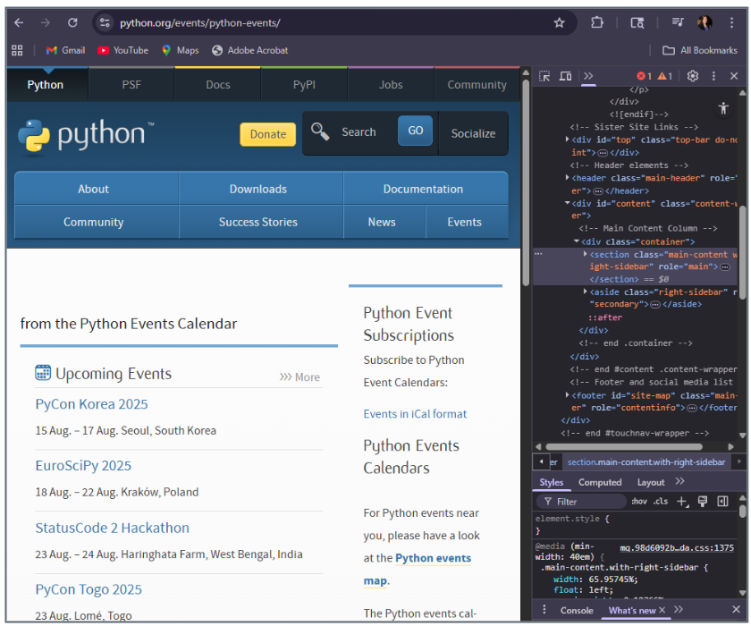
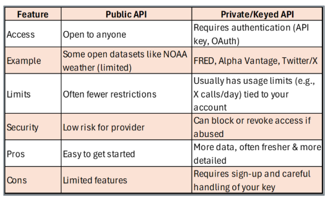
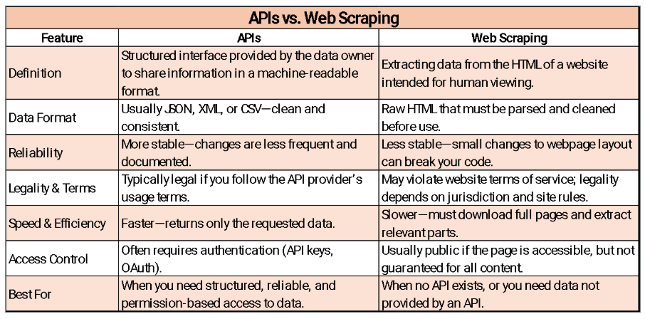

This section teaches how to acquire web data two ways — by parsing human-oriented HTML (web scraping) and by calling machine-friendly endpoints (APIs) — and shows when to use each. You will practice inspecting sites, locating target elements, and extracting fields with `requests`, `BeautifulSoup`, and `pandas`, then contrast that with structured API calls that return predictable JSON (e.g., Open-Meteo). Worked examples cover end-to-end flows (URL anatomy → request → parse/clean → display), common failure points (fragile page structure, missing fields), and hardening tips (headers, error handling). The section closes with an ethics lens — copyright, terms of service, and responsible use — so students can build useful pipelines that are both technically sound and legally compliant.

## Web Scraping

Web scraping is the process of programmatically fetching a web page and extracting specific information from its HTML. It is the right choice when no API exists for the data you need, but it requires more care than calling an API because page structure can change at any time.

### Step 1: Inspect Your Data Source

Before writing a single line of code, spend a minute understanding the target URL. Consider `https://www.python.org/events/`:

-   [**`https://`**]{style="background-color: yellow;"} — the **protocol** (HyperText Transfer Protocol Secure); tells the browser to communicate securely with the server. *How to talk to the site.*
-   [**`www.python.org`**]{style="background-color: yellow;"} — the **domain name**, pointing to the server hosting the site. *Where to go.*
-   [**`/events/`**]{style="background-color: yellow;"} — the **path** indicating which page or section to load. *What to see once you get there.*

To find the HTML elements you want to extract, open the page in Chrome or Firefox and press **Ctrl + Shift + I** (Windows) or **Cmd + Option + I** (Mac) to open the browser developer tools. Click the **Elements** tab and hover over different parts of the page to see which HTML tags surround your target data.



### Web Scraping Example

::: note
Source code for class examples: <https://github.com/SchlosserPG/ForClass>
:::

The script below scrapes upcoming Python events from python.org. It follows four steps:

1. Import `requests` (for fetching the page) and `BeautifulSoup` (for parsing HTML).
2. Send a **GET** request to the URL and retrieve the raw HTML.
3. Create a `BeautifulSoup` object to parse the HTML into a navigable tree.
4. Locate the event list and collect all individual event entries.

```{python}
import requests
from bs4 import BeautifulSoup

# Step 1–2: fetch the page
url = 'https://www.python.org/events/'
req = requests.get(url)

# Step 3: parse the HTML into a navigable tree
soup = BeautifulSoup(req.text, 'lxml')

# Step 4: find the <ul> containing events, then collect each <li> item
events = soup.find('ul', {'class': 'list-recent-events'}).find_all('li')
```

::: note
`lxml` is a fast HTML/XML parser that BeautifulSoup uses internally. It must be installed separately: `pip install lxml`. If you do not have it, you can substitute `'html.parser'` (Python's built-in parser) — it is slower but requires no extra install.
:::

### Extracting Data from Each Event

`events` is now a Python list of BeautifulSoup elements, one per event `<li>` tag. The loop below iterates through the list and pulls three fields from each event: title, location, and date.

```{python}
for event in events:
```

**Title** — `.find('h3')` locates the `<h3>` tag that wraps the event name. `.get_text(strip=True)` extracts the plain text and removes surrounding whitespace.

```{python}
    title = event.find('h3').get_text(strip=True)
```

**Location** — `.find('span', {'class': 'event-location'})` targets the `<span>` tag whose CSS class is `event-location`. This is how you narrow a search when a tag type alone is not specific enough.

```{python}
    location = event.find('span',
                          {'class': 'event-location'}).get_text(strip=True)
```

**Date** — `.find('time')` locates the semantic `<time>` tag holding the event date.

```{python}
    date = event.find('time').get_text(strip=True)
```

Each field is printed with a label, and `"-" * 40` draws a visual separator between events.

```{python}
    print(f"Title: {title}")
    print(f"Location: {location}")
    print(f"Date: {date}")
    print("-" * 40)
```

**Complete loop — putting it all together:**

```{python}
for event in events:
    title    = event.find('h3').get_text(strip=True)
    location = event.find('span',
                          {'class': 'event-location'}).get_text(strip=True)
    date     = event.find('time').get_text(strip=True)

    print(f"Title: {title}")
    print(f"Location: {location}")
    print(f"Date: {date}")
    print("-" * 40)
```

## APIs

### What Is an API?

An **Application Programming Interface (API)** is a defined contract between two software systems. It specifies exactly what requests a service will accept, what data it will return, and in what format. Rather than downloading a web page and parsing its HTML, you send a structured request to an API endpoint and receive clean, machine-readable data — usually JSON — in return.

Think of an API like ordering at a restaurant: you do not walk into the kitchen yourself; you use the menu (the API specification) to place an order (a request), and the kitchen sends back exactly what you asked for (the response).

### APIs vs. Web Scraping

| | **API** | **Web Scraping** |
|---|---|---|
| Data format | Structured JSON or XML | Unstructured HTML |
| Stability | Versioned, documented | Breaks when page layout changes |
| Authentication | Often required | Rarely required |
| Legal clarity | Governed by Terms of Service | Must check ToS carefully |
| Best for | Ongoing integrations | One-off or no-API situations |

**Key advantages of APIs:**

-   [**Structured data**]{style="background-color: yellow;"} — clean JSON or XML, no cleanup needed.
-   [**Consistent schema**]{style="background-color: yellow;"} — predictable, labeled fields that do not change unexpectedly.
-   [**Defined access**]{style="background-color: yellow;"} — clear endpoints, parameters, and documented usage limits.
-   [**Easy access**]{style="background-color: yellow;"} — read-only data often requires no authentication.
-   [**Best practice**]{style="background-color: yellow;"} — always include a descriptive `User-Agent` header in requests so servers can identify your client.

### How API Requests Work

All APIs follow the same basic pattern: you make a **request**, and the API returns a **response**. Every time you open a social media feed, check a weather app, or get directions, your device is calling an API and displaying the response. This is also called *calling an API* or *making an API call*.

In Python, the `requests` library is the standard tool for this. A typical call looks like:

```{python}
import requests

response = requests.get("https://api.example.com/data", params={"key": "value"})
data = response.json()   # converts the JSON response into a Python dictionary
```

### API Formats

APIs come in several architectural styles. **REST** (Representational State Transfer) is by far the most common for public data services and is what all examples in this course use. Others include **GraphQL** (flexible query-based), **SOAP** (older, XML-based, common in enterprise systems), and **gRPC** (high-performance, used in microservices).

### Public vs. Private APIs

-   [**Public APIs**]{style="background-color: yellow;"} — openly available; instant access, but often limited in request volume or data depth. Examples: Open-Meteo (weather), NASA APOD, World Bank data.
-   [**Private APIs**]{style="background-color: yellow;"} — require registration; more powerful and data-rich, but require an API key and careful key management.



### API Keys

An **API key** is a unique string — typically a long sequence of letters and numbers — that identifies your application to an API provider. Think of it as a library card for borrowing data: it tells the provider who you are and tracks your usage against any rate limits.

To obtain an API key:

1. Create a free account with the data provider.
2. Navigate to the **API**, **Developers**, or **Account Settings** section.
3. Click **Generate API Key** or **Create Access Token**.
4. Copy the key and store it somewhere safe — such as a `.env` file or environment variable — so it is **never** hardcoded in your script or uploaded to GitHub.

::: note
If you accidentally push an API key to a public GitHub repository, treat it as compromised. Delete or regenerate it immediately through the provider's website, then remove it from your git history.
:::

### JSON — The Language of APIs

**JSON (JavaScript Object Notation)** is the most common data format returned by APIs. It is organized as **key–value pairs** (exactly like a Python dictionary) and **arrays** (exactly like a Python list). This makes it trivial to work with: `.json()` from the `requests` library converts the raw response text directly into Python objects.

```{python}
# Example JSON response from a weather API:
# {
#   "city": "Williamsburg",
#   "temperature": 22.5,
#   "conditions": "Partly cloudy"
# }

data = response.json()
print(data["city"])          # "Williamsburg"
print(data["temperature"])   # 22.5
```

## Weather API Demo

### Overview

This demo builds a small Python script that calls the **Open-Meteo API** — a free, no-key-required weather service — for five Virginia cities and displays the results as a formatted table. It demonstrates the full API workflow: configure → request → parse JSON → store → display.

### Building the Request Step by Step

Import the two libraries needed:

```{python}
import requests   # for making HTTP requests to the API
import pandas as pd  # for organizing results into a table
```

Store city coordinates in a dictionary. Using a dictionary allows us to loop cleanly — one iteration per city.

```{python}
# 5 sample cities in Virginia with (latitude, longitude)
cities_va = {
    "Williamsburg":    (37.2707,  -76.7075),
    "Richmond":        (37.5407,  -77.4360),
    "Virginia Beach":  (36.8529,  -75.9780),
    "Roanoke":         (37.27097, -79.94143),
    "Charlottesville": (38.0293,  -78.4767)
}
```

The base URL is the **endpoint** — the specific address of the resource we want. Query parameters (latitude, longitude, etc.) are appended separately via `params=`.

```{python}
url = "https://api.open-meteo.com/v1/forecast"
```

An empty list will collect one dictionary of results per city.

```{python}
results = []
```

Loop through each city. `.items()` returns `(key, value)` pairs; `(lat, lon)` unpacks the coordinate tuple in one step.

```{python}
for city, (lat, lon) in cities_va.items():
```

Build the `params` dictionary. The API uses these as URL query parameters (e.g., `?latitude=37.27&longitude=-76.71&current_weather=true`).

```{python}
    params = {
        "latitude":        lat,
        "longitude":       lon,   # note: spelled correctly — a common typo is "longtitude"
        "current_weather": True
    }
```

Send the GET request. `raise_for_status()` immediately raises a `requests.HTTPError` if the server returns an error code (e.g., 404 Not Found, 429 Too Many Requests). Without it, a failed request would silently proceed to `.json()` and produce a confusing error or corrupt data.

```{python}
    response = requests.get(url, params=params)
    response.raise_for_status()   # raise immediately if the server returned an error
    data = response.json()        # parse JSON into a Python dictionary
```

Extract the weather fields if present; use `None` as a safe placeholder if the key is missing.

```{python}
    if "current_weather" in data:
        weather = data["current_weather"]
        results.append({
            "City":             city,
            "Temperature (C)":  weather["temperature"],
            "Wind Speed (m/s)": weather["windspeed"],
            "Time":             weather["time"]
        })
    else:
        # API did not return current_weather for this location
        results.append({
            "City":             city,
            "Temperature (C)":  None,
            "Wind Speed (m/s)": None,
            "Time":             None
        })
```

Convert the list of dictionaries into a DataFrame and print.

```{python}
df = pd.DataFrame(results)
print(df)
```

### Complete Script

```{python}
import requests
import pandas as pd

cities_va = {
    "Williamsburg":    (37.2707,  -76.7075),
    "Richmond":        (37.5407,  -77.4360),
    "Virginia Beach":  (36.8529,  -75.9780),
    "Roanoke":         (37.27097, -79.94143),
    "Charlottesville": (38.0293,  -78.4767)
}

url     = "https://api.open-meteo.com/v1/forecast"
results = []

for city, (lat, lon) in cities_va.items():
    params   = {"latitude": lat, "longitude": lon, "current_weather": True}
    response = requests.get(url, params=params)
    data     = response.json()

    if "current_weather" in data:
        w = data["current_weather"]
        results.append({"City": city,
                         "Temperature (C)":  w["temperature"],
                         "Wind Speed (m/s)": w["windspeed"],
                         "Time":             w["time"]})
    else:
        results.append({"City": city,
                         "Temperature (C)":  None,
                         "Wind Speed (m/s)": None,
                         "Time":             None})

df = pd.DataFrame(results)
print(df)
```

## Web Scraping with pandas

Sometimes the data you want is already in an HTML table — neatly structured rows and columns. In that case, `pandas.read_html()` is a faster alternative to manually parsing with BeautifulSoup: it finds all `<table>` elements on a page and returns them as a list of DataFrames.

The example below scrapes the Wikipedia list of countries by population.

```{python}
import pandas as pd
import requests

url = "https://en.wikipedia.org/wiki/List_of_countries_and_dependencies_by_population"

# Fetch the raw HTML with a browser-like User-Agent header
# (some sites block requests without one)
headers  = {"User-Agent": "Mozilla/5.0"}
response = requests.get(url, headers=headers)
response.raise_for_status()   # raises an HTTPError if the request failed

# Parse every <table> on the page into a list of DataFrames
tables = pd.read_html(response.text)

# Find the table that contains both a "location" and "population" column
candidate = None
for t in tables:
    cols = [c.lower() for c in t.columns.astype(str)]
    if any("location" in c for c in cols) and any("population" in c for c in cols):
        candidate = t
        break

if candidate is None:
    raise ValueError("Could not find a suitable table on the page.")

# Standardize column names to "Location" and "Population"
col_map = {}
for c in candidate.columns:
    cl = str(c).lower()
    if "location"   in cl: col_map[c] = "Location"
    elif "population" in cl: col_map[c] = "Population"

df_scrape = candidate.rename(columns=col_map)[["Location", "Population"]].copy()

# Clean the Population column:
# Wikipedia includes footnote markers like [1] and comma separators
df_scrape["Population"] = (
    df_scrape["Population"]
    .astype(str)
    .str.replace(r"\[.*?\]", "", regex=True)   # remove footnotes: [1], [a], etc.
    .str.replace(",", "", regex=False)          # remove thousands separators
    .str.extract(r"(\d+)", expand=False)        # keep only the leading digits
    .astype("Int64")                            # convert to nullable integer
)

# Sort and take the top 10 most populous countries
df_scrape = (
    df_scrape.dropna(subset=["Population"])
             .sort_values("Population", ascending=False)
             .head(10)
             .reset_index(drop=True)
)

print(df_scrape)
```

**Why this counts as scraping:**

-   You are fetching human-oriented HTML and interpreting its structure programmatically.
-   Wikipedia may change its table layout, column names, or footnote format at any time — breaking this script without warning.
-   Significant cleaning is required (footnotes, commas, non-numeric characters) before the data is usable.

## API vs. Web Scraping: Comparison



## Ethics and Legal Considerations

Much online content — text, images, and code — is protected by copyright. Scraping may be legal for personal viewing, but using scraped content to train AI models (a form of large-scale reproduction) can violate copyright if done without permission from the content owner.

**Example:** The New York Times and other publishers are [suing AI companies](https://www.nytimes.com/2023/12/27/business/media/new-york-times-open-ai-microsoft-lawsuit.html) for scraping their content without licensing agreements.

Before scraping any site at scale, always:

1. Read the site's `robots.txt` file (e.g., `https://www.example.com/robots.txt`) to see what crawlers are allowed to access.
2. Review the site's Terms of Service for explicit scraping policies.
3. Avoid overloading servers — add delays between requests and limit your request rate.

> [**Discussion: What are the ethical and legal boundaries of scraping data for training AI models?**]{style="background-color: yellow;"}
